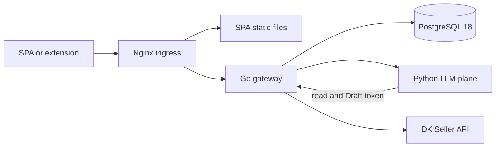

# Deployment guide

This guide covers a fresh local environment, a same-origin local integration
deployment, SPA and Chrome-extension artifacts, external-service configuration,
and the production release sequence.

> **Current release status:** local infrastructure and the same-origin
> integration topology are available. Production deployment is **not runnable
> from this repository yet**: the gated S34 production Compose file, production
> images, TLS Nginx configuration, registry workflow, WAL backup/restore tooling, and
> production user bootstrap do not exist. The extension builds and can be loaded
> unpacked, but its production gateway host permission and several runtime data
> seams are also unfinished. The production section below is therefore an exact
> readiness and execution checklist, not a claim that the missing artifacts are
> already present.

Do not use test fixtures, the mock DK server, Mailpit, Spotlight, the seeded
owner, or any example credential in production.

## 1. Runtime shape

Production and the reliable local integration topology use one browser origin:



Only the Nginx edge should be internet-facing. PostgreSQL and the LLM plane remain on the
private container network. The LLM plane must never receive `DATABASE_URL`, the
DK seller token, or `CONNECTOR_ENCRYPTION_KEY`.

## 2. What you need

### Local workstation

- Docker Engine with Compose v2
- Node.js and pnpm
- Python and uv
- Go
- Task, golangci-lint, Semgrep, Goose, sqlc, River, jq, OpenSSL, curl, and zip
- Chrome 116 or newer for the MV3 extension

From the repository root:

```sh
task doctor
command -v openssl
command -v curl
command -v zip
```

`task doctor` prints every missing project tool. Install missing prerequisites,
then bootstrap the workspace:

```sh
task setup
```

### Production inputs supplied by an operator

Do not start S34 until a human has explicitly approved live deployment and
supplied all of the following:

- VPS access and a non-root deployment account
- a domain, DNS control, and public TCP ports 80 and 443
- container-registry credentials
- an isolated backup destination and its credentials
- a production PostgreSQL password and application connection URL
- a separately protected 32-byte connector encryption key
- a random LLM-to-gateway machine token
- an approved OpenAI-compatible model endpoint, key, model name, and measured
  capability set, or an explicit decision to keep the mock/provider-disabled
  behavior
- a trusted local SMTP relay address; the current mailer does not support SMTP
  authentication or implicit TLS itself
- DK application/client registration and seller authorization for each account
- the final web origin and extension distribution method

Seller access and paid model benchmarking are separate S35 live gates. They are
not prerequisites for bringing up a production topology with marketplace writes
dark and no seller account connected.

Store at least these production secrets separately and inject them only into
their named consumers:

| Secret | Consumer |
|---|---|
| PostgreSQL user/password and `DATABASE_URL` | PostgreSQL/core/migration jobs as appropriate |
| `CONNECTOR_ENCRYPTION_KEY` | core only |
| `LLM_GATEWAY_TOKEN` | core and LLM only |
| `LLM_PROVIDER_API_KEY` | LLM only |
| registry credential | CI/deployment host only |
| backup-destination credential | PostgreSQL backup job only |
| TLS certificate/ACME credential, if required | Nginx/TLS termination layer only |

DK seller access/refresh tokens are not deployment secrets: the core receives
them through the seller authorization exchange and stores them sealed.

## 3. Configuration and secrets

`task up` generates and persists safe local values automatically. To customize
individual services, copy the optional template and generate fresh values:

```sh
cp .env.example .env
openssl rand -base64 32
openssl rand -hex 32
openssl rand -base64 24
```

Put the first value in `CONNECTOR_ENCRYPTION_KEY`, the second in
`LLM_GATEWAY_TOKEN`, and reserve the third as the local seeded-owner password.
The connector key must decode to exactly 32 bytes. Never rotate it without a
token re-encryption procedure: DK access and refresh tokens are sealed with this
key in PostgreSQL.

Load `.env` into the current local shell:

```sh
set -a
. ./.env
set +a
```

The file is only a local convenience. The LLM service intentionally does not
auto-load `.env`; production orchestration must inject the allowed `LLM_*`
variables explicitly.

### Core variables

| Variable | Required | Purpose |
|---|---:|---|
| `APP_ENV` | yes | `dev` disables Secure cookies; use `prod` behind HTTPS |
| `DATABASE_URL` | for full service | PostgreSQL application URL; unset serves public routes only |
| `CONNECTOR_ENCRYPTION_KEY` | for DK connector | base64-encoded 32-byte AES key for tokens at rest |
| `DK_API_BASE_URL` | recommended | local mock URL or `https://seller.digikala.com` after live approval |
| `LLM_SERVICE_URL` | for chat | internal LLM service URL; unset makes chat fail closed |
| `LLM_GATEWAY_TOKEN` | for LLM tools | shared random bearer token, read and Draft only |
| `HTTP_ADDR` | no | gateway listen address, default `:8080` |
| `LOG_LEVEL` | no | structured-log level |
| `CHAT_KILL_SWITCH` | no | disables chat globally without disabling screens |
| `CHAT_KILL_SWITCH_ACCOUNTS` | no | comma-separated account UUIDs with chat disabled |
| `SMTP_ADDR` | no | trusted SMTP relay, default `localhost:1025` |
| `NOTIFY_FROM_ADDR` | no | enables the email digest when nonempty |
| `APP_BASE_URL` | no | absolute SPA URL used in email links |
| `NOTIFY_LOCALE` | no | digest locale, default `fa-IR` |
| `NOTIFY_REGION` | no | analytics region label, default `IR` |
| `CURRENCY_CONTRACT_VERSION` | no | analytics contract label, default `v1` |
| `OTEL_ENABLED` | no | enables the Go OpenTelemetry SDK |
| `OTEL_EXPORTER_OTLP_ENDPOINT` | with OTel | OTLP/HTTP collector endpoint |
| `SENTRY_SPOTLIGHT` | dev only | local Spotlight stream; never set in production |

### LLM variables

Every LLM setting is prefixed with `LLM_`.

| Variable | Safe local value | Production meaning |
|---|---|---|
| `LLM_PROVIDER_KIND` | `mock` | `openai_compatible` only after the gated benchmark |
| `LLM_PROVIDER_BASE_URL` | ignored by mock | provider `/v1` base URL |
| `LLM_PROVIDER_API_KEY` | empty | provider secret |
| `LLM_PROVIDER_MODEL` | `mock-model` | measured model identifier |
| `LLM_PROVIDER_TIMEOUT_SECONDS` | `30` | provider timeout |
| `LLM_MAX_OUTPUT_TOKENS` | `1024` | hard response ceiling |
| `LLM_GRAPH_RECURSION_LIMIT` | `24` | graph bound |
| `LLM_TOOL_CALL_RUN_LIMIT` | `12` | per-turn total tool bound |
| `LLM_PER_TOOL_CALL_RUN_LIMIT` | `4` | per-tool bound |
| `LLM_PER_TOOL_TIMEOUT_SECONDS` | `15` | tool timeout |
| `LLM_NODE_TRANSIENT_RETRIES` | `1` | bounded transient retry |
| `LLM_CHAT_DISABLED_GLOBAL` | `false` | LLM-local chat kill switch |
| `LLM_CHAT_DISABLED_ACCOUNTS` | `[]` | JSON array of disabled account UUIDs |
| `LLM_SENTRY_SPOTLIGHT` | empty | dev-only Spotlight URL |
| `LLM_LANGSMITH_TRACING` | `false` | external trace export; requires explicit approval |
| `LLM_LANGSMITH_API_KEY` | empty | LangSmith secret |

`CI` forces LangSmith off. Never provide `DATABASE_URL` or the connector key to
the LLM container.

### Build-time browser variables

Vite substitutes these values during the build; changing them requires a new
bundle.

| Surface | Variable | Recommended value |
|---|---|---|
| SPA | `VITE_GATEWAY_BASE_URL` | `/api` behind same-origin Nginx |
| SPA | `VITE_MARKETPLACE_ACCOUNT_ID` | selected/bootstrap account UUID |
| SPA | `VITE_SENTRY_SPOTLIGHT` | local dev only; empty for production |
| extension | `VITE_GATEWAY_BASE_URL` | absolute gateway base, such as `https://ops.example.com/api` |
| extension | `VITE_WEB_BASE_URL` | absolute SPA origin |

Vite variables are public. Never put a database password, provider API key,
seller token, connector key, or LLM gateway token in a `VITE_*` variable.

## 4. Local development: infrastructure and hot reload

The one-command path starts infrastructure, initializes an existing or fresh
local database non-destructively, generates stable dev-only credentials, and
runs the browser surfaces through a same-origin Vite proxy:

```sh
task up
```

No `.env` file or manual export is required. Optional `.env` values override
local defaults. Open `http://localhost:5173` after the ready message; the local
owner password is stored at `tmp/dev-owner-password` with mode `0600`. The Vite
development server uses it only server-side to establish an HTTP-only browser
session after the first protected 401; it is not embedded in client JavaScript.

The remaining steps in this section are useful when running each service
individually instead.

1. Start PostgreSQL, the DK mock, telemetry, Mailpit, and Spotlight:

   ```sh
   task dev
   ```

2. Reset and migrate the disposable development database:

   ```sh
   task db:reset
   ```

   This drops and recreates the database named by `DATABASE_URL`. Confirm that
   it points to a disposable local database before running it.

3. Optionally create the test-only owner password:

   ```sh
   export SEEDE2E_EMAIL=owner@dev.local
   export SEEDE2E_PASSWORD='<generated local password>'
   cd services/core
   go run ./cmd/seede2e
   cd ../..
   ```

   `cmd/seede2e` is for local and CI environments only. It is not a production
   account-provisioning mechanism.

4. Run individual processes when working on one plane:

   ```sh
   cd services/llm
   LLM_PROVIDER_KIND=mock uv run uvicorn llm.asgi:app --app-dir src --host 127.0.0.1 --port 8100 --reload
   ```

   In another terminal:

   ```sh
   cd services/core
   APP_ENV=dev \
   DATABASE_URL="$DATABASE_URL" \
   CONNECTOR_ENCRYPTION_KEY="$CONNECTOR_ENCRYPTION_KEY" \
   DK_API_BASE_URL=http://localhost:8090 \
   LLM_SERVICE_URL=http://localhost:8100 \
   LLM_GATEWAY_TOKEN="$LLM_GATEWAY_TOKEN" \
   go run ./cmd/core
   ```

   Component work on the SPA can use:

   ```sh
   task ts:dev
   ```

5. Inspect local dependencies:

   | Service | URL |
   |---|---|
   | DK mock | `http://localhost:8090` |
   | Mailpit | `http://localhost:8025` |
   | Grafana | `http://localhost:3000` |
   | Prometheus | `http://localhost:9090` |
   | Spotlight | `http://localhost:8969` |

   All of these bind to `127.0.0.1` only (loopback) by default, so the dev stack
   is not exposed to the LAN. Set `DK_DEV_BIND_IP=0.0.0.0` to deliberately expose
   them. Grafana anonymous admin is disabled: log in as `admin` with the password
   `task dev` / `task up` writes to `tmp/dev-grafana-admin-password` (mode 0600),
   or provide your own via `GF_SECURITY_ADMIN_PASSWORD`.

`task up` configures Vite to proxy `/api` to the core and strip the prefix,
matching the local Nginx integration route without requiring core CORS.

Stop the infrastructure without deleting its named volumes:

```sh
docker compose -f deploy/compose.dev.yml down
```

Add `-v` only when you deliberately want to delete the local database and all
other named dev volumes.

## 5. Local same-origin deployment: SPA, core, LLM, and DK mock

This is the closest runnable local equivalent to the planned production shape.
It serves the built SPA and `/api` through Nginx at one origin.

1. Stop the dev stack if it is using local PostgreSQL port 5432:

   ```sh
   docker compose -f deploy/compose.dev.yml down
   ```

2. Generate and export the disposable seeded-owner credential:

   ```sh
   export SEEDE2E_EMAIL=owner@dev.local
   export SEEDE2E_PASSWORD='<generated local password>'
   ```

3. Build the SPA with its default same-origin `/api` base:

   ```sh
   env -u VITE_GATEWAY_BASE_URL pnpm --filter @market-ops/web build
   ```

   The output is `apps/web/dist/`.

4. Validate the resolved Compose configuration:

   ```sh
   docker compose -f deploy/compose.test.yml config --quiet
   ```

5. Start the stack and wait for health checks:

   ```sh
   docker compose -f deploy/compose.test.yml up -d --wait postgres mockdk llm core nginx
   docker compose -f deploy/compose.test.yml ps
   ```

   The one-shot `migrate` service resets the disposable database, applies Goose
   and River migrations, loads development fixtures, and assigns the password
   from step 2.

6. Verify the gateway and SPA:

   ```sh
   curl -fsS http://localhost:8888/api/healthz
   curl -fsS http://localhost:8888/
   ```

7. Open `http://localhost:8888`. The SPA currently has no login screen. In
   Chrome DevTools Console on that origin, create the browser session:

   ```js
   await fetch("/api/auth/login", {
     method: "POST",
     headers: { "content-type": "application/json" },
     body: JSON.stringify({
       email: "owner@dev.local",
       password: "<the password from step 2>",
     }),
   });
   location.reload();
   ```

   Confirm it with:

   ```js
   await (await fetch("/api/auth/me")).json();
   ```

8. In onboarding, submit any nonempty authorization code. The local DK mock
   accepts it and returns offline test tokens. Do not use a real seller code in
   this topology.

9. Diagnose failures with:

   ```sh
   docker compose -f deploy/compose.test.yml logs core llm mockdk migrate nginx
   ```

10. Stop and delete the disposable integration database:

    ```sh
    docker compose -f deploy/compose.test.yml down -v
    ```

    This intentionally destroys the integration database.

To run the repository’s complete cross-plane verification instead of keeping a
manual stack alive:

```sh
task test:integration
```

The test command tears its stack down when it finishes.

## 6. Build release artifacts

Run the pre-merge gates before treating any output as releasable:

```sh
task ci:local
task test:integration
```

Then build every plane:

```sh
task build:all
```

Expected outputs:

| Artifact | Output |
|---|---|
| Go core | `services/core/bin/core` |
| Python LLM | wheel under the repository `dist/` directory |
| SPA | `apps/web/dist/` |
| unpacked Chrome extension | `apps/extension/dist/` |
| zipped Chrome extension | `apps/extension/build/market-ops-extension.zip` |

The production image build and registry-push workflow is not implemented yet;
these local artifacts are not a substitute for immutable production images.

## 7. Build and install the Chrome extension

### Local installable bundle

1. Select the absolute gateway and web URLs for the bundle:

   ```sh
   VITE_GATEWAY_BASE_URL=http://localhost:8888/api \
   VITE_WEB_BASE_URL=http://localhost:8888 \
   pnpm --filter @market-ops/extension build
   ```

2. Confirm both artifacts exist:

   ```sh
   test -f apps/extension/dist/manifest.json
   test -f apps/extension/build/market-ops-extension.zip
   unzip -t apps/extension/build/market-ops-extension.zip
   ```

3. In Chrome, open `chrome://extensions`, enable **Developer mode**, click
   **Load unpacked**, and select `apps/extension/dist/`.

4. Reload the extension after every rebuild.

### Pairing flow

After logging into the SPA, a pairing code can be requested from the browser
console and entered in the extension popup:

```js
await (
  await fetch("/api/ext/pairing/code", {
    method: "POST",
  })
).json();
```

### Extension blockers that must be fixed before functional release

The current bundle is installable, but it is not operationally release-ready:

- `apps/extension/public/manifest.json` grants DK hosts only. Chrome requires a
  matching `host_permissions` entry for service-worker requests to the gateway.
  The build does not inject the configured gateway origin.
- the confirmed-owned-target index starts empty and has no production sync
  producer, so capture correctly fails closed
- watchlist, overlay/history reads, and scheduled allocation still use
  fail-closed adapters

A production extension build must generate or validate a manifest containing
the exact HTTPS gateway origin, for example
`https://ops.example.com/*`, while retaining only the required DK host grants.
Do not add a broad `<all_urls>` permission. Then wire and test the remaining
server-backed adapters before calling the extension functional.

## 8. External services

### DK Seller API

Local and CI environments use `http://localhost:8090`. Production uses the
frozen contract’s server `https://seller.digikala.com` only after live approval.

The operator does **not** paste DK access or refresh tokens into environment
variables or the extension. The seller completes the DK authorization flow; the
core exchanges the returned authorization code and seals the resulting tokens in
PostgreSQL with `CONNECTOR_ENCRYPTION_KEY`.

Capabilities begin `Unknown`. Keep catalog-dependent behavior and marketplace
writes disabled until the S35 probes verify each capability for each account.
Every live price-write probe requires separate human approval.

### OpenAI-compatible model provider

Local, tests, and CI use `LLM_PROVIDER_KIND=mock` and make no paid calls. After
the S35 benchmark selects an approved endpoint:

```text
LLM_PROVIDER_KIND=openai_compatible
LLM_PROVIDER_BASE_URL=https://provider.example/v1
LLM_PROVIDER_API_KEY=<secret-store reference/value>
LLM_PROVIDER_MODEL=<qualified model>
```

Keep model credentials only in the LLM service. The current LLM tool registry
still contains unavailable stub runners for real gateway reads and Drafts, so
provider connectivity alone does not make conversational tools operational.
That wiring must be completed and covered by cross-boundary tests first.

### SMTP

For local email capture:

```text
SMTP_ADDR=localhost:1025
NOTIFY_FROM_ADDR=market-ops@dev.local
```

Read messages at `http://localhost:8025`. In production, point `SMTP_ADDR` at a
trusted loopback/private relay that accepts unauthenticated plain SMTP from the
core network. Direct use of an authenticated public SMTP provider is currently
unsupported and needs a mailer/relay implementation before deployment.

### Observability

Local services are provided by `deploy/compose.dev.yml`. For core export:

```text
OTEL_ENABLED=true
OTEL_EXPORTER_OTLP_ENDPOINT=http://localhost:4318
```

Spotlight is local-only. LangSmith exports prompts and completions to an external
service and remains disabled unless that data transfer is explicitly approved.
The production OTel, metrics, logs, traces, alerting, retention, and access
control topology is part of the missing S34 deployment work.

## 9. Production readiness gate

All boxes below must be satisfied before the first live deployment:

- [ ] explicit human S34 “go” recorded
- [ ] `deploy/compose.prod.yml` authored and reviewed
- [ ] pinned, immutable core and LLM production images authored
- [ ] core image runs as non-root with a minimal/distroless runtime
- [ ] LLM image installs from the uv lock without editable source mounts
- [ ] production Nginx configuration serves the SPA and proxies `/api`
- [ ] approved TLS termination and certificate renewal are configured for Nginx
- [ ] production Nginx configuration exposes the S34 `/healthz` probe
- [ ] PostgreSQL 18 mounts `/var/lib/postgresql`, not the legacy
      `/var/lib/postgresql/data` path
- [ ] WAL archiving targets an isolated destination
- [ ] backup retention and a scratch restore drill are implemented
- [ ] CI builds, scans, signs or attests as required, and pushes immutable tags
- [ ] production user bootstrap/invitation is implemented without `seede2e`
- [ ] authenticated SMTP relay support is implemented or a trusted local relay
      is provisioned
- [ ] LLM gateway read/Draft tool runners are wired
- [ ] the core assembles every production-required catalog, identity, and
      observation adapter
- [ ] SPA production build passes `assert:prod-clean`
- [ ] extension manifest generation includes the exact gateway host
- [ ] extension target sync and server-backed adapters are complete
- [ ] `task ci:local` and `task test:integration` pass on the release commit
- [ ] rollback rehearsal and database migration policy are reviewed

## 10. Production deployment sequence

The commands in this section become executable only after the missing S34
artifacts exist. Keep `<release>`, `<domain>`, and paths explicit; do not deploy
`latest`.

1. **Record authorization.** Record the human go/no-go, release commit, intended
   immutable image tags, maintenance window, operator, and rollback owner.

2. **Build and verify.** Run CI on the exact release commit. Build the SPA with
   `VITE_GATEWAY_BASE_URL=/api`, run both browser production-clean assertions,
   build minimal core/LLM images, scan them, and push immutable tags.

3. **Provision the host.** Patch the OS, create a non-root deploy account,
   install Docker/Compose, allow inbound 22 from approved operator networks and
   80/443 publicly, and deny public access to PostgreSQL, core, LLM, SMTP relay,
   and telemetry backends.

4. **Configure DNS.** Point the domain’s A/AAAA records at the VPS and verify
   resolution before starting Nginx. Install the approved certificate and
   renewal mechanism; the public ingress needs reachable ports 80 and 443.

5. **Install secrets.** Put per-service environment files outside the checkout,
   owned by the deployment account and readable only by it. Split secrets so the
   LLM environment receives only provider settings and its gateway token. Keep
   the connector key separately backed up; never print resolved Compose config
   into shared logs because it may contain secrets.

6. **Validate configuration.** On the host, fetch the exact release and run:

   ```sh
   docker compose -f deploy/compose.prod.yml config --quiet
   ```

   Review image digests, mounts, networks, health checks, restart policies,
   resource limits, and secret-file paths.

7. **Prepare PostgreSQL.** Mount one persistent volume at
   `/var/lib/postgresql` for PostgreSQL 18’s major-version directory layout.
   Configure WAL archiving to the isolated backup destination, verify upload,
   and take a pre-deploy backup.

8. **Prove restore before launch.** Restore the backup into a scratch PostgreSQL
   instance, run integrity checks, and preserve the drill log. A backup that has
   not been restored is not release evidence.

9. **Run migrations once.** Run Goose application migrations and River
   migrations as explicit one-shot jobs before starting the new core. Never run
   `task db:reset` or load development fixtures in production.

10. **Start private services, then ingress.** Start PostgreSQL, telemetry, LLM,
    and core; wait for health checks; then start Nginx:

    ```sh
    docker compose -f deploy/compose.prod.yml up -d --wait
    docker compose -f deploy/compose.prod.yml ps
    ```

11. **Verify TLS and same-origin routing.** From outside the VPS:

    ```sh
    curl -fsS https://<domain>/healthz
    curl -fsS https://<domain>/api/healthz
    curl -fsSI https://<domain>/
    ```

    Verify Secure session cookies, SPA history fallback on a deep link, security
    headers, no mixed content, and that core/LLM/PostgreSQL ports are not public.

12. **Run non-live smoke tests.** Bootstrap a real production owner through the
    approved production provisioning path. Verify login, screen reads, chat
    kill-switch behavior, notification storage, telemetry, and email relay. Do
    not connect a seller account or perform a marketplace write during S34.

13. **Publish the extension only after its blockers close.** Build it with the
    production HTTPS URLs, inspect `dist/manifest.json`, install the unpacked
    candidate, pair it, verify credential revocation and confirmed-owned-target
    capture, then distribute the exact reviewed zip through the chosen managed
    or store channel.

14. **Observe and close the window.** Check error rate, latency, job failures,
    database/WAL health, certificate status, and backup delivery. Record the
    deployment result and restore evidence.

15. **Run S35 separately.** With another explicit human go, connect at least
    three production seller accounts, execute capability and data-quality
    probes, benchmark the approved paid model, and record every measured
    threshold. Marketplace writes remain recommend-only unless the relevant
    account and region gates pass; every reversible write probe is individually
    approved.

## 11. Rollback and recovery

Before deployment, record the previous immutable image tags and whether each
database migration has a safe down path.

If the release fails:

1. stop further rollout and enable the global chat kill switch if the problem is
   isolated to chat
2. keep marketplace writes dark; revoke extension credentials if capture is
   implicated
3. collect core, LLM, Nginx, job, and migration logs without logging secrets
4. switch Compose back to the previous immutable image tags
5. roll back schema only when the reviewed migration policy says the down path
   is safe; otherwise roll the application forward with a compatibility fix
6. run `docker compose ... up -d --wait` and repeat health/TLS/smoke checks
7. restore PostgreSQL to a new instance only for corruption or an explicitly
   approved point-in-time recovery; preserve the failed instance for diagnosis
8. record the incident, operator decisions, data-loss window, and follow-up work

Rotation of `LLM_GATEWAY_TOKEN` requires updating core and LLM atomically.
Rotation of `CONNECTOR_ENCRYPTION_KEY` requires a designed re-encryption process;
changing the value alone makes stored DK tokens unreadable.

## 12. Final handoff record

For every deployed release, retain:

- release commit and immutable image digests
- redacted Compose validation result
- CI and integration-test results
- migration log and schema version
- TLS health and external smoke-test output
- backup object identifier and scratch restore-drill output
- previous-image rollback rehearsal result
- extension zip checksum and reviewed manifest permissions
- human go/no-go records for S34 and, separately, S35
- measured capability/model/region configuration applied during S35

The binding release gates remain in
`docs/implementation/dk-p0-implementation-steps.md` (S34–S36) and
`CLAUDE.md`. This guide does not waive them.

## References

- [Docker Compose production guidance](https://docs.docker.com/compose/how-tos/production/)
- [NGINX HTTPS server configuration](https://nginx.org/en/docs/http/configuring_https_servers.html)
- [Chrome: load an unpacked extension](https://developer.chrome.com/docs/extensions/get-started/tutorial/hello-world)
- [Chrome extension host permissions](https://developer.chrome.com/docs/extensions/develop/concepts/declare-permissions)
- [Chrome extension cross-origin network requests](https://developer.chrome.com/docs/extensions/develop/concepts/network-requests)
