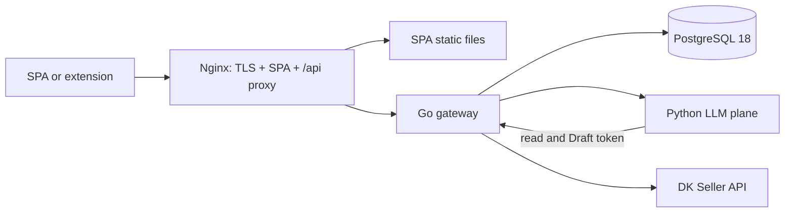

# Deployment guide

This guide covers a fresh local environment, a same-origin local integration
deployment, SPA and Chrome-extension artifacts, external-service configuration,
and the production release sequence.

> **Current release status:** local infrastructure, the same-origin integration
> topology, and the production Compose topology are available. The registry
> workflow (`.github/workflows/release.yml`) builds, Trivy-scans, and publishes
> immutable multi-platform images; `deploy/compose.prod.yml`,
> `deploy/nginx/nginx.prod.conf` (TLS termination) and `deploy/goose.Dockerfile`
> (the forward-only schema migration runner) exist and are described below.
> §6.1 explains what a release run produces and how `task release:images` turns
> it into a deployable environment file; §10 is the sequence that consumes it.
>
> Production deployment is still **not complete**: WAL backup/restore tooling
> and the production observability stack do not exist, the SPA still resolves
> its marketplace account from a build-time constant (§10 step 9b), and no
> deployment has been executed — S34 remains `pending` and gated on an explicit
> human "go". Production owner provisioning now exists (`task prod:bootstrap`).
> The extension builds and can be loaded unpacked, but its production gateway
> host permission and several runtime data seams are also unfinished. The
> readiness checklist in §9 is the authoritative list of what is and is not
> done; an unticked box is a genuine gap, not a formality.

Do not use test fixtures, the mock DK server, Mailpit, Spotlight, the seeded
owner, or any example credential in production.

## 1. Runtime shape

Production and the reliable local integration topology use one browser origin:


```mermaid
flowchart LR
    Browser[SPA or extension] --> Nginx[Nginx: TLS + SPA + /api proxy]
    Nginx --> Web[SPA static files]
    Nginx --> Core[Go gateway]
    Core --> DB[(PostgreSQL 18)]
    Core --> LLM[Python LLM plane]
    LLM -->|read and Draft token| Core
    Core --> DK[DK Seller API]
```

Nginx is the single ingress: it terminates TLS, serves the SPA, and proxies
`/api` to core, so the browser sees exactly one origin. There is no second proxy
in front of it. `deploy/nginx/nginx.prod.conf` adds the TLS listener, the
HTTP→HTTPS redirect and the ACME challenge path to the same configuration the
integration stack runs; certificates come from the one-shot `certbot` service.
The local integration topology (`compose.test.yml`) uses the same Nginx layer
with no TLS.

PostgreSQL, core, and the LLM plane publish no ports at all. The LLM plane must
never receive `DATABASE_URL`, the DK seller token, or
`CONNECTOR_ENCRYPTION_KEY`; `deploy/compose.prod.yml` omits all three from its
`environment:` block deliberately.

## 2. What you need

### Local workstation

- Docker Engine with Compose v2
- Node.js and pnpm
- Python and uv
- Go
- Task, golangci-lint, Semgrep, Goose, sqlc, River, jq, OpenSSL, curl, and zip
- Chrome 116 or newer for the MV3 extension

From the repository root:

```sh
task doctor
command -v openssl
command -v curl
command -v zip
```

`task doctor` prints every missing project tool. Install missing prerequisites,
then bootstrap the workspace:

```sh
task setup
```

### Production inputs supplied by an operator

Do not start S34 until a human has explicitly approved live deployment and
supplied all of the following:

- VPS access and a non-root deployment account
- a domain, DNS control, and public TCP ports 80 and 443
- container-registry credentials
- an isolated backup destination and its credentials
- a production PostgreSQL password and application connection URL
- a separately protected 32-byte connector encryption key
- a random LLM-to-gateway machine token
- an approved OpenAI-compatible model endpoint, key, model name, and measured
  capability set, or an explicit decision to keep the mock/provider-disabled
  behavior
- a trusted local SMTP relay address; the current mailer does not support SMTP
  authentication or implicit TLS itself
- DK application/client registration and seller authorization for each account
- the final web origin and extension distribution method

Seller access and paid model benchmarking are separate S35 live gates. They are
not prerequisites for bringing up a production topology with marketplace writes
dark and no seller account connected.

Store at least these production secrets separately and inject them only into
their named consumers:

| Secret | Consumer |
|---|---|
| PostgreSQL user/password and `DATABASE_URL` | PostgreSQL/core/migration jobs as appropriate |
| `CONNECTOR_ENCRYPTION_KEY` | core only |
| `LLM_GATEWAY_TOKEN` | core and LLM only |
| `LLM_PROVIDER_API_KEY` | LLM only |
| registry credential | CI/deployment host only |
| backup-destination credential | PostgreSQL backup job only |
| TLS certificate/ACME credential, if required | Nginx/TLS termination layer only |

DK seller access/refresh tokens are not deployment secrets: the core receives
them through the seller authorization exchange and stores them sealed.

## 3. Configuration and secrets

`task up` generates and persists safe local values automatically. To override
individual services, create a local `.env` and generate fresh values:

```sh
openssl rand -base64 32
openssl rand -hex 32
openssl rand -base64 24
```

Put the first value in `CONNECTOR_ENCRYPTION_KEY`, the second in
`LLM_GATEWAY_TOKEN`, and reserve the third as the local seeded-owner password.
The connector key must decode to exactly 32 bytes. Never rotate it without a
token re-encryption procedure: DK access and refresh tokens are sealed with this
key in PostgreSQL.

Load `.env` into the current local shell:

```sh
set -a
. ./.env
set +a
```

The file is only a local convenience. The LLM service intentionally does not
auto-load `.env`; production orchestration must inject the allowed `LLM_*`
variables explicitly.

### Core variables

| Variable | Required | Purpose |
|---|---:|---|
| `APP_ENV` | yes | `dev` disables Secure cookies; use `prod` behind HTTPS |
| `DATABASE_URL` | for full service | PostgreSQL application URL; unset serves public routes only |
| `CONNECTOR_ENCRYPTION_KEY` | for DK connector | base64-encoded 32-byte AES key for tokens at rest |
| `DK_API_BASE_URL` | recommended | local mock URL or `https://seller.digikala.com` after live approval |
| `LLM_SERVICE_URL` | for chat | internal LLM service URL; unset makes chat fail closed |
| `LLM_GATEWAY_TOKEN` | for LLM tools | shared random bearer token, read and Draft only |
| `HTTP_ADDR` | no | gateway listen address, default `:8080` |
| `LOG_LEVEL` | no | structured-log level |
| `CHAT_KILL_SWITCH` | no | disables chat globally without disabling screens |
| `CHAT_KILL_SWITCH_ACCOUNTS` | no | comma-separated account UUIDs with chat disabled |
| `SMTP_ADDR` | no | trusted SMTP relay, default `localhost:1025` |
| `NOTIFY_FROM_ADDR` | no | enables the email digest when nonempty |
| `APP_BASE_URL` | no | absolute SPA URL used in email links |
| `NOTIFY_LOCALE` | no | digest locale, default `fa-IR` |
| `NOTIFY_REGION` | no | analytics region label, default `IR` |
| `CURRENCY_CONTRACT_VERSION` | no | analytics contract label, default `v1` |
| `OTEL_ENABLED` | no | enables the Go OpenTelemetry SDK |
| `OTEL_EXPORTER_OTLP_ENDPOINT` | with OTel | OTLP/HTTP collector endpoint |
| `SENTRY_SPOTLIGHT` | dev only | local Spotlight stream; never set in production |

### LLM variables

Every LLM setting is prefixed with `LLM_`.

| Variable | Safe local value | Production meaning |
|---|---|---|
| `LLM_PROVIDER_KIND` | `mock` | `openai_compatible` only after the gated benchmark |
| `LLM_PROVIDER_BASE_URL` | ignored by mock | provider `/v1` base URL |
| `LLM_PROVIDER_API_KEY` | empty | provider secret |
| `LLM_PROVIDER_MODEL` | `mock-model` | measured model identifier |
| `LLM_PROVIDER_TIMEOUT_SECONDS` | `30` | provider timeout |
| `LLM_MAX_OUTPUT_TOKENS` | `1024` | hard response ceiling |
| `LLM_GRAPH_RECURSION_LIMIT` | `24` | graph bound |
| `LLM_TOOL_CALL_RUN_LIMIT` | `12` | per-turn total tool bound |
| `LLM_PER_TOOL_CALL_RUN_LIMIT` | `4` | per-tool bound |
| `LLM_PER_TOOL_TIMEOUT_SECONDS` | `15` | tool timeout |
| `LLM_NODE_TRANSIENT_RETRIES` | `1` | bounded transient retry |
| `LLM_CHAT_DISABLED_GLOBAL` | `false` | LLM-local chat kill switch |
| `LLM_CHAT_DISABLED_ACCOUNTS` | `[]` | JSON array of disabled account UUIDs |
| `LLM_SENTRY_SPOTLIGHT` | empty | dev-only Spotlight URL |
| `LLM_LANGSMITH_TRACING` | `false` | external trace export; requires explicit approval |
| `LLM_LANGSMITH_API_KEY` | empty | LangSmith secret |

`CI` forces LangSmith off. Never provide `DATABASE_URL` or the connector key to
the LLM container.

### Build-time browser variables

Vite substitutes these values during the build; changing them requires a new
bundle.

| Surface | Variable | Recommended value |
|---|---|---|
| SPA | `VITE_GATEWAY_BASE_URL` | `/api` behind same-origin Nginx |
| SPA | `VITE_MARKETPLACE_ACCOUNT_ID` | selected/bootstrap account UUID |
| SPA | `VITE_SENTRY_SPOTLIGHT` | local dev only; empty for production |
| extension | `VITE_GATEWAY_BASE_URL` | absolute gateway base, such as `https://ops.example.com/api` |
| extension | `VITE_WEB_BASE_URL` | absolute SPA origin |

Vite variables are public. Never put a database password, provider API key,
seller token, connector key, or LLM gateway token in a `VITE_*` variable.

## 4. Local development: infrastructure and hot reload

The one-command path starts infrastructure, initializes an existing or fresh
local database non-destructively, generates stable dev-only credentials, and
runs the browser surfaces through a same-origin Vite proxy:

```sh
task up
```

No `.env` file or manual export is required. Optional `.env` values override
local defaults. Open `http://localhost:5173` after the ready message; the local
owner password is stored at `tmp/dev-owner-password` with mode `0600`. The Vite
development server uses it only server-side to establish an HTTP-only browser
session after the first protected 401; it is not embedded in client JavaScript.

The remaining steps in this section are useful when running each service
individually instead.

1. Start PostgreSQL, the DK mock, telemetry, Mailpit, and Spotlight:

   ```sh
   task dev
   ```

2. Reset and migrate the disposable development database:

   ```sh
   task db:reset
   ```

   This drops and recreates the database named by `DATABASE_URL`. Confirm that
   it points to a disposable local database before running it.

3. Optionally create the test-only owner password:

   ```sh
   export SEEDE2E_EMAIL=owner@dev.local
   export SEEDE2E_PASSWORD='<generated local password>'
   cd services/core
   go run ./cmd/seede2e
   cd ../..
   ```

   `cmd/seede2e` is for local and CI environments only. It is not a production
   account-provisioning mechanism.

4. Run individual processes when working on one plane:

   ```sh
   cd services/llm
   LLM_PROVIDER_KIND=mock uv run uvicorn llm.asgi:app --app-dir src --host 127.0.0.1 --port 8100 --reload
   ```

   In another terminal:

   ```sh
   cd services/core
   APP_ENV=dev \
   DATABASE_URL="$DATABASE_URL" \
   CONNECTOR_ENCRYPTION_KEY="$CONNECTOR_ENCRYPTION_KEY" \
   DK_API_BASE_URL=http://localhost:8090 \
   LLM_SERVICE_URL=http://localhost:8100 \
   LLM_GATEWAY_TOKEN="$LLM_GATEWAY_TOKEN" \
   go run ./cmd/core
   ```

   Component work on the SPA can use:

   ```sh
   task ts:dev
   ```

5. Inspect local dependencies:

   | Service | URL |
   |---|---|
   | DK mock | `http://localhost:8090` |
   | Mailpit | `http://localhost:8025` |
   | Grafana | `http://localhost:3000` |
   | Prometheus | `http://localhost:9090` |
   | Spotlight | `http://localhost:8969` |

   All of these bind to `127.0.0.1` only (loopback) by default, so the dev stack
   is not exposed to the LAN. Set `DK_DEV_BIND_IP=0.0.0.0` to deliberately expose
   them. Grafana anonymous admin is disabled: log in as `admin` with the password
   `task dev` / `task up` writes to `tmp/dev-grafana-admin-password` (mode 0600),
   or provide your own via `GF_SECURITY_ADMIN_PASSWORD`.

`task up` configures Vite to proxy `/api` to the core and strip the prefix,
matching the local Nginx integration route without requiring core CORS.

Stop the infrastructure without deleting its named volumes:

```sh
docker compose -f deploy/compose.dev.yml down
```

Add `-v` only when you deliberately want to delete the local database and all
other named dev volumes.

## 5. Local same-origin deployment: SPA, core, LLM, and DK mock

This is the closest runnable local equivalent to the planned production shape.
It serves the built SPA and `/api` through Nginx at one origin.

1. Stop the dev stack if it is using local PostgreSQL port 5432:

   ```sh
   docker compose -f deploy/compose.dev.yml down
   ```

2. Generate and export the disposable seeded-owner credential:

   ```sh
   export SEEDE2E_EMAIL=owner@dev.local
   export SEEDE2E_PASSWORD='<generated local password>'
   ```

3. Build the SPA with its default same-origin `/api` base:

   ```sh
   env -u VITE_GATEWAY_BASE_URL pnpm --filter @market-ops/web build
   ```

   The output is `apps/web/dist/`.

4. Validate the resolved Compose configuration:

   ```sh
   docker compose -f deploy/compose.test.yml config --quiet
   ```

5. Start the stack and wait for health checks:

   ```sh
   docker compose -f deploy/compose.test.yml up -d --wait postgres mockdk llm core nginx
   docker compose -f deploy/compose.test.yml ps
   ```

   The one-shot `migrate` service resets the disposable database, applies Goose
   and River migrations, loads development fixtures, and assigns the password
   from step 2.

6. Verify the gateway and SPA:

   ```sh
   curl -fsS http://localhost:8888/api/healthz
   curl -fsS http://localhost:8888/
   ```

7. Open `http://localhost:8888/`. The SPA routes unauthenticated browsers to
   `/login`; sign in with the disposable owner credential from step 2. The
   authed layout resolves `GET /auth/me` before any protected screen mounts
   (issue #168), so the session is established through the normal UI rather
   than a console workaround.

8. In onboarding, submit any nonempty authorization code. The local DK mock
   accepts it and returns offline test tokens. Do not use a real seller code in
   this topology.

9. Diagnose failures with:

   ```sh
   docker compose -f deploy/compose.test.yml logs core llm mockdk migrate nginx
   ```

10. Stop and delete the disposable integration database:

    ```sh
    docker compose -f deploy/compose.test.yml down -v
    ```

    This intentionally destroys the integration database.

To run the repository’s complete cross-plane verification instead of keeping a
manual stack alive:

```sh
task test:integration
```

The test command tears its stack down when it finishes.

## 6. Build release artifacts

Run the pre-merge gates before treating any output as releasable:

```sh
task ci:local
task test:integration
```

Then build every plane:

```sh
task build:all
```

Expected outputs:

| Artifact | Output |
|---|---|
| Go core | `services/core/bin/core` |
| Python LLM | wheel under the repository `dist/` directory |
| SPA | `apps/web/dist/` |
| unpacked Chrome extension | `apps/extension/dist/` |
| zipped Chrome extension | `apps/extension/build/market-ops-extension.zip` |

These local artifacts are not a substitute for immutable production images. A
production deployment never builds anything on the host: it consumes images the
release pipeline already built, scanned, attested and pushed.

`task images:build` and `task images:validate` build the same four Dockerfiles
locally for inspection (non-root user, expected entrypoint, OCI labels, no baked
secrets, forward-only goose entrypoint/command). They produce
`market-ops-*:local` tags that are never deployed.

### 6.1 The container-release pipeline and what it hands you

`.github/workflows/release.yml` ("container release") is the only producer of
deployable images. It has three jobs:

| Job | What it does |
|---|---|
| `validate release metadata` | Derives `version`, `revision`, `sha8`, `created`. On a tag push it enforces strict semver and refuses a tag whose commit is not reachable from `origin/main`. Sets `publish=true` only there. |
| `build and scan` (8 matrix jobs) | Builds core, llm, nginx and goose for `linux/amd64` and `linux/arm64` with `push: false`, then fails on any HIGH or CRITICAL Trivy finding. |
| `publish immutable multi-platform images` | Runs only when `publish=true`. Logs in to GHCR *after* every scan passes, refuses to overwrite an existing `:<version>` or `:git-<sha8>` tag, pushes multi-arch manifests with SBOM and `provenance: mode=max`, and uploads the digests. |

Read a run the way its summary page shows it. Eight green `build and scan` jobs
with the `publish immutable multi-platform images` job **skipped** is the normal
and correct outcome for a pull request: the code builds clean on both
architectures and carries no HIGH/CRITICAL vulnerabilities — and **no images
exist**. Nothing from that run is deployable, and the artifacts it uploaded are
Docker build records, not image digests. Only a strict-semver `v*` tag pushed on
a commit reachable from `origin/main` publishes:

```sh
git tag v0.1.0
git push origin v0.1.0
```

The publish job's last step writes one file, `images.env`, and uploads it as the
artifact `image-digests-<version>` (retained 90 days):

```text
CORE_IMAGE=ghcr.io/mhosseinab/market-ops-core@sha256:...
LLM_IMAGE=ghcr.io/mhosseinab/market-ops-llm@sha256:...
NGINX_IMAGE=ghcr.io/mhosseinab/market-ops-nginx@sha256:...
GOOSE_IMAGE=ghcr.io/mhosseinab/market-ops-goose@sha256:...
```

Those four variables are exactly the four `deploy/compose.prod.yml` requires, so
the deployment reduces to "point the env file at these digests, then start the
stack". `task release:images` moves them across; nothing is retyped:

```sh
export ENVFILE=/etc/market-ops/prod.env

# preferred — pull the artifact from the successful release run for the tag
task release:images -- --tag v0.1.0 --env-file "$ENVFILE"

# no GitHub CLI on the host — download images.env from the Actions UI, pass it
task release:images -- --from ~/images.env --env-file "$ENVFILE"

# artifact expired (>90 days) or unavailable — resolve the digests from GHCR
task release:images -- --resolve v0.1.0 --env-file "$ENVFILE"
```

All three modes end in the same place: the four `*_IMAGE` lines in `$ENVFILE`
are replaced in place, every other line is left untouched, and the file's mode
is preserved. The tool refuses any reference that is not
`ghcr.io/<owner>/market-ops-<component>@sha256:<64 hex>` — a tag can be moved
after the scan that approved it, so a tag is not a deployable reference. It also
saves the digests it replaced to `$ENVFILE.prev-images`, which is what
`task prod:rollback` reads.

Before starting anything, prove the pinned digests are still fetchable:

```sh
task release:images:check
```

The human-readable tags (`:<version>` and `:git-<sha8>`) exist for browsing
GHCR. Deploy by digest, never by tag and never `latest`.

### 6.2 One-time host preparation

Do this once per host, before the first release:

```sh
sudo install -d -m 0750 -o "$USER" -g "$USER" /etc/market-ops
install -m 0600 deploy/.env.prod.example /etc/market-ops/prod.env
export ENVFILE=/etc/market-ops/prod.env
```

Fill in every non-`*_IMAGE` value in `$ENVFILE` by hand (§3 and §10 step 5);
`task release:images` owns the four image lines from then on. Keep `$ENVFILE`
outside the checkout and readable only by the deployment account — a `git pull`
must never be able to touch it.

## 7. Build and install the Chrome extension

### Local installable bundle

1. Select the absolute gateway and web URLs for the bundle:

   ```sh
   VITE_GATEWAY_BASE_URL=http://localhost:8888/api \
   VITE_WEB_BASE_URL=http://localhost:8888 \
   pnpm --filter @market-ops/extension build
   ```

2. Confirm both artifacts exist:

   ```sh
   test -f apps/extension/dist/manifest.json
   test -f apps/extension/build/market-ops-extension.zip
   unzip -t apps/extension/build/market-ops-extension.zip
   ```

3. In Chrome, open `chrome://extensions`, enable **Developer mode**, click
   **Load unpacked**, and select `apps/extension/dist/`.

4. Reload the extension after every rebuild.

### Pairing flow

After logging into the SPA, a pairing code can be requested from the browser
console and entered in the extension popup:

```js
await (
  await fetch("/api/ext/pairing/code", {
    method: "POST",
  })
).json();
```

### Extension blockers that must be fixed before functional release

The current bundle is installable. The manifest is correctly scoped at build
time — `apps/extension/scripts/manifest.mjs` injects the gateway origin from
`VITE_GATEWAY_BASE_URL` into `host_permissions`, fails closed (build aborts) if
it is unset, empty, or wider than one concrete HTTPS host, and is pinned by
`apps/extension/src/lib/manifest-gen.test.ts`. The remaining operational gaps
are server-backed:

- the confirmed-owned-target index starts empty and has no production sync
  producer, so capture correctly fails closed
- watchlist, overlay/history reads, and scheduled allocation still use
  fail-closed adapters

A production extension build supplies the real HTTPS gateway origin via
`VITE_GATEWAY_BASE_URL`; least-privilege scoping is then enforced by the build
itself. Wire and test the remaining server-backed adapters before calling the
extension functional.

## 8. External services

### DK Seller API

Local and CI environments use `http://localhost:8090`. Production uses the
frozen contract’s server `https://seller.digikala.com` only after live approval.

The operator does **not** paste DK access or refresh tokens into environment
variables or the extension. The seller completes the DK authorization flow; the
core exchanges the returned authorization code and seals the resulting tokens in
PostgreSQL with `CONNECTOR_ENCRYPTION_KEY`.

Capabilities begin `Unknown`. Keep catalog-dependent behavior and marketplace
writes disabled until the S35 probes verify each capability for each account.
Every live price-write probe requires separate human approval.

### OpenAI-compatible model provider

Local, tests, and CI use `LLM_PROVIDER_KIND=mock` and make no paid calls. After
the S35 benchmark selects an approved endpoint:

```text
LLM_PROVIDER_KIND=openai_compatible
LLM_PROVIDER_BASE_URL=https://provider.example/v1
LLM_PROVIDER_API_KEY=<secret-store reference/value>
LLM_PROVIDER_MODEL=<qualified model>
```

Keep model credentials only in the LLM service. The current LLM tool registry
still contains unavailable stub runners for real gateway reads and Drafts, so
provider connectivity alone does not make conversational tools operational.
That wiring must be completed and covered by cross-boundary tests first.

### SMTP

For local email capture:

```text
SMTP_ADDR=localhost:1025
NOTIFY_FROM_ADDR=market-ops@dev.local
```

Read messages at `http://localhost:8025`. In production, point `SMTP_ADDR` at a
trusted loopback/private relay that accepts unauthenticated plain SMTP from the
core network. Direct use of an authenticated public SMTP provider is currently
unsupported and needs a mailer/relay implementation before deployment.

### Observability

Local services are provided by `deploy/compose.dev.yml`. For core export:

```text
OTEL_ENABLED=true
OTEL_EXPORTER_OTLP_ENDPOINT=http://localhost:4318
```

Spotlight is local-only. LangSmith exports prompts and completions to an external
service and remains disabled unless that data transfer is explicitly approved.
The production OTel, metrics, logs, traces, alerting, retention, and access
control topology is part of the missing S34 deployment work.

## 9. Production readiness gate

All boxes below must be satisfied before the first live deployment:

- [ ] explicit human S34 “go” recorded
- [x] `deploy/compose.prod.yml` authored
- [ ] `deploy/compose.prod.yml` reviewed by a human operator
- [x] pinned, immutable core and LLM production images authored
- [x] core image runs as non-root with a minimal/distroless runtime
      (`gcr.io/distroless/static-debian12:nonroot`, `USER nonroot:nonroot`)
- [x] LLM image installs from the uv lock without editable source mounts
      (`uv sync --frozen --no-dev --package market-ops-llm --no-editable`)
- [x] production Nginx configuration serves the SPA and proxies `/api`
- [x] TLS termination and certificate renewal are configured for Nginx
      (`deploy/nginx/nginx.prod.conf`; certificates issued and renewed by the
      one-shot `certbot` service, persisted in the `letsencrypt` volume)
- [ ] the TLS configuration has been exercised against the real domain
- [x] production Nginx configuration exposes the `/healthz` probe
- [x] PostgreSQL 18 mounts `/var/lib/postgresql`, not the legacy
      `/var/lib/postgresql/data` path
- [x] a forward-only application-schema migration runner exists
      (`deploy/goose.Dockerfile`; goose v3.27.2, entrypoint `goose`, command
      `up`) and is wired as a one-shot `migrate` service that core waits on
- [ ] WAL archiving targets an isolated destination
- [ ] backup retention and a scratch restore drill are implemented
- [x] CI builds, scans, and attests (SBOM + `provenance: mode=max`), and pushes
      immutable tags that it refuses to overwrite
- [x] the release run's digests reach `$ENVFILE` through a checked tool rather
      than a copy-paste (`task release:images`; digest-only validation and the
      fail-closed paths are pinned by `tools/deploy/release_images_test.sh`,
      which runs in `task test:all`)
- [ ] the production observability stack is deployed (`compose.prod.yml` ships
      no collector; keep `OTEL_ENABLED=false` until it does)
- [x] production user bootstrap/invitation is implemented without `seede2e`
      (`core bootstrap-owner` / `task prod:bootstrap`; transactional, idempotent,
      rotation revokes live sessions; proven by
      `services/core/cmd/core/bootstrap_db_test.go`)
- [ ] the SPA resolves its marketplace account at runtime rather than from the
      build-time `VITE_MARKETPLACE_ACCOUNT_ID` / dev seed fallback (§10 step 9b)
- [ ] authenticated SMTP relay support is implemented or a trusted local relay
      is provisioned
- [ ] LLM gateway read/Draft tool runners are wired
- [ ] the core assembles every production-required catalog, identity, and
      observation adapter
- [ ] SPA production build passes `assert:prod-clean`
- [x] extension manifest generation includes the exact gateway host
      (`apps/extension/scripts/manifest.mjs` injects `VITE_GATEWAY_BASE_URL`
      into `host_permissions` at build time and fails closed on a missing or
      wider-than-one-host grant; pinned by `manifest-gen.test.ts`)
- [ ] extension target sync and server-backed adapters are complete
- [ ] `task ci:local` and `task test:integration` pass on the release commit
- [ ] rollback rehearsal and database migration policy are reviewed

## 10. Production deployment sequence

> For a single Debian 12 VPS with Docker already installed,
> [`docs/runbook-first-production-deploy.md`](docs/runbook-first-production-deploy.md)
> is the keystroke-level companion to this section: firewall, DNS, secrets,
> digest pinning, certificate issuance, bootstrap, verification and renewal, in
> order, with the raw `docker compose` equivalent beside every task wrapper.


The Compose topology, TLS ingress, and migration runner these steps use now
exist; the backup, observability, and user-bootstrap steps still reference work
that does not. Keep `<release>`, `<domain>`, and paths explicit; deploy by
digest, never by tag and never `latest`.

Every step below runs from a checkout of the release commit on the deployment
host, against a single environment file kept outside that checkout (§6.2). Set
it once per shell:

```sh
export ENVFILE=/etc/market-ops/prod.env
```

The `task prod:*` commands each read `$ENVFILE` and `deploy/compose.prod.yml`,
and fail closed when `ENVFILE` is unset or unreadable. The raw equivalent, if
you prefer to drive Compose directly or need a flag these wrappers do not pass:

```sh
export COMPOSE="docker compose --env-file $ENVFILE -f deploy/compose.prod.yml"
```

Compose refuses to start with a required value unset — each one fails the parse
with a named message rather than booting a half-wired stack.

At a glance, the whole sequence on an already-provisioned host is:

```sh
export ENVFILE=/etc/market-ops/prod.env
task release:images -- --tag v0.1.0 --env-file "$ENVFILE"   # step 2
task release:images:check                                   # step 2
task prod:certs:issue                                       # step 4, first release only
task prod:config                                            # step 6
task prod:migrate:status && task prod:migrate               # step 9
task prod:bootstrap                                         # step 9b, first time only
task prod:up                                                # step 10
```

The numbered steps below are the gates around those commands. Do not collapse
them: steps 1, 3, 5, 7, 8, 11 and 12 are the reason the sequence is safe.

1. **Record authorization.** Record the human go/no-go, release commit, intended
   immutable image tags, maintenance window, operator, and rollback owner.

2. **Publish the release, then pin it.** Run CI on the exact release commit,
   then publish by pushing a strict-semver tag reachable from `origin/main`:

   ```sh
   git tag v0.1.0 && git push origin v0.1.0
   ```

   The workflow builds core, LLM, Nginx (which bakes the SPA with
   `VITE_GATEWAY_BASE_URL=/api`) and the goose migration runner for amd64 and
   arm64, blocks on HIGH/CRITICAL Trivy findings, and pushes immutable tags.
   Wait for the `publish immutable multi-platform images` job to go green — if
   it was skipped, no images exist and there is nothing to deploy (§6.1).

   Then, on the deployment host, pull the run's digests into the env file and
   confirm they resolve:

   ```sh
   task release:images -- --tag v0.1.0 --env-file "$ENVFILE"
   task release:images:check
   ```

   `--from ~/images.env` (manual artifact download) and `--resolve v0.1.0`
   (registry lookup) are the fallbacks when the host has no GitHub CLI or the
   artifact has expired. Record the four printed digests in the handoff (§12);
   they are the release's identity, and the rollback in §11 needs them.

3. **Provision the host.** Patch the OS, create a non-root deploy account,
   install Docker/Compose, allow inbound 22 from approved operator networks and
   80/443 publicly, and deny public access to PostgreSQL, core, LLM, SMTP relay,
   and telemetry backends.

4. **Configure DNS, then issue the certificate.** Point the domain’s A/AAAA
   records at the VPS and verify resolution *before* the first `up`. Nginx will
   not start without a certificate on disk, so issue one first with port 80 free:

   ```sh
   task prod:certs:issue
   ```

   That reads `DK_DOMAIN` and `DK_ACME_EMAIL` from `$ENVFILE` and runs:

   ```sh
   $COMPOSE run --rm --service-ports certbot certonly --standalone \
     --cert-name market-ops -d "$DK_DOMAIN" \
     --email "$DK_ACME_EMAIL" --agree-tos --no-eff-email
   ```

   `--cert-name market-ops` is required, not cosmetic: it fixes the live
   directory to a domain-independent path that `nginx.prod.conf` names as a
   literal. The Nginx image sets its own `ENTRYPOINT`, so the base image's
   envsubst step never runs and a templated path would not be expanded.

   Renew from cron, using the webroot the running Nginx already serves on
   port 80:

   ```sh
   task prod:certs:renew
   # = $COMPOSE run --rm certbot renew --webroot -w /var/www/certbot
   #   $COMPOSE exec nginx nginx -s reload
   ```

   The `letsencrypt` volume holds the issued certificates and the ACME account
   key: back it up with the database, and never delete it casually — re-issuing
   burns the Let's Encrypt rate limit for that hostname.

5. **Install secrets.** Fill in every non-`*_IMAGE` value in `$ENVFILE`
   (§6.2), owned by the deployment account and readable only by it. Split
   secrets so the LLM environment receives only provider settings and its
   gateway token. Keep the connector key separately backed up; never print
   resolved Compose config into shared logs because it may contain secrets.

6. **Validate configuration.** On the host, on a checkout of the exact release:

   ```sh
   task prod:config          # = $COMPOSE config --quiet
   ```

   This exits non-zero and names the first missing variable rather than booting
   a half-wired stack. Review image digests, mounts, networks, health checks,
   restart policies, resource limits, and secret-file paths — reading the
   rendered config privately with `$COMPOSE config` if you need to. Do not print
   the resolved config into a shared log: it contains every substituted secret,
   which is why the task deliberately prints only pass/fail.

7. **Prepare PostgreSQL.** Mount one persistent volume at
   `/var/lib/postgresql` for PostgreSQL 18’s major-version directory layout.
   Configure WAL archiving to the isolated backup destination, verify upload,
   and take a pre-deploy backup.

8. **Prove restore before launch.** Restore the backup into a scratch PostgreSQL
   instance, run integrity checks, and preserve the drill log. A backup that has
   not been restored is not release evidence.

9. **Run migrations once.** The `migrate` service applies the Goose application
   schema as a one-shot job; core waits on it via
   `condition: service_completed_successfully`, and River's own job-queue schema
   is applied by `cmd/core` at boot. To run it ahead of the stack and read the
   log before anything serves traffic:

   ```sh
   task prod:migrate:status   # = $COMPOSE run --rm migrate status
   task prod:migrate          # = $COMPOSE run --rm migrate up
   ```

   `deploy/goose.Dockerfile` can only migrate forward: its entrypoint is goose
   and its command is `up`. Re-running `up` on an already-migrated database is a
   no-op that preserves data. Never run `task db:reset` in production — that is
   `deploy/migrate.Dockerfile`, the integration-stack image, and it **drops the
   database** and loads development fixtures.

9b. **Create the first owner.** A migrated database has schema and no rows: no
    user, no organization, no marketplace account. The gateway exposes no
    signup or invite route, so without this step the SPA reaches `/login` and
    stops. Run the one-shot provisioning command once per environment:

    ```sh
    task prod:bootstrap
    ```

    It prompts for the password with echo disabled — the owner credential never
    reaches shell history, `$ENVFILE`, or `docker compose config` output. The
    other inputs come from `$ENVFILE`: `BOOTSTRAP_OWNER_EMAIL`,
    `BOOTSTRAP_ORG_NAME`, `BOOTSTRAP_ACCOUNT_NATIVE_ID` and optionally
    `BOOTSTRAP_ACCOUNT_DISPLAY_NAME`.

    Under the hood this runs the same digest-pinned core image with the
    `bootstrap-owner` argument (`services/core/cmd/core/bootstrap.go`) — the
    only way to reach a second command inside a distroless image with no shell.
    It creates the organization, one `owner` user, the argon2id credential and
    the organization's marketplace account **in one transaction**, so a failure
    partway through leaves nothing behind.

    It is idempotent and deliberately unsurprising: re-running reports the
    existing identifiers and changes nothing. To rotate that owner's password
    later, set `BOOTSTRAP_ROTATE_PASSWORD=true` in `$ENVFILE` and re-run — the
    rotation also revokes every live session for that user, so cookies issued
    with the old password stop working immediately.

    Record the printed `organization`, `user` and `marketplaceAccount` ids in
    the handoff (§12). Never use `cmd/seede2e` here: it is test/CI-only, defaults
    to the `owner@dev.local` fixture identity, creates no marketplace account,
    runs outside a transaction, and is not compiled into any published image.

    > **Known gap — account-scoped screens.** The published Nginx image bakes
    > `VITE_GATEWAY_BASE_URL=/api` but not `VITE_MARKETPLACE_ACCOUNT_ID`
    > (`deploy/nginx/Dockerfile`), so `apps/web/src/data/account.tsx` falls back
    > to the dev seed UUID `00000000-0000-0000-0000-000000000003`. After
    > bootstrap you can sign in and the shell loads, but account-scoped screens
    > query an account that does not exist in this database. Two ways out:
    > return the id from the server on `SessionInfo` (the correct fix — the
    > server already has `db.GetMarketplaceAccountByOrganization`, and
    > `marketplace_accounts.organization_id` is UNIQUE, so the session's
    > `organizationId` determines it), or rebuild and republish the Nginx image
    > with `VITE_MARKETPLACE_ACCOUNT_ID` set to the id this step printed. Until
    > one of those lands, treat the deployment as infrastructure-verified, not
    > feature-complete.

10. **Start the stack.** Compose ordering brings up PostgreSQL, then migrations,
    then core and the LLM plane, then Nginx:

    ```sh
    task prod:up               # = $COMPOSE up -d --wait ; $COMPOSE ps
    ```

    `--wait` blocks on health checks. Note that `core` has no container health
    check — it is distroless with no shell to run one. The Nginx health check
    calls `/api/healthz`, which proxies through to core, so a healthy Nginx
    proves the whole edge→gateway path rather than merely that a process
    started.

11. **Verify TLS and same-origin routing.** From outside the VPS:

    ```sh
    curl -fsS https://<domain>/healthz
    curl -fsS https://<domain>/api/healthz
    curl -fsSI https://<domain>/
    ```

    Verify Secure session cookies, SPA history fallback on a deep link, security
    headers, no mixed content, and that core/LLM/PostgreSQL ports are not public.

12. **Run non-live smoke tests.** Sign in as the owner created in step 9b.
    Verify login, screen reads, chat
    kill-switch behavior, notification storage, telemetry, and email relay. Do
    not connect a seller account or perform a marketplace write during S34.

13. **Publish the extension only after its blockers close.** Build it with the
    production HTTPS URLs, inspect `dist/manifest.json`, install the unpacked
    candidate, pair it, verify credential revocation and confirmed-owned-target
    capture, then distribute the exact reviewed zip through the chosen managed
    or store channel.

14. **Observe and close the window.** Check error rate, latency, job failures,
    database/WAL health, certificate status, and backup delivery. Record the
    deployment result and restore evidence.

15. **Run S35 separately.** With another explicit human go, connect at least
    three production seller accounts, execute capability and data-quality
    probes, benchmark the approved paid model, and record every measured
    threshold. Marketplace writes remain recommend-only unless the relevant
    account and region gates pass; every reversible write probe is individually
    approved.

## 11. Rollback and recovery

Before deployment, record the previous release's immutable image digests and
whether each database migration has a safe down path.

Rolling the application back is a digest swap, and `task release:images` already
kept the previous digests: it wrote them to `$ENVFILE.prev-images` when it
installed the current release.

```sh
task prod:rollback
```

That restores the four previous digests and re-runs `up -d --wait`. It changes
images only — it does not touch the schema. If `$ENVFILE.prev-images` is missing
(the first release, or an env file edited by hand), pin the previous version
explicitly instead:

```sh
task release:images -- --tag <previous-version> --env-file "$ENVFILE"
task prod:up
```

Note that a rollback itself rewrites `$ENVFILE.prev-images` with the digests it
just replaced — the failed release. That is how you roll forward again after a
fix, but it means the snapshot is one step deep, not a history. The release
handoff record (§12) is the durable list.

If the release fails:

1. stop further rollout and enable the global chat kill switch if the problem is
   isolated to chat
2. keep marketplace writes dark; revoke extension credentials if capture is
   implicated
3. collect core, LLM, Nginx, job, and migration logs without logging secrets
   (`task prod:logs`, or `task prod:logs -- core migrate` for one plane)
4. run `task prod:rollback` to restore the previous release's digests and
   restart the stack
5. roll back schema only when the reviewed migration policy says the down path
   is safe; otherwise roll the application forward with a compatibility fix.
   The `migrate` image cannot do this for you: it is forward-only by
   construction, so a schema rollback is a deliberate, separately approved
   operation
6. repeat the health/TLS/smoke checks from steps 10–12
7. restore PostgreSQL to a new instance only for corruption or an explicitly
   approved point-in-time recovery; preserve the failed instance for diagnosis
8. record the incident, operator decisions, data-loss window, and follow-up work

Rotation of `LLM_GATEWAY_TOKEN` requires updating core and LLM atomically.
Rotation of `CONNECTOR_ENCRYPTION_KEY` requires a designed re-encryption process;
changing the value alone makes stored DK tokens unreadable.

## 12. Final handoff record

For every deployed release, retain:

- release commit and the four immutable image digests — capture them with
  `task release:images -- --tag <version> --print`, which prints the exact
  `*_IMAGE` lines without writing anything. `$ENVFILE.prev-images` holds only
  the single previous release, so this record is the durable rollback history
- redacted Compose validation result
- CI and integration-test results
- migration log and schema version
- TLS health and external smoke-test output
- backup object identifier and scratch restore-drill output
- previous-image rollback rehearsal result
- extension zip checksum and reviewed manifest permissions
- human go/no-go records for S34 and, separately, S35
- measured capability/model/region configuration applied during S35

The binding release gates remain in
`docs/implementation/dk-p0-implementation-steps.md` (S34–S36) and
`CLAUDE.md`. This guide does not waive them.

## References

- [Docker Compose production guidance](https://docs.docker.com/compose/how-tos/production/)
- [NGINX HTTPS server configuration](https://nginx.org/en/docs/http/configuring_https_servers.html)
- [Chrome: load an unpacked extension](https://developer.chrome.com/docs/extensions/get-started/tutorial/hello-world)
- [Chrome extension host permissions](https://developer.chrome.com/docs/extensions/develop/concepts/declare-permissions)
- [Chrome extension cross-origin network requests](https://developer.chrome.com/docs/extensions/develop/concepts/network-requests)
