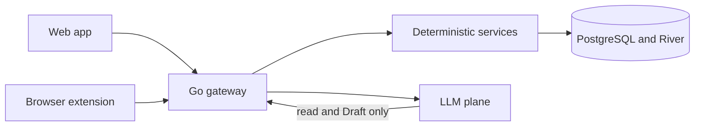
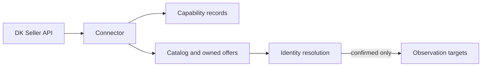
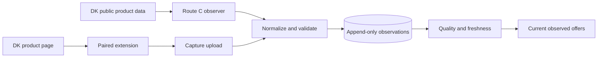
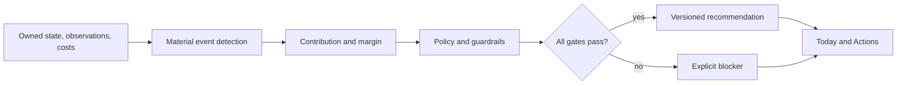
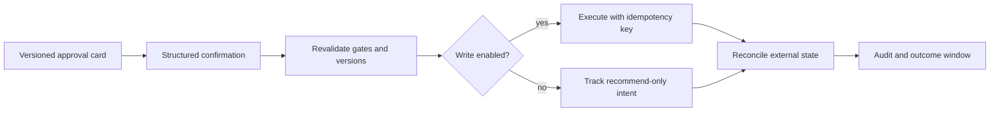
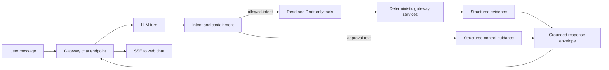
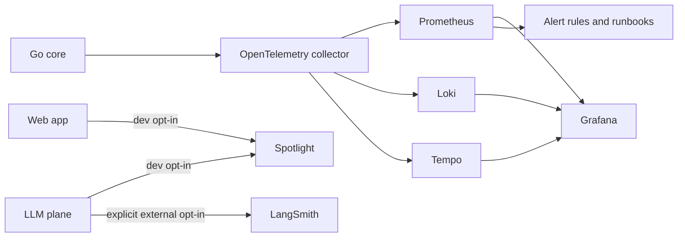
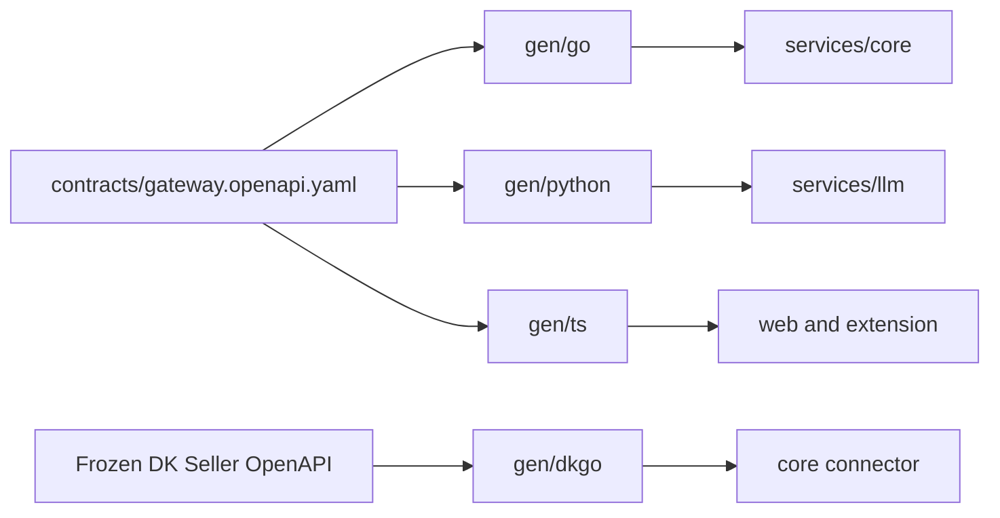

# market-ops

Marketplace intelligence and controlled pricing operations for professional Digikala sellers.

The product combines a Persian-first web application and browser extension with a deterministic Go core. It collects owned-catalog and public-market evidence, resolves product identity, detects material changes, evaluates contribution and pricing policy, prepares versioned actions, and tracks those actions through reconciliation and outcome measurement.

The conversational layer explains and prepares work; it does not own money calculations, policy, approval, or execution.

## Runtime boundaries

| Boundary | Path | Responsibility |
|---|---|---|
| Deterministic core | `services/core` | Gateway, domain rules, persistence, jobs, DK adapters, approval, execution, audit, and outcomes |
| LLM plane | `services/llm` | Intent routing, grounded explanation, typed response composition, and read/Draft-only tools |
| Web application | `apps/web` | Persian-first structured workflows and the persistent chat dock |
| Browser extension | `apps/extension` | Scoped capture from supported DK product pages, watchlists, and observe-only overlays |
| Shared locale | `packages/locale` | fa-IR/en catalogs, digits, Jalali display, money formatting, freshness labels, and pseudo-localization |
| Gateway contracts | `contracts` and `gen` | Hand-authored OpenAPI source and committed generated Go, Python, and TypeScript artifacts |
| Data and jobs | PostgreSQL + River | System of record, append-only evidence/action history, and background processing |
| Operations | `deploy`, `runbooks`, `tools/obs` | Local infrastructure, telemetry, dashboards, alerts, and recovery procedures |

The browser talks only to the Go gateway. The LLM service is internal and has no database credential. It calls the gateway with a machine principal limited to reads and terminal Draft creation.



## Data flows

### 1. Owned catalog and capability state

The official seller connector supplies owned state. Capabilities start `Unknown`; downstream behavior stays disabled until a capability is explicitly verified.



Relevant modules: `connector`, `catalog`, `identity`, and `observation` in `services/core/internal`.

### 2. Market evidence ingestion

Route C is the controlled server observer. Route B is the paired browser extension. Both preserve raw evidence and enter the same server-authoritative normalization and quality pipeline.



Only confirmed owned targets enter the commercial observation path. Ambiguous identity, money units, parser output, or conflicting evidence is quarantined rather than inferred.

Relevant modules: `routec`, `normalize`, `observation`, `pairing`, and `watchlist` in the core; `content`, `background`, and `lib` in the extension.

### 3. Evidence to recommendation

The decision path combines owned state, market evidence, and versioned costs. Numeric financial values come from deterministic services, never from the UI or model.



Relevant modules: `money`, `cost`, `margin`, `event`, `policy`, `guardrail`, `recommendation`, and `approval`.

### 4. Approval to measured outcome

Approval is a structured, version-bound control. Free-text agreement changes no state. Every confirmation revalidates current parameters and context before the action can advance.



Marketplace writes are dark by default. They require a verified `price_write` capability and an explicit region enablement; otherwise the same action is tracked in recommend-only mode.

Relevant modules: `approval`, `execution`, `reconcile`, `audit`, and `outcome`.

### 5. Conversational turn

The Go gateway owns the browser session and streams the final response. The LLM plane operates on JSON-safe turn state, uses typed reads and Draft-only tools, and returns a validated evidence envelope.



If the model, a tool, or response validation fails, chat returns a structured failure and a deep link to the equivalent screen. Structured workflows remain available when chat is disabled.

### 6. Telemetry and operations



Operational recovery guides live in [`runbooks/`](runbooks/README.md); dashboard sources and alert rules live under `deploy/`. Spotlight and LangSmith are disabled unless explicitly configured, and LangSmith remains disabled in CI.

## Module guide

### Go core

`services/core/cmd/core` assembles one process. Domain code is grouped under `services/core/internal`:

| Group | Modules | What they own |
|---|---|---|
| Runtime boundary | `httpapi`, `auth`, `perm`, `config`, `db`, `jobs`, `log`, `obs` | Generated API implementation, sessions and permissions, configuration, sqlc access, River workers, logs, metrics, and traces |
| Acquisition | `connector`, `catalog`, `identity`, `normalize`, `observation`, `routec`, `pairing`, `watchlist` | DK access, owned records, identity state, public evidence, extension credentials, and collection scope |
| Economics and decisions | `money`, `cost`, `margin`, `event`, `policy`, `guardrail`, `recommendation`, `approval` | Exact money arithmetic, cost profiles, contribution, event ranking, policy order, action parameters, and versioned controls |
| Action lifecycle | `execution`, `reconcile`, `audit`, `outcome` | Idempotent attempts, external-state reconciliation, append-only audit, and measured outcomes |
| Operator support | `briefing`, `notify`, `analytics` | Daily briefings, in-app/email notifications, and typed product analytics |

Database sources are split between reversible Goose migrations in `services/core/migrations` and sqlc queries in `services/core/queries`. Generated query code lives in `services/core/internal/db` and is not edited directly.

Supporting commands under `services/core/cmd` provide the offline DK mock, capability probes, deterministic integration seeding, and margin reconciliation.

### Python LLM plane

| Path | Responsibility |
|---|---|
| `orchestrator` | Bounded LangGraph turn execution and structured failure mapping |
| `intents` | Intent classification and normalization |
| `contextres` | Deterministic account/entity/context resolution |
| `tools` | Allowlisted read and Draft-only tool registry |
| `flows` | Briefing, investigation, simulation, blocker, monitoring, and action-preparation flows |
| `envelope` | Evidence grounding and response-schema validation |
| `providers` | Mock and OpenAI-compatible model transport boundary |
| `evals` and `fixtures/evals` | Offline evaluation harness and adversarial datasets |

The service exposes FastAPI health, registry, and streaming chat endpoints. Its default provider is the deterministic local mock; external model calls require explicit environment configuration.

### TypeScript surfaces

- `apps/web/src/screens` contains Today, Products, Market, Actions, Settings, Operations, onboarding, cost, review, and recommendation views.
- `apps/web/src/chat` contains the dock, SSE transport, evidence rendering, and structured card hosts.
- `apps/web/src/data` wraps the generated gateway client. It does not recalculate policy or money.
- `apps/extension/src/background` owns scheduling and queue processing.
- `apps/extension/src/content` owns page integration and the observe-only overlay.
- `apps/extension/src/lib` owns parsing, validation, normalization, scoped storage, deduplication, capability gating, watchlists, and upload transport.
- `packages/locale` is shared by both apps; user-facing copy comes from catalog keys rather than component literals.

### Contracts and generated code



Edit contract sources, then run `task contracts:generate`. Never hand-edit `gen/`; `task contracts:drift` verifies reproducibility.

## Local development

The repository uses Task as the cross-language entry point, with Go workspaces, a pnpm workspace, and a uv workspace underneath it.

### Bootstrap

```sh
task doctor
cp .env.example .env
task setup
task dev
```

`task dev` starts local infrastructure: PostgreSQL, the offline DK mock, OpenTelemetry Collector, Prometheus, Grafana, Loki, Tempo, Mailpit, and Spotlight. Application processes are built and run separately.

To create a fresh development database after loading `.env` into your shell:

```sh
task db:reset
```

Useful local endpoints:

| Service | URL |
|---|---|
| Grafana | `http://localhost:3000` |
| Prometheus | `http://localhost:9090` |
| Mailpit | `http://localhost:8025` |
| Spotlight | `http://localhost:8969` |
| Mock DK Seller API | `http://localhost:8090` |

These dev services bind to `127.0.0.1` only (loopback), so they are not reachable from the LAN. To deliberately expose them (e.g. from a remote dev box), set `DK_DEV_BIND_IP=0.0.0.0` before bringing the stack up. Grafana no longer allows anonymous admin — log in as `admin` with the password `task dev` / `task up` generates in `tmp/dev-grafana-admin-password` (or set your own `GF_SECURITY_ADMIN_PASSWORD`).

### Run everything (web SPA + core + LLM plane)

```sh
task up
```

This is the one-command local startup path. It starts infrastructure, applies non-destructive migrations and fixtures, creates stable dev-only secrets under `tmp/`, builds the Go core, and starts the mock-provider LLM plane, core, and Vite SPA. Vite proxies same-origin `/api` requests to the core and bootstraps the seeded owner’s development session after the first 401. No `.env`, manual exports, `task dev`, `task db:reset`, or browser-console login is required.

Open `http://localhost:5173` after the ready message. Ctrl-C stops the three application processes and leaves the reusable infrastructure running. Logs are in `tmp/up-{llm,core,web}.log`; the generated local owner password is in `tmp/dev-owner-password` with mode `0600`.

### Build and verify

```sh
task build:all    # contracts first, then Go + Python + TypeScript
task test:all     # all three language suites in parallel
task lint:all     # linters + money static guard in parallel
task ci:local     # full pre-merge gate (the above + drift + migrate:verify + pseudoloc + obs:validate)
task test:integration   # cross-plane stack vs offline DK mock (needs Docker)
```

`task ci:local` is the pre-merge gate: contract drift, linters, all language tests, migration reversibility, TypeScript builds, pseudo-localization, and observability validation. `task test:integration` runs the real cross-plane stack against the offline DK mock and requires Docker.

### Command reference

`task --list` is authoritative. The grouped reference below covers every task in this repo.

| Group | Command | What it does |
|---|---|---|
| **Stack** | `task up` | Initialize and run the full local stack without manual environment setup |
| | `task dev` | Bring up Postgres 18 + mockdk + otel/grafana/loki/tempo/mailpit/spotlight |
| | `task test:integration` | Run the S32 cross-plane suite (compose stack; needs Docker) |
| **Bootstrap** | `task doctor` | Verify every required toolchain binary is installed |
| | `task setup` | Fresh-clone bootstrap: pnpm + uv + go.work + generated contracts |
| **Build / test / lint** | `task build:all` | Generate contracts, then build every language plane |
| | `task test:all` | Run all Go, Python, and TypeScript suites in parallel |
| | `task lint:all` | Run all linters + money static guard in parallel |
| | `task ci:local` | Full pre-merge CI gate, in CI order |
| **Go core** | `task go:init` | Create the local, gitignored `go.work` if absent |
| | `task go:sync` | Sync the Go workspace modules |
| | `task go:build` | Build the core binary to `services/core/bin/core` |
| | `task go:test` | Run Go tests with the race detector |
| | `task go:lint` | golangci-lint per module with `GOWORK=off` |
| | `task go:tidy` | `go mod tidy`; fail if `go.mod`/`go.sum` change |
| **Python LLM plane** | `task py:build` | Build the LLM-plane wheel |
| | `task py:test` | Run the pytest suite |
| | `task py:lint` | Ruff + strict mypy |
| | `task py:fmt` | Format with Ruff |
| **TypeScript surfaces** | `task ts:dev` | Start the Vite dev server for `apps/web` (`:5173`) |
| | `task ts:build` | Build the web app + extension |
| | `task ts:test` | Run Vitest across all pnpm workspace packages |
| | `task ts:lint` | Type-check every workspace package + Biome |
| | `task ts:fmt` | Format with Biome |
| | `task ts:copylint` | Reject inline user-facing copy / Persian text in UI components |
| | `task ts:pseudoloc` | Copy-lint + pseudo-localization gate (LOC-011) |
| **Contracts / codegen** | `task contracts:generate` | Regenerate every committed client + server artifact |
| | `task contracts:drift` | Regenerate and fail if `contracts/` or `gen/` change |
| | `task contracts:gen:go` | Generate Go gateway server types + strict-server stubs |
| | `task contracts:gen:dkgo` | Generate the DK Seller Go client |
| | `task contracts:gen:python` | Generate the Python gateway client |
| | `task contracts:gen:ts` | Generate TypeScript schema types |
| **Database** | `task db:reset` | Drop + recreate dev DB, goose up, River migrate, seed fixtures |
| | `task migrate:verify` | Prove migration reversibility (goose up → reset → up) |
| **Money / observability** | `task lint:money` | semgrep guard: ban raw arithmetic + float on money paths |
| | `task obs:dashboards` | Regenerate §18 Grafana dashboard JSON from its source |
| | `task obs:validate` | Validate dashboards + alert rules + runbook refs offline |

For running individual services without `task up`, see the per-plane tasks above (`task ts:dev`, `task go:build`, `task py:build`) — the LLM plane runs directly via `uv run uvicorn llm.asgi:app` from `services/llm`. The MV3 extension has no dev server; it builds to a load-unpacked bundle (`task ts:build`).

## Safety model

- Money uses checked integer mantissas with explicit currency and exponent; floats are forbidden on money paths.
- Unknown capabilities, ambiguous units, uncertain identity, stale evidence, and conflicting observations fail closed.
- Observations, action state history, audit records, and outcome windows are append-only.
- Approval binds action ID, parameter version, context version, and expiry to a structured control.
- The LLM plane has no database access and no approve, execute, confirm-result, guardrail-write, or permission tools.
- The extension receives a scoped capture credential, never a seller API token.
- Locale, calendar, direction, and display currency are presentation data; deterministic domain behavior is locale-neutral.

The binding invariants and contribution rules are in [`CLAUDE.md`](CLAUDE.md).

## Documentation

| Document | Use it for |
|---|---|
| [`docs/PRD.md`](docs/PRD.md) | Product requirements, acceptance criteria, domain model, and release gates |
| [`docs/implementation/dk-p0-monorepo.md`](docs/implementation/dk-p0-monorepo.md) | Repository layout, toolchain, command semantics, and CI conventions |
| [`design/README.md`](design/README.md) | UI tokens, screen inventory, interaction rules, and canonical Persian state copy |
| [`design/IA_AND_COMPONENTS.md`](design/IA_AND_COMPONENTS.md) | Routes, deep links, chat contexts, and shared component contracts |
| [`docs/DK Marketplace - Open API Service.yml`](docs/DK%20Marketplace%20-%20Open%20API%20Service.yml) | Frozen authenticated DK Seller API source |
| [`docs/DK-public-research-result/`](docs/DK-public-research-result/) | Public API, Route C, selector, normalization, extension, and compliance evidence |
| [`DEPLOYMENT.md`](DEPLOYMENT.md) | Local deployment, configuration, artifacts, extension installation, production readiness, rollout, and rollback |
| [`runbooks/`](runbooks/README.md) | Connector, observation, parser, reconciliation, and LLM outage recovery |

Project-wide contribution rules, code-generation triggers, test discipline, and production-operation gates are defined in [`CLAUDE.md`](CLAUDE.md) and [`AGENTS.md`](AGENTS.md).
