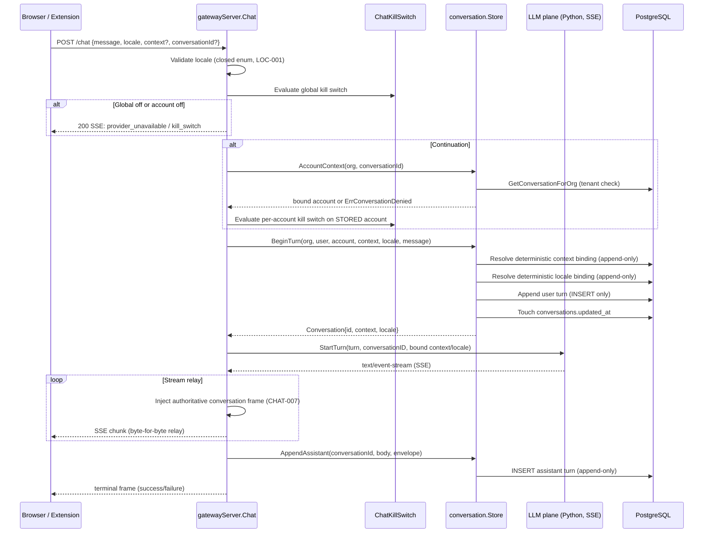
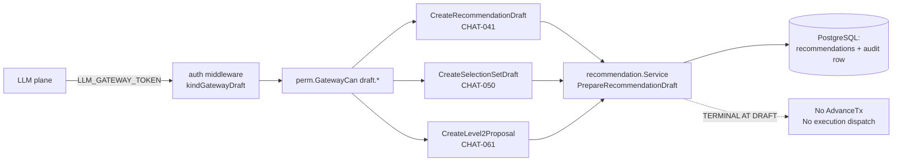
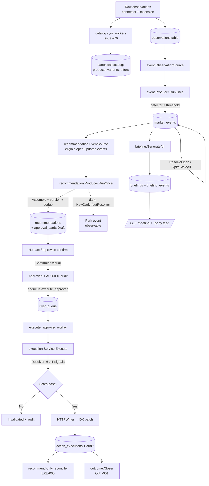
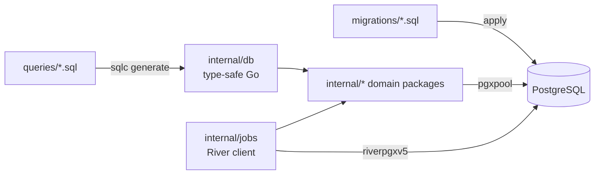
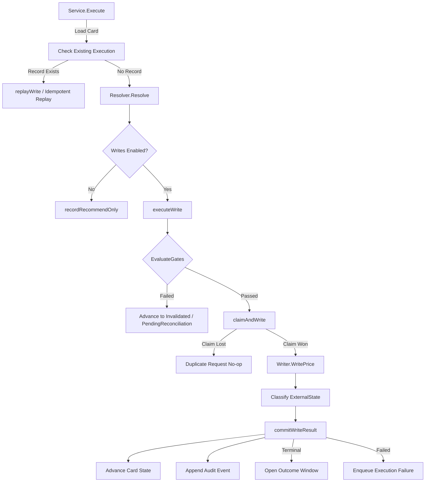

# Market-Ops Core Service

The `services/core` package is the deterministic Go core and API gateway for the `market-ops` project (PRD §19.3). It ships as a single binary that owns every central domain responsibility: HTTP ingress, deterministic domain logic, the gateway-owned chat durability store, the scheduled producer pipeline, and the deterministic Database/`sqlc` layer. The LLM plane is treated as an external, read/Draft-only service reached over an OpenAI-compatible transport seam — it holds no DB credential and can never approve or execute.

## Architecture at a Glance

```mermaid
flowchart TD
    subgraph Ingress["HTTP ingress (internal/httpapi)"]
        REQ[Request]
        VAL[OpenAPI validator]
        AUTH[Auth + perm middleware]
        HAND[gatewayServer handlers]
        REQ --> VAL --> AUTH --> HAND
    end

    subgraph Gateway["Gateway-owned domain"]
        CONV[conversation.Store<br/>CHAT-008]
        BRIEF[briefing.Service<br/>CHAT-010]
        REC[recommendation.Service<br/>Draft-only seam]
        EV[event.Service<br/>EVT-001..005]
        EXEC[execution.Service<br/>EXE-001..005]
        OBS[observation.Service]
        CAT[catalog.ReadService]
        COST[cost.Service]
        CONN[connector.Service]
    end

    subgraph Producers["Scheduled producers (internal/jobs → River)"]
        EvtProd[event.Producer]
        RecProd[recommendation.Producer]
        BriefGen[briefing.GenerateAll]
        ExecMatch[execution.RecommendOnlyReconciler]
        OutClose[outcome.Closer]
        ExecDispatch[execute_approved worker]
        NotifyDeliver[notification_deliver worker]
        ReopenDispatch[mapping_reopened worker]
        UrgentEmail[notification_urgent_email worker]
        CatalogSync[catalog sync workers]
    end

    subgraph Persistence["Persistence (internal/db → sqlc + pgx)"]
        PG[(PostgreSQL)]
        RIVER[(river_queue)]
    end

    LLMSVC["LLM plane (Python, external)<br/>OpenAI-compatible HTTP"]

    HAND --> CONV
    HAND --> BRIEF
    HAND --> REC
    HAND --> EV
    HAND --> EXEC
    HAND --> OBS
    HAND --> CAT
    HAND --> COST
    HAND --> CONN
    HAND -->|SSE proxy| LLMSVC

    EvtProd --> EV
    RecProd --> REC
    BriefGen --> BRIEF
    ExecMatch --> EXEC
    OutClose --> OUT[outcome.Service]
    ExecDispatch --> EXEC
    CatalogSync --> CONN

    CONV --> PG
    BRIEF --> PG
    REC --> PG
    EV --> PG
    EXEC --> PG
    OBS --> PG
    CAT --> PG
    COST --> PG
    CONN --> PG
    Producers --> RIVER
    RIVER --> PG
```



### Commands (`cmd/`)
- **`core`**: The main API gateway and service binary (entry point above).
- **`dkprobe`**: Probe / health check utility for external DK connectors.
- **`marginreconcile`**: CLI for margin and cost reconciliation.
- **`mockdk`**: Mock DK server for local development and testing.
- **`section16gate`**: Utility for Section 16 regulatory gating and checks.
- **`seede2e`**: Tool for seeding end-to-end test data.

### Internal Domains (`internal/`)
Business logic is modular and separated into focused domain packages:

- **Core Operations**: `money`, `identity`, `policy`, `approval`, `execution`, `reconcile`, `audit`, `recommendation`, `margin`, `cost`, `outcome`.
- **Communication & Events**: `event`, `notify`, `conversation`, `routec`, `briefing`.
- **Data & Access**: `catalog`, `observation`, `watchlist`, `pairing`, `analytics`, `diagnostics`.
- **Infrastructure**: `httpapi`, `httpx`, `jobs`, `db`, `log`, `obs` (observability), `config`, `connector`, `mockdk`, `normalize`.
- **Security & Safety**: `auth`, `perm`, `guardrail`.

## Module Dependency Graph

The diagram below shows how the wired services depend on each other at runtime. Arrows point from a consumer to its dependency. The LLM plane is intentionally isolated — the gateway proxies a turn to it but it never touches the database.

```mermaid
flowchart LR
    HTTP[httpapi gatewayServer]

    HTTP --> AUTH SVC[auth.Service]
    HTTP --> CONN[connector.Service]
    HTTP --> COST[cost.Service]
    HTTP --> EVT[event.Service]
    HTTP --> REC[recommendation.Service]
    HTTP --> IDEN[identity.Service]
    HTTP --> EXEC[execution.Service]
    HTTP --> OUT[outcome.Service]
    HTTP --> GUARD[guardrail.Service]
    HTTP --> WATCH[watchlist.Service]
    HTTP --> BRIEF[briefing.Service]
    HTTP --> NOTIFY[notify.Store]
    HTTP --> CONV[conversation.Store]
    HTTP --> OBS[observation.Service]
    HTTP --> CAT[catalog.ReadService]
    HTTP --> DIAG[diagnostics.ReadService]
    HTTP --> PAIR[pairing.Service]
    HTTP -->|SSE proxy only| LLM[LLM plane<br/>external]

    BRIEF --> EVT
    REC --> EXEC
    EXEC --> REC
    NOTIFY --> ANALYTICS[analytics.Emitter]
    IDEN --> REC
    IDEN --> ROUTEC[routec.TargetRetirer]

    AUTH SVC --> DB[(db.Queries / pgx pool)]
    CONN --> DB
    COST --> DB
    EVT --> DB
    REC --> DB
    IDEN --> DB
    EXEC --> DB
    OUT --> DB
    GUARD --> DB
    WATCH --> DB
    BRIEF --> DB
    NOTIFY --> DB
    CONV --> DB
    OBS --> DB
    CAT --> DB
    DIAG --> DB
    PAIR --> DB
    ANALYTICS --> DB
```

Key properties enforced by this graph:
- **Single DB pool.** One `pgxpool.Pool` backs every DB-backed route; a missing `DATABASE_URL` leaves only public routes wired (fail-closed posture).
- **`httpapi` is the only `gen/go` consumer.** Domain packages never import generated transport code.
- **Conversation identity is gateway-owned.** `conversation.Store` resolves the conversation id and hands it to the LLM plane — the LLM plane only echoes it.
- **Recommendation ↔ execution cycle.** `recommendation.Service` dispatches approved cards to `execution.Service`; `execution.Service` reads back the authoritative card from `recommendation.Service` for revalidation.

## LLM Plane Data Flow

`/chat` is the only route that touches the LLM plane. The gateway proxies the turn but owns every authoritative decision: identity, locale, deterministic context binding, kill switch evaluation, durability, and the terminal assistant record. The LLM plane is read/Draft-only and can never approve or execute.



### Why the gateway owns the conversation
- **Identity (CHAT-008).** The LLM plane holds no DB credential; every persisted turn flows through `conversation.Store`.
- **Deterministic binding (CHAT-007).** `resolveContext` / `resolveLocale` are pure decisions run inside the `BeginTurn` transaction; a stale or silently-relabeling binding rejects the turn before any proxy occurs.
- **Kill switch (CHAT-009).** The per-account switch is evaluated against the *stored* conversation account, never the caller-supplied optional field, so it cannot be bypassed by omitting the account.
- **Free text carries no authority (§8).** A stored message can never approve or execute; there is no such column or code path.

### LLM Draft-only write seam (`/chat/cards/*`)

The LLM plane may request Draft-only artifacts via the machine credential (`LLM_GATEWAY_TOKEN`). Every write is **terminal at Draft** — it can never advance the §8.4 approval machine or trigger execution.



The `DraftService` interface is satisfied by the same `recommendation.Service` that backs the human `/approvals/*` routes, but the Draft-only routes are reachable only by the machine principal and produce only Draft-state artifacts.

## Deterministic Producer Pipeline

The gateway runs a River-backed job pipeline that drives the deterministic producers. Every producer is **idempotent per (event, evidence version)**, so re-runs and restarts never duplicate work. The chain below shows how raw observations become approved, executed price changes.



### Stage responsibilities
| Stage | Package | Idempotency key | Fail-closed behaviour |
|---|---|---|---|
| Observation ingest | `observation`, `connector`, `catalog` | capture id + dedup | Server-authoritative quality/route; extension cannot self-certify. |
| Event detection | `event.Producer` | `transitionDedupKey` | Unknown exposure stays `Unknown`; never coerced to zero. |
| Event lifecycle | `event.Service` | monotonic evidence version | Condition-clear and stale-expiry run in the same pass as production. |
| Recommendation assembly | `recommendation.Producer` | `(event, evidence_version)` lineage | Dark resolver parks events (`ErrInputsUnavailable`); never fabricates a price. |
| Approval | `recommendation.Service` | version-bound `Binding` | Stale binding → card superseded; never executes. |
| Execution | `execution.Service` | stable idempotency key | Missing live signal → `ErrSignalsStatic` → parked (`JobSnooze`), never written. |
| Outcome close | `outcome.Closer` | action/account/window | No evidence → `Incomplete`, stays OPEN. |
| Briefing | `briefing.Service` | `(account, business_day)` | Reuses the SAME `Today` ranking so ids/order cannot drift. |

### Durable intents wired into the pipeline
Each lifecycle transition enqueues a durable River intent transactionally with its owning commit, so a committed transition is never lost to a transient failure or restart:

- `execute_approved` — issued by `ConfirmIndividual` (issue #92).
- `mapping_reopened` — issued by identity reopen; fans out to `ReopenExpirer` + `TargetRetirer` (issue #49).
- `notification_deliver` — issued by market-event open, execution failure, safety failure (issue #110).
- `notification_urgent_email` — issued by execution/safety-failure delivery; own retry/backoff + dead-letter (issue #122).
- `catalog_sync` — issued by the onboarding "Sync catalog" control (issue #76).

## Data Persistence Layer

The service strictly separates data persistence from business logic using `sqlc`:

1. **Schema & Queries** — PostgreSQL migrations live in `migrations/`. Domain-specific SQL queries are defined in `queries/` (e.g., `approval.sql`, `catalog.sql`, `observation.sql`).
2. **Code Generation** — `sqlc` (configured via `sqlc.yaml`) generates type-safe Go code using the `pgx/v5` driver. It outputs an interface and strongly typed models into `internal/db`, mapping PostgreSQL types to native Go types (`uuid.UUID`, `time.Time`).
3. **API & Logic** — Requests enter via HTTP handlers (`internal/httpapi`, `internal/httpx`), are processed by domain packages (`internal/approval`, `internal/execution`, etc.), and persist state via the generated `internal/db` layer.
4. **Asynchronous Processing** — Background tasks and scheduling are managed by `internal/jobs`, which interfaces with `riverpgxv5` (implied by the driver choice in `sqlc.yaml`).



## Design Objectives
- **Deterministic and Centralized**: Acts as the single source of truth for critical operations such as money management, policy enforcement, identity, and auditing.
- **Type Safety and Performance**: Eschews reflection-heavy ORMs in favor of `sqlc` for compile-time verified database access and native Postgres driver performance.
- **Strict Separation of Concerns**: Isolates business domains into their own packages and SQL files to prevent domain leakage and ensure maintainability. The LLM plane is reachable only through the gateway's OpenAI-compatible seam.
- **Security, Auditability, and Compliance**: Built-in packages like `audit`, `guardrail`, `perm`, and tools like `section16gate` reflect a design heavily focused on financial safety, regulatory compliance, and system observability.
- **Fail-Closed by Default**: Every unwired plane returns a structured `provider_unavailable` / unavailable error rather than a silent success; the LLM plane, execution write path, and recommendation resolver all ship dark until their gated enablement lands.

## Execution Revalidation and Writing Flow

The diagram below illustrates the exact execution decision tree for price mutations (from `internal/execution`). It shows how the idempotent execution revalidates conditions before dispatching to the external writer.


