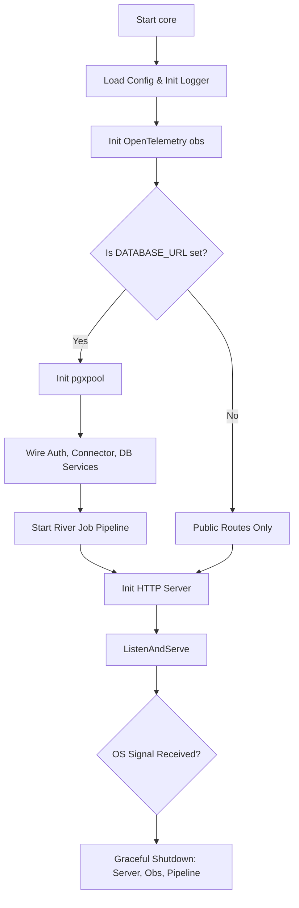

# Core

## Objective
The `core` command is the single deterministic Go binary for the `market-ops` backend. It acts as both the gateway and the domain core (PRD §19.3), unifying HTTP API routes, background workers, configuration, logging, and observability into one process.

## How it Works
Upon startup, the binary:
1. Loads configuration from environment variables and sets up structured logging (`slog`) and OpenTelemetry (`obs`).
2. Conditionally establishes a PostgreSQL connection pool (`pgxpool`). If `DATABASE_URL` is absent, it runs in a degraded mode, exposing only public routes.
3. Wires the necessary domain services: authentication, DK API connector, cost plane, event engine (detectors, Today feed), recommendation/approval plane, identity-mapping, guardrails/watchlists, notification delivery, and execution.
4. Starts a robust background job pipeline utilizing `river` queues to handle delayed, periodic, and transactional background work (e.g., market event production, outcomes, daily digests, and catalog syncing).
5. Exposes an HTTP API serving screens and the chat LLM plane, with specific routes guarded by session authentication and permission middleware.
6. Gracefully handles shutdown signals (SIGINT/SIGTERM) to drain connections, complete pending transactions, and flush telemetry.

## Data Flow
- **Ingress**: HTTP requests arrive at the server and are routed to their respective domain service handlers.
- **State Storage**: Domain entities are stored and read from PostgreSQL. 
- **Asynchronous Execution**: Operations with asynchronous implications (like executing approved recommendations, sending emails, processing catalog syncs) write jobs to `river` tables transactionally with the state commit. The integrated job pipeline's workers then reliably drain these intents.
- **LLM Plane**: If `LLM_SERVICE_URL` is set, Chat routes proxy requests to the LLM backend while maintaining gateway-owned conversation durability and auth control.

## Constraints
- **Fail-Closed by Default**: Prerequisite missing configurations lead to specific disabled components. E.g., if the connector encryption key is missing, connector routes fail closed; if the chat LLM plane URL is missing, `/chat` fails closed but UI screens continue serving.
- **Execution Dark Mode**: The execution and reconciliation plane currently ships "dark" (writes OFF) until the S35 verified parameter probes are available. Real execution writes and recommendations based on live targets are disabled in code.
- **Chat Kill Switch**: A configured set of accounts (`CHAT_KILL_SWITCH_ACCOUNTS`) can disable chat interactions independently of screen functionality.

## Architecture Diagram

