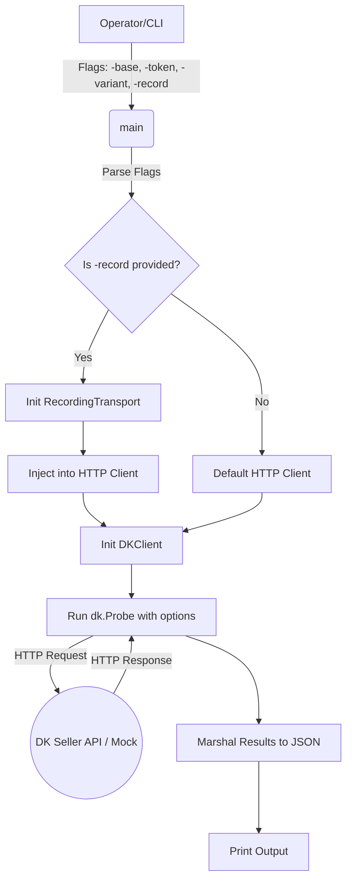

# DKProbe

## Objective
The `dkprobe` command is a capability probe harness used to execute PRD §15.2 probes against a DK Seller API endpoint. It verifies and evaluates supported capabilities based on the connected seller's context.

## How it Works
1. Parses CLI flags: `-base` (target DK API URL, defaults to local mock), `-token` (access token), `-record` (optional directory for snapshotting), and `-variant` (sample variant ID).
2. Initializes an HTTP client. If `-record` is provided, it injects a `RecordingTransport` which intercepts and freezes the raw HTTP requests and responses to the specified directory for S35 verification.
3. Initializes a `DKClient` and runs `.Probe()` to verify the provided capabilities using the supplied access token.
4. Prints the generated verdicts and statuses to standard output as formatted JSON.

## Data Flow
- **Input**: The DK access token, base URL, and configuration parameters via environment or flags.
- **Execution**: The probe communicates synchronously with the DK Seller API endpoint over HTTP.
- **Output**: JSON payload summarizing the capabilities supported by the targeted DK instance, plus potentially written recorded snapshot files.

## Constraints
- **No Side Effects**: The harness is strictly a read/probe tool. It NEVER exchanges tokens or fires writes on its own.
- **Operator-Driven**: Pointing the probe at a live DK system is a GATED operation requiring human authorization (hence the default targets the local mock server).

## Architecture Diagram

