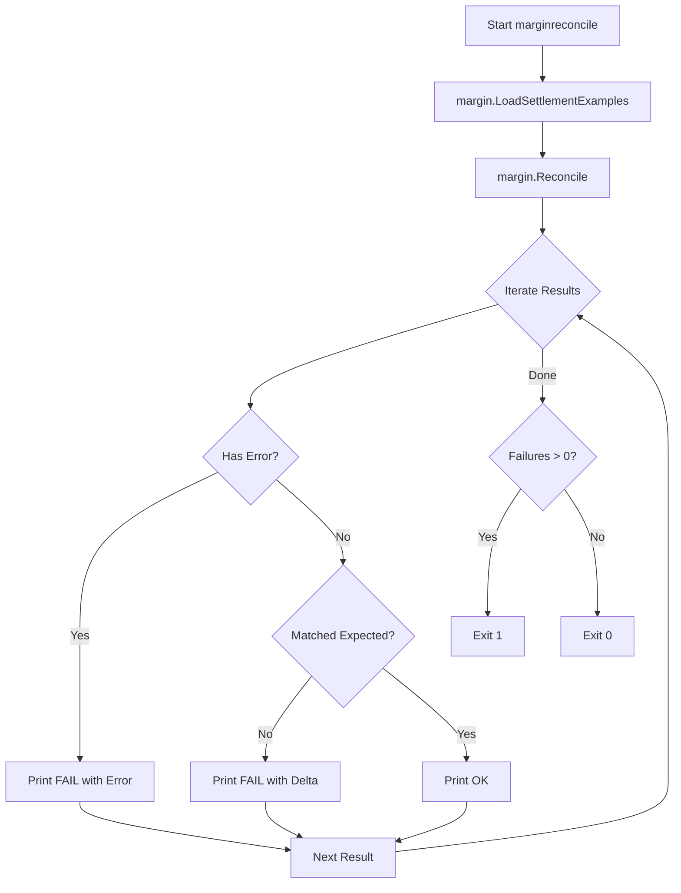

# MarginReconcile

## Objective
The `marginreconcile` command is the Gate 0a margin-reconciliation testing harness. It serves to guarantee the deterministic margin contribution engine (`internal/margin`) can precisely reproduce expected contributions derived from synthetic settlement examples.

## How it Works
1. Loads a defined set of synthetic settlement examples representing various margin/fee calculation scenarios (`margin.LoadSettlementExamples()`).
2. Iterates over these examples, pushing them through the internal contribution engine (`margin.Reconcile(examples)`).
3. Verifies if the computed output matches the expected target contribution within the example's explicitly declared rounding tolerance.
4. Generates a line-by-line terminal report of the results.
5. Exits with a non-zero status code if *any* single example mismatches its target, preventing the build or CI step from passing.

## Data Flow
- **Input**: Hardcoded deterministic synthetic settlement examples (and in the future, S35 real settlement examples).
- **Processing**: The internal contribution engine parses the inputs to calculate margins.
- **Output**: Writes reconciliation results (FAIL or OK) to standard out, tracking unexpected mantissa deltas.

## Constraints
- **Strict Adherence**: It acts as a hard gate for any build running it; a rounding deviation beyond the specified tolerance is a hard failure.
- **Synthetic Limitations**: Currently, five synthetic examples ship with it. Real (≥30) representative settlement examples will be provided via the S35 gated step, meaning this harness must be kept stable for when live/paid measurement feeds real examples in.

## Architecture Diagram

