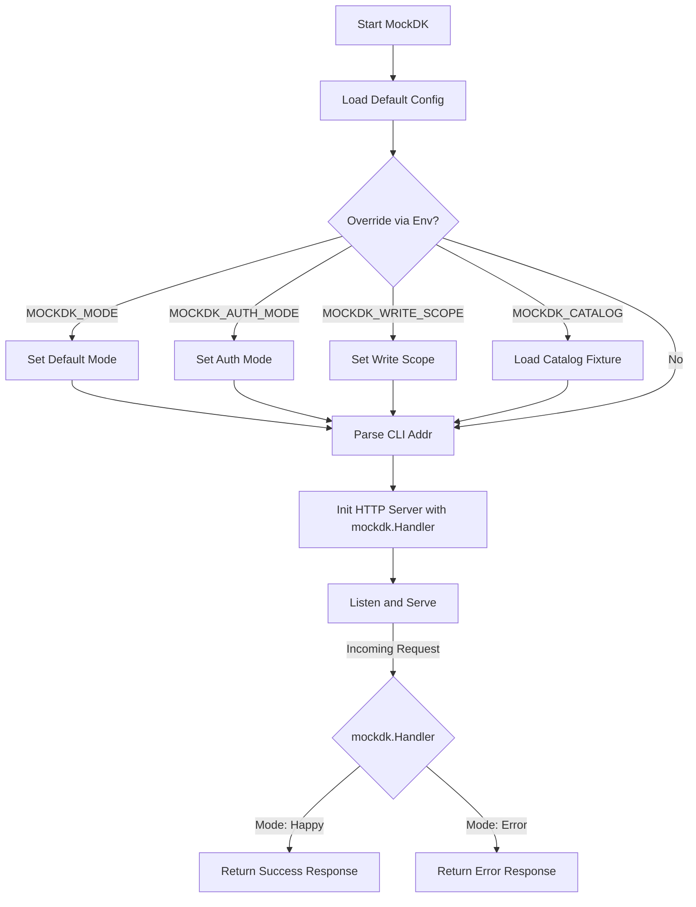

# MockDK

## Objective
The `mockdk` command provides a configurable mock DK Seller server implementation (`internal/mockdk`) designed specifically for offline and local testing of the connector service without exposing the codebase to the live DK API.

## How it Works
1. Configures its behavior based on a suite of environment variables. These include `MOCKDK_ADDR` for the listen port and operational switches like `MOCKDK_MODE`, `MOCKDK_AUTH_MODE`, and `MOCKDK_WRITE_SCOPE`.
2. Can optionally seed a deterministic catalog (`MOCKDK_CATALOG=true`), presenting a fixed suite of items to simulate real product sync imports in local test journeys.
3. Boots a standard HTTP server mimicking the endpoints, schemas, and responses of the real DK Seller API according to the selected "mode" (e.g., happy, unauthorized, rate_limited, malformed).

## Data Flow
- **Ingress**: Receives simulated outbound requests from the core connector service during local testing.
- **Processing**: Routes the requests to mocked handlers which apply the configured fault or success mode logic.
- **Egress**: Returns deterministic JSON responses simulating the real third-party API behavior.

## Constraints
- **Isolation**: MockDK is exclusively meant for development (`compose.dev.yml`) and testing. The codebase must never develop against the live DK instance.
- **Synchronized Pager**: When enabling the catalog fixture, the mock's reported `PageSize` strictly matches the syncer's required page size (50) to prevent the connector from rejecting the pager state due to cardinality incoherence.

## Architecture Diagram

