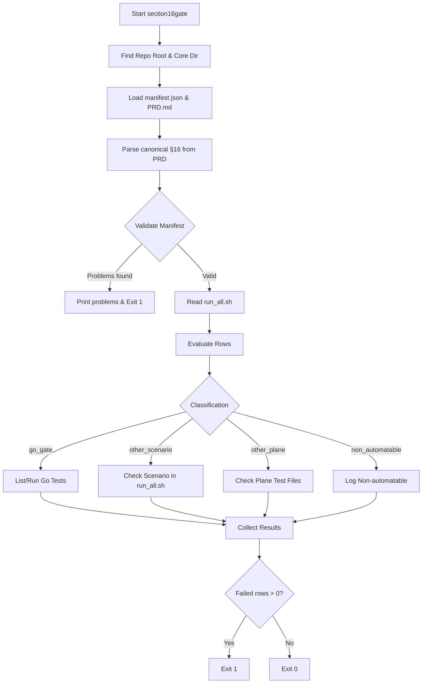

# Section16Gate

## Objective
The `section16gate` command is the S32 integration gate for verifying the PRD §16 edge-case contracts. It acts as an executable manifest cross-checker, ensuring every edge case codified in the product requirements is programmatically tested and verified.

## How it Works
1. Loads the edge-case manifest (`section16_manifest.json`) and parses the canonical markdown table natively from `docs/PRD.md` (section 16).
2. Performs structural validation to guarantee every single row in the PRD is classified within the manifest and that the manifest contains no stale/duplicate rows.
3. Depending on the test classification (`go_gate`, `other_scenario`, `other_plane`, or `non_automatable`):
   - For `go_gate`: Inspects the Go module (`go test -list`) to assert the linked tests exist without compilation errors. In execution mode, it runs `go test -json` and strictly enforces that every test function passes. Skipped or failed tests break the gate.
   - For `other_scenario`: Verifies the shell scenario is represented in the `run_all.sh` integration script.
   - For `other_plane`: Ensures the required test files and validation markers physically exist in the repository.
4. Outputs a final status report, exiting non-zero if the PRD table has unclassified cases or if any single automation step fails.

## Data Flow
- **Input**:
  - The `PRD.md` documentation file.
  - The `section16_manifest.json` mapping file.
  - Test suites run natively against a real PostgreSQL database (if executing).
- **Processing**: String comparisons for markdown arrays, execution of the `go test` subsystem.
- **Output**: Terminal report detailing the PASS/FAIL outcome of each edge case.

## Constraints
- **Database Dependency**: The execution of `go test` requires a live database backend (usually run inside a `compose` integration stack), as the tests execute database operations. 
- **Toolchain**: Modifies the Go toolchain environment by setting `GOWORK=off` during test evaluation.
- **Strict Alignment**: Cannot pass if tests are skipped, renamed without manifest updates, or if PRD changes are made without a corresponding manifest classification.

## Architecture Diagram

