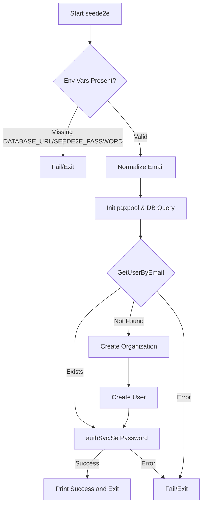

# SeedE2E

## Objective
The `seede2e` command is a test infrastructure tool intended specifically for integration and system-test suites (e.g., Playwright kill-switch journeys and adversarial containment replays). It provisions a known, fixed password for the deterministic owner user to enable automated authentication against a real gateway.

## How it Works
1. Validates required environment variables, notably `DATABASE_URL` and `SEEDE2E_PASSWORD`. It defaults to the canonical `owner@dev.local` email from `dev_seed.sql`.
2. Connects to PostgreSQL, canonicalizing the requested email address.
3. Retrieves the user account. If the user does not exist (e.g., `task db:reset` was not executed), it falls back to dynamically creating a new organization and owner account.
4. Uses `auth.Service.SetPassword` to inject the plaintext password into the authentication service, rendering it login-ready.

## Data Flow
- **Inputs**: Environment variables (`DATABASE_URL`, `SEEDE2E_PASSWORD`, `SEEDE2E_EMAIL`).
- **Processing**: Database lookups and auth password hashing via the core authentication internal service.
- **Output**: Database mutation (updates the user's password hash) and a confirmation log to stdout.

## Constraints
- **Test Infrastructure Only**: This is strictly reserved for CI and system testing. It is never invoked within production paths (`compose.prod.yml`).
- **Idempotency**: It is entirely idempotent; running it repeatedly simply overwrites the user's password without duplicating records.
- **No Defaults**: Fails closed deliberately if `SEEDE2E_PASSWORD` is omitted to prevent the creation of guessable or credential-less default accounts, even in test environments.

## Architecture Diagram

