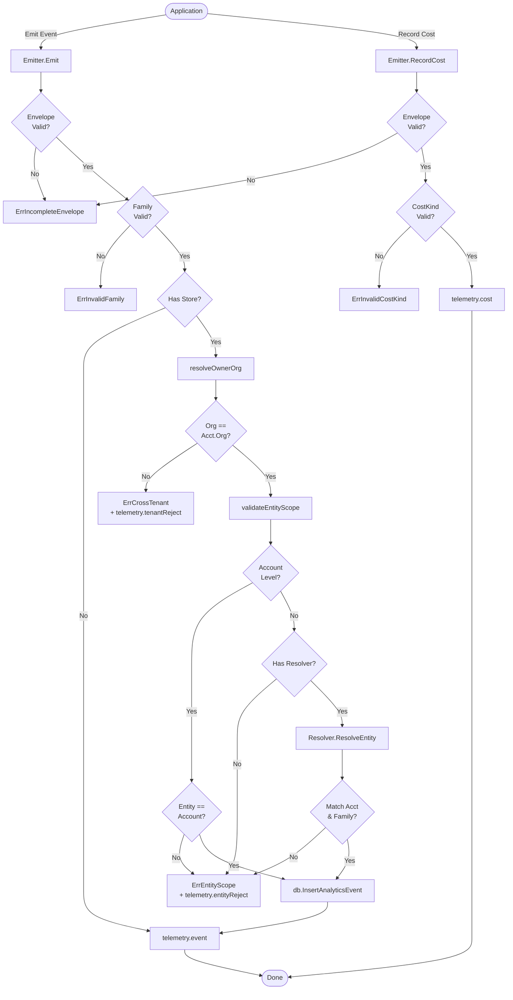

# Analytics

The `analytics` package implements the §18 event pipe, serving as a typed, strictly validated emitter for the eleven event families and §17.3 cost counters in the DK Marketplace Intelligence core.

## Objectives
- **Envelope Completeness**: Enforces that every event carries a full envelope (organization, account, entity, locale, region, currency contract version, source surface, and timestamp). A missing field is a hard rejection.
- **Tenant Integrity**: Enforces strict tenant separation (§18 and §4.6 invariants). Cross-tenant envelope pairings are rejected server-side to ensure an account's data cannot be misattributed or leaked. 
- **Append-Only Immutability**: Provides an `INSERT`/`SELECT` only pipe for `analytics_events`. No `UPDATE` or `DELETE` is issued.
- **Cost Recording**: Acts as the collector for variable cost metrics (in integer minor units), emitting them via OpenTelemetry.

## How it Works
The `Emitter` handles the persistence and metric incrementation for events. 
- `Emit()` takes an event, checks the envelope's completeness, and verifies the family validity. 
- It resolves the authoritative organization from the account row to ensure tenant integrity.
- It then validates the entity scope via the injected `EntityResolver` (for entity-level families), ensuring the entity belongs to the account and is compatible with the family.
- Finally, it persists the event to the database and records telemetry.

## Data Flow
- **Events**: Application -> `Emitter.Emit()` -> Validation (Completeness, Tenant, Entity) -> `db.InsertAnalyticsEvent` -> OpenTelemetry Counter.
- **Costs**: Application -> `Emitter.RecordCost()` -> Validation -> OpenTelemetry Counter (not stored in DB as a row).
- **Resolvers**: Entity-level families rely on a dynamically injected `EntityResolver` to evaluate whether an entity naturally fits within the caller's account and family. Account-level families inherently evaluate against the account ID.

## Constraints
- **Data Integrity**: The pipeline rejects incomplete envelopes (fail-closed) and never writes a partial event row.
- **Security / Oracle Prevention**: Cross-tenant and cross-account validation failures fail-closed uniformly. They expose no existence or ownership details to the caller (unknown and foreign entities produce identical errors) to prevent tenant sniffing.
- **No Floating Point**: Cost amounts strictly use `int64` minor units.
- **Observability Label Budget**: Tenant identifiers (UUIDs) and unbound versions are never added to Prometheus metric labels to prevent cardinality explosions; they are strictly bound to the persisted DB layer.

## Architecture Diagram

