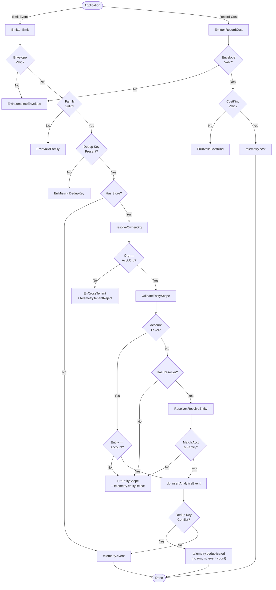

# Analytics

The `analytics` package implements the §18 event pipe, serving as a typed, strictly validated emitter for the eleven event families and §17.3 cost counters in the DK Marketplace Intelligence core.

## Objectives
- **Envelope Completeness**: Enforces that every event carries a full envelope (organization, account, entity, locale, region, currency contract version, source surface, and timestamp). A missing field is a hard rejection.
- **Tenant Integrity**: Enforces strict tenant separation (§18 and §4.6 invariants). Cross-tenant envelope pairings are rejected server-side to ensure an account's data cannot be misattributed or leaked. 
- **Append-Only Immutability**: Provides an `INSERT`/`SELECT` only pipe for `analytics_events`. No `UPDATE` or `DELETE` is issued (`ON CONFLICT DO NOTHING` is still insert-only; `DO UPDATE` is forbidden).
- **Event Deduplication (§4.6 never-cut)**: Every event carries a mandatory, stable `DedupKey` derived from the committed business row that produced it. The guarantee is structural — an account-scoped partial unique index on `(marketplace_account_id, dedup_key)` (migration 0045) plus `ON CONFLICT DO NOTHING`.
- **Cost Recording**: Acts as the collector for variable cost metrics (in integer minor units), emitting them via OpenTelemetry.

## How it Works
The `Emitter` handles the persistence and metric incrementation for events. 
- `Emit()` takes an event, checks the envelope's completeness, and verifies the family validity. 
- It resolves the authoritative organization from the account row to ensure tenant integrity.
- It then validates the entity scope via the injected `EntityResolver` (for entity-level families), ensuring the entity belongs to the account and is compatible with the family.
- Finally, it persists the event to the database and records telemetry.

## Data Flow
- **Events**: Application -> `Emitter.Emit()` -> Validation (Completeness, Tenant, Entity) -> `db.InsertAnalyticsEvent` -> OpenTelemetry Counter.
- **Costs**: Application -> `Emitter.RecordCost()` -> Validation -> OpenTelemetry Counter (not stored in DB as a row).
- **Resolvers**: Entity-level families rely on a dynamically injected `EntityResolver` to evaluate whether an entity naturally fits within the caller's account and family. Account-level families inherently evaluate against the account ID.

## Delivery semantics (loss vs. duplication)

| Property | Guarantee | Mechanism |
| --- | --- | --- |
| Duplication | **Impossible** for a keyed event within one account — *while the key column exists* | Partial unique index `(marketplace_account_id, dedup_key) WHERE dedup_key IS NOT NULL`; the insert is `ON CONFLICT DO NOTHING`, so the second write is a structural no-op and the committed row is never rewritten. `Emit` returns `nil` for a suppressed duplicate (an idempotent success, so a producer's retry terminates) and increments `analytics.events_deduplicated` **instead of** `analytics.events`, so a dashboard never counts an event with no row behind it. **Rollback caveat:** `goose down` on migration 0045 drops the column, which keeps every event row but destroys its key — the surviving rows become permanently unkeyed and their deduplication window reopens, so a later retry writes a second row for an already-recorded fact with no suppression and no `events_deduplicated` signal. Treat a 0045 rollback on a populated database as an **incident** requiring a manual re-key, never a routine op. |
| Loss | **Possible, bounded, observed** | Producers emit **after** their business transaction commits. An emitter/sink failure returns an error the producer logs, and `Emit` increments **`analytics.emit_failures`** (label-free) so an unreachable sink is distinguishable from an idle pipe rather than showing up as four flat-zero series; it never rolls back safety-critical business state (analytics is an advisory pipe). A durable per-family outbox — safe to retry precisely because the key exists — is a follow-on producer sub-step, never a silent fallback. |
| Ordering | Not guaranteed | Consumers read `occurred_at` from the envelope, not arrival order. |
| Cross-tenant dedup | **Impossible** | The key is unique only *within* an account; two accounts may use identical keys and each persists its own row. |

A missing key is rejected (`ErrMissingDedupKey`), never defaulted: an unkeyed event would be a silent opt-out of the deduplication invariant, and a freshly generated per-call key would deduplicate nothing while appearing to. The **empty** key is rejected by the database too (`analytics_events_dedup_key_nonempty` CHECK): `''` is not `NULL`, so without that constraint it would sit *inside* the partial unique index and one account's first `''` row would silently suppress every later `''` row — real data loss wearing the deduplication invariant's uniform.

**Precisely what is enforced where.** The database structurally guarantees, for *every* writer, that (1) two rows in one account cannot share a non-null `dedup_key` and (2) no row's key is empty. It does **not** require a row to be keyed at all: a `NULL` key is outside the partial index and is not deduplicated. That residual is closed only at the service boundary — `Emit`'s `ErrMissingDedupKey` — which binds this Go core and nothing else; an out-of-band writer inserting `NULL` is not structurally prevented. Making the column `NOT NULL` is the follow-on hardening. No backfill value is ever fabricated for an unkeyed row.

## Constraints
- **Data Integrity**: The pipeline rejects incomplete envelopes (fail-closed) and never writes a partial event row.
- **Security / Oracle Prevention**: Cross-tenant and cross-account validation failures fail-closed uniformly. They expose no existence or ownership details to the caller (unknown and foreign entities produce identical errors) to prevent tenant sniffing.
- **No Floating Point**: Cost amounts strictly use `int64` minor units.
- **Observability Label Budget**: Tenant identifiers (UUIDs) and unbound versions are never added to Prometheus metric labels to prevent cardinality explosions; they are strictly bound to the persisted DB layer.

## Architecture Diagram

```mermaid
flowchart TD
    App([Application]) -->|Emit Event| Emit[Emitter.Emit]
    App -->|Record Cost| RecordCost[Emitter.RecordCost]

    Emit --> ValEnv1{"Envelope<br/>Valid?"}
    ValEnv1 -->|No| ErrEnv[ErrIncompleteEnvelope]
    ValEnv1 -->|Yes| ValFam{"Family<br/>Valid?"}
    ValFam -->|No| ErrFam[ErrInvalidFamily]
    ValFam -->|Yes| ValKey{"Dedup Key<br/>Present?"}
    ValKey -->|No| ErrKey[ErrMissingDedupKey]
    ValKey -->|Yes| Store{"Has Store?"}
    
    Store -->|No| OTel[telemetry.event]
    Store -->|Yes| ResolveOrg[resolveOwnerOrg]
    
    ResolveOrg --> CheckOrg{"Org == <br/>Acct.Org?"}
    CheckOrg -->|No| ErrCross["ErrCrossTenant<br/>+ telemetry.tenantReject"]
    CheckOrg -->|Yes| ValEntity[validateEntityScope]
    
    ValEntity --> IsAcctLevel{"Account<br/>Level?"}
    IsAcctLevel -->|Yes| AcctMatch{"Entity ==<br/>Account?"}
    AcctMatch -->|No| ErrScope["ErrEntityScope<br/>+ telemetry.entityReject"]
    AcctMatch -->|Yes| Insert[db.InsertAnalyticsEvent]
    
    IsAcctLevel -->|No| HasRes{"Has Resolver?"}
    HasRes -->|No| ErrScope
    HasRes -->|Yes| ResEnt[Resolver.ResolveEntity]
    ResEnt --> CheckScope{"Match Acct<br/>& Family?"}
    CheckScope -->|No| ErrScope
    CheckScope -->|Yes| Insert
    
    Insert --> Conflict{"Dedup Key<br/>Conflict?"}
    Conflict -->|Yes| Dedup["telemetry.deduplicated<br/>(no row, no event count)"]
    Conflict -->|No| OTel
    Dedup --> Done([Done])
    OTel --> Done
    
    RecordCost --> ValEnv2{"Envelope<br/>Valid?"}
    ValEnv2 -->|No| ErrEnv
    ValEnv2 -->|Yes| ValKind{"CostKind<br/>Valid?"}
    ValKind -->|No| ErrKind[ErrInvalidCostKind]
    ValKind -->|Yes| OTelCost[telemetry.cost]
    OTelCost --> Done
```
