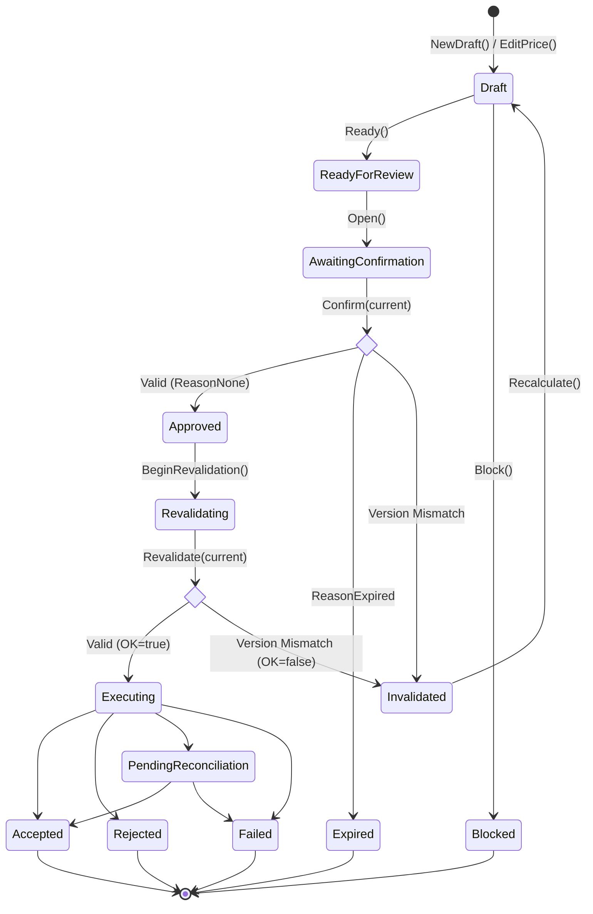

# Approval

The `approval` package implements the §8.4 approval state machine and the APR-001 version-bound approval control for the DK Marketplace Intelligence core. It is responsible for orchestrating how a proposed action (recommendation) is reviewed, bound to strict context conditions, and eventually approved or rejected.

## Objectives
- **Version Binding (APR-001)**: Ensures that an approval control perfectly binds to the state of the world at its creation (action ID, parameter version, context version, policy version, cost-profile version, evidence versions, and an explicit expiry time).
- **Free-Text Containment**: Enforces that only structured, explicitly bound controls can authorize actions. A large language model cannot approve a write through free-text alone; a structured control activation is mandatory.
- **Immutable Auditability**: Cards are fully immutable. Actions such as editing a price or transitioning state yield a completely new card version.

## How it Works
- **State Machine**: The package defines a rigorous, verbatim transcription of the §8.4 state machine (`Draft` -> `ReadyForReview` -> `AwaitingConfirmation` -> `Approved` / `Expired` / `Invalidated`, etc.). Only predefined edges are permitted; unknown transitions are immediately rejected.
- **Card Lifecycle**: A `Card` carries the state. A structured `Control` is generated *only* when a non-simulation card sits in the `AwaitingConfirmation` state.
- **Version Revalidation**: Before confirmation and execution, the control's bound versions are re-evaluated against the current, server-resolved state. Any drift (e.g. policy changes, price edits, timeouts) invalidates the control, sending it to the `Invalidated` state.

## Data Flow
- **Creation**: `NewDraft()` initializes a `Draft` card with defensively copied evidence constraints.
- **Progression**: Methods like `Ready()`, `Open()`, `Confirm()`, and `Revalidate()` advance the card to a new state and return the new `Card` instance.
- **Confirmation & Revalidation**: `Confirm()` evaluates the bounded `Control` for expiry and state-match against `current` conditions. `Revalidate()` is used right before crossing into the execution boundary (`S18`), blocking if a change has occurred out-of-band.
- **Price Edits**: `EditPrice()` creates a new card with a new parameter version, automatically invalidating stale controls pointing to the old price.

## Constraints
- **Immutability**: Cards are never mutated in place. All mutations yield a new representation.
- **Money Operations**: Float values and arithmetic operators (`+`, `-`, `*`, `/`) are strictly forbidden. The `money.Money` type handles amounts.
- **Simulation Prohibition**: A what-if (simulation) card cannot ever expose an active `Control`, preventing accidental write authorization.
- **Server Authority**: Approvals must check against server-resolved state (`current`), never relying blindly on client-echoed bindings.

## State Machine Diagram

