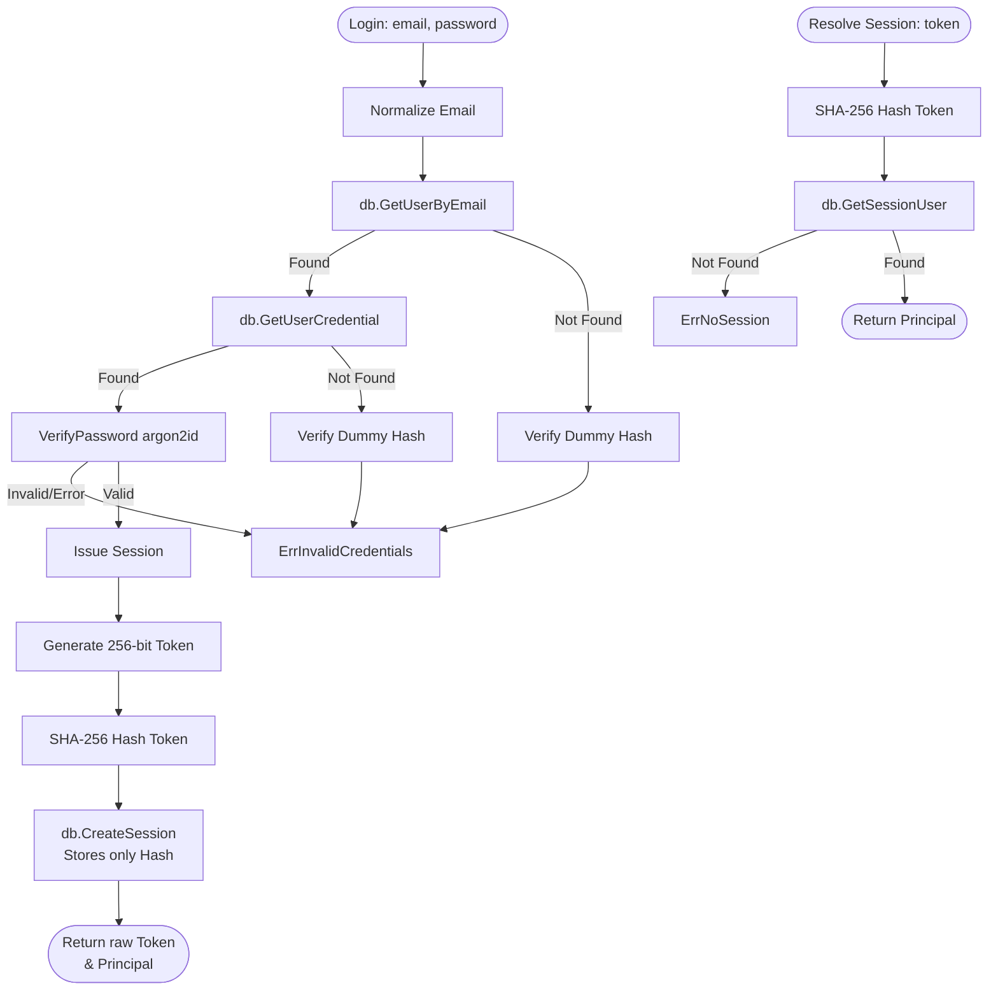

# Auth Package

## Objectives
The `auth` package serves as the authentication plane for the core service. It manages credential verification via `argon2id` and handles server-side session issuance and resolution, directly supporting the single permission matrix.

## How it Works
- **Credential Handling**: Uses memory-hard `argon2id` hashing for passwords, adhering to OWASP guidance. Passwords are never stored or logged in plain text.
- **Session Management**: Issues 256-bit cryptographically random tokens.
- **Constant-Time Verification**: Login attempts against non-existent users still run a dummy hash verification to ensure uniform timing, preventing user enumeration via timing oracles.

## Data Flow
1. **Login**: 
   - Normalizes the provided email.
   - Retrieves the user and their credential.
   - Validates the password using constant-time comparison against the stored `argon2id` hash.
   - If successful, a new random token is generated.
2. **Session Persistence**: Only the SHA-256 hash of the generated token is stored in the database, along with its expiration.
3. **Session Resolution**: The raw token is hashed and looked up in the database to retrieve the authenticated `Principal` (user, organization, and role).

## Constraints
- **Session Security**: The raw token is never persisted to the database. A database dump cannot be used to mint valid session cookies.
- **Fail Closed**: Any failure during login (unknown email, bad password) yields a uniform `ErrInvalidCredentials`. Any failure during session resolution yields `ErrNoSession`, ensuring unauthorized access is denied by default.
- **Secure Transport**: The session token must only be returned in a secure, `httpOnly` cookie and never placed in the response body or client-side storage.

## Authentication & Session Flow Diagram

