# Briefing Package

## Objectives
The `briefing` package generates, persists, and serves the once-per-business-day daily briefing for marketplace accounts. It ensures that the generated briefing is deeply tied to the "Today" feed ranking to provide consistent traceability.

## How it Works
The briefing is generated from a `TodayRanker` which provides a ranked feed of events for an account. The generation process takes a snapshot of this ranking for the current business calendar day (in UTC) and saves it durably. 

## Data Flow
1. **Generation**: `GenerateForAccount` and `GenerateAll` fetch ranked events from the `TodayRanker`. The header and all events are inserted into the database within a single atomic transaction.
2. **Retrieval**: `Get` and `GetForOrg` read the briefing from the database for a given account and business day. 

## Constraints
- **Determinism**: The briefing uses the exact same `event.Rank` as the Today feed to prevent drift between what was generated and what was ranked.
- **Idempotency**: Briefing generation is idempotent per business day. A same-day rerun (e.g., due to a retry of a River job) results in a no-op, preventing duplicate records.
- **Tenant Isolation**: Reads are scoped to the authenticated principal's organization. An attempt to read a briefing for an account not owned by the caller's organization results in a uniform `ErrAccountNotFound`, preventing cross-tenant disclosure or existence oracles.
- **Append-Only**: Briefings and briefing events are stored as append-only records.

## Data Flow Diagram

```mermaid
flowchart TD
    subgraph Generation
        GenAll[GenerateAll] -->|Fan-out accounts| GenAcct[GenerateForAccount]
        GenAcct --> Ranker[TodayRanker.Today]
        Ranker -->|Ranked Events| Tx[Begin Tx]
        Tx --> InsertHead[db.InsertBriefing]
        InsertHead -->|Already Exists?| NoOp[Idempotent No-op]
        InsertHead -->|New| InsertEvts[db.InsertBriefingEvent]
        InsertEvts --> Commit[Commit Tx]
    end
    
    subgraph Retrieval
        GetOrg[GetForOrg] --> ResolveAcct[accountForOrg]
        ResolveAcct --> CheckOwnership{Acct == Requested?}
        CheckOwnership -->|No / Missing| Err404[ErrAccountNotFound]
        CheckOwnership -->|Yes| Get[Get]
        Get --> GetHead[db.GetBriefingByAccountDay]
        GetHead --> ListEvts[db.ListBriefingEvents]
        ListEvts --> RetBrief([Return Briefing])
    end
```

