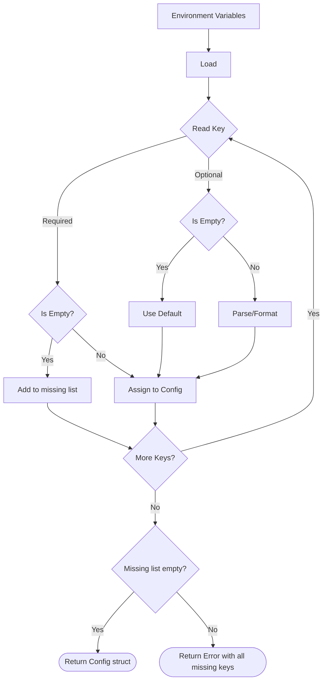

# Core Configuration (`config`)

## Objectives
The `config` package is responsible for loading the core service configuration from the process environment variables. It is designed to be **fail-fast**, meaning it validates all required configurations at startup and reports all missing or invalid variables in a single error. This ensures that the application never starts in a half-wired or misconfigured state.

## How It Works
The `Load` function initializes a configuration reader which wraps the environment variable lookup (e.g., `os.Getenv`). 
The reader provides helpers like `required`, `optional`, and `boolOptional` to extract values. As it processes each variable, it accumulates any missing required keys rather than failing immediately on the first missing key. If the `missing` list is non-empty at the end of the process, it returns a comprehensive error.

## Data Flow
1. **Environment Variables**: Raw strings are read from the environment.
2. **Parsing and Defaults**: The reader trims whitespace, parses commas into lists (e.g., `CHAT_KILL_SWITCH_ACCOUNTS`), parses booleans, and applies defaults where allowed (e.g., `:8080` for `HTTP_ADDR`).
3. **Struct Population**: A resolved, validated `Config` struct is returned.

## Constraints
- **Fail-Fast**: A misconfigured deployment must fail to start.
- **No Branching**: Values are plain data. There is no locale, region, or currency branching logic living in this package.
- **No Default Secrets**: Secrets (such as `LLMGatewayToken`) are never defaulted and must explicitly be provided via the environment.

## Configuration Loading Flow

