# Connector (`connector`)

## Objectives
The `connector` package manages integration with the external DK Seller API. It handles token exchange, storage, and refresh, enforces tenant authorization, drives a capability registry based on live probes, and fetches catalog variants.

## How It Works
- **Token Management**: `service.go` orchestrates connecting, refreshing, and disconnecting. It exchanges OAuth authorization codes for access/refresh tokens and persists them sealed (encrypted at rest).

- **Capability Gating**: The connector implements a capability registry (e.g., `CatalogRead`, `PriceWrite`). Every capability starts in an `Unknown` state. Capabilities transition to `Supported`, `Unsupported`, or `Degraded` based on actual API probes (using `DKClient.Probe`). Dependent operations must call `Require` or `IsSupported` before executing logic.
- **DK Client Wrapper**: `DKClient` (`client.go`) wraps the generated `dkgo` client. It is the ONLY seam that reaches out to the DK API. It uses trace-propagating HTTP transports and injects bearer tokens.
- **Catalog Synchronization**: `catalog_client.go` handles fetching seller variants from DK. It implements robust parser drift detection and pagination validation.

## Data Flow
1. **Connection**: The caller invokes `Connect` with an auth code. The connector verifies tenant ownership, exchanges the code, seeds capabilities, stores the tokens, and immediately probes capabilities.
2. **API Interaction**: When an operation (e.g., `FetchVariantsPage`) is requested, the service first checks if the necessary capabilities are `Supported` via the `Registry`. It then decrypts the access token and makes the call via `DKClient`.
3. **Sync Enqueue**: Instead of running syncs inline, the connector interacts with a `SyncEnqueuer` to transactionally schedule asynchronous background jobs for catalog synchronization.

## Constraints
- **Capability Invariants**: `Unknown` never enables dependent logic. Capabilities must explicitly be `Supported` for logic to run. When tokens are refreshed or disconnected, capabilities are atomically reset to `Unknown`.
- **Tenant Isolation**: Account ownership is validated against the authenticated organization before **any** DK call or database write (`S8-AUTHZ-001`). Unknown or foreign accounts yield an indistinguishable `ErrAccountNotFound` to prevent existence oracles.
- **Money Quarantine**: When fetching variant items, the DK price token is preserved verbatim as a `json.Number` (string). It is never parsed into a float or numeric type within this package to prevent rounding and unit ambiguity issues.
- **Strict Pagination Validation**: Pager cardinality (requested page vs echoed page, total rows vs total pages) must perfectly align. Ambiguous payloads fail closed to avoid data corruption.

## Data Flow Diagram

```mermaid
flowchart TD
    subgraph Connection Flow
        Connect["Connect (Auth Code)"] --> Validate[Validate Tenant]
        Validate --> Exch[Exchange for Tokens]
        Exch --> Seed[Seed Capabilities to Unknown]
        Seed --> Store[Store Sealed Tokens]
        Store --> Enq[Enqueue Initial Sync]
        Enq --> Probe1[Probe Capabilities]
    end

    subgraph Operation Flow
        Op[API Requested] --> ReqCap[Require Capability]
        ReqCap -->|Unknown| Probe2[Probe / Fetch]
        Probe2 --> CheckCap{"Is Supported?"}
        ReqCap -->|Known| CheckCap
        
        CheckCap -->|No| ErrCap[ErrCapabilityNotSupported]
        CheckCap -->|Yes| Decrypt[Decrypt Token]
        Decrypt --> Call[DKClient API Call]
    end
    
    subgraph Refresh Flow
        Refresh[Refresh Token] --> Reset[Reset Capabilities to Unknown]
        Reset --> CallRefresh[Exchange Refresh Token]
        CallRefresh --> StoreNew[Store New Tokens]
    end
```

