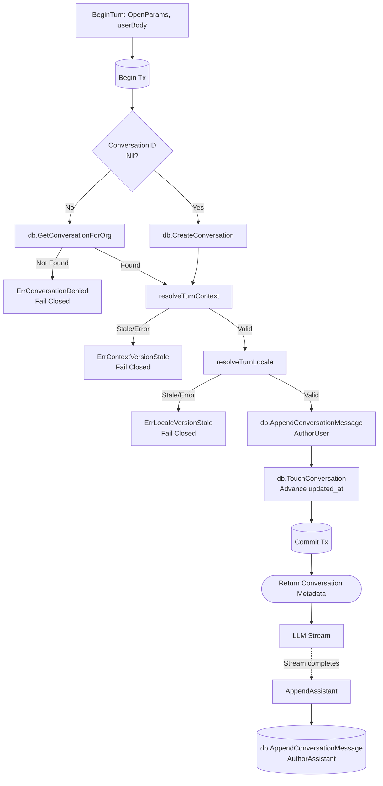

# Conversation (`conversation`)

## Objectives
The `conversation` package serves as the gateway-owned durability layer for chat conversations and their message turns. It provides a 90-day searchable history while strictly adhering to safety, deterministic context bindings, and audit independence.

## How It Works
- **Storage Layer**: `Store` (`conversation.go`) interacts with the database to atomically append message turns and resolve conversations under the user's organization.
- **Context Binding**: `context.go` provides pure logic for deterministic context transitions (e.g., binding a conversation to a specific entity). 
- **Locale Binding**: `locale.go` manages pure logic for the authoritative wire locale of the conversation, treating locale as explicit data rather than inferring it from text.

## Data Flow
1. **Begin Turn**: The caller invokes `BeginTurn` with an intent to append a user message. 
2. **Resolution & Auth**: The store ensures the conversation ID belongs to the caller's organization. It resolves the deterministic context and locale by comparing the client's requested versions against the stored versions.
3. **Persist**: The user turn is saved as an append-only row. 
4. **Gateway Identity**: The authoritative conversation metadata is returned to the caller so it can be passed to the LLM plane. The LLM plane uses this identity but does not directly touch the database.
5. **Assistant Append**: Once the LLM response completes, `AppendAssistant` saves the assistant's turn.

## Constraints
- **Append-Only**: Message turns are INSERT-only. The database issues no `UPDATE` or `DELETE` on message rows.
- **Audit Independence**: Conversations hold no action, approval, or execution state. If a conversation is deleted, the core audit logs for executions remain perfectly intact.
- **Free Text carries no authority**: A stored message can never approve or execute an action.
- **Fail-Closed Versioning**: Both `context` and `locale` enforce strict version matching. Stale views from the client (version mismatch) or missing explicit transition flags cause the request to fail closed (no DB writes occur).

## Data Flow Diagram

