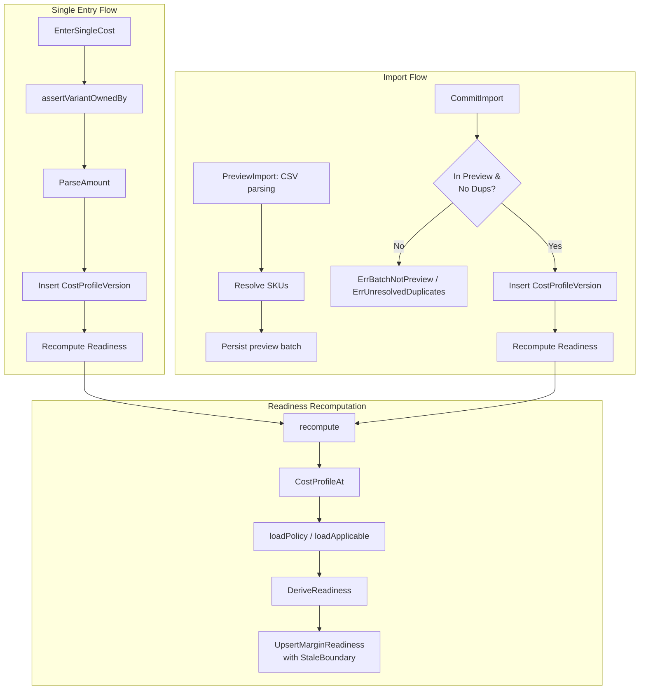

# Cost (`cost`)

## Objectives
The `cost` package manages effective-dated, component-versioned cost profiles, handles CSV imports (preview and commit), accepts single-value cost entries, provides point-in-time cost lookup, and derives margin readiness.

## How It Works
- **Import Pipeline**: `PreviewImport` parses a CSV file, resolves SKUs against the account's catalog, and persists a `preview` batch. No actual cost values are committed to production profiles at this stage. 
- **Commit Flow**: `CommitImport` commits the preview batch. It takes accepted rows and writes them as new, effective-dated cost profile versions, then recomputes readiness for affected SKUs.
- **Cost Profiles & Point-in-Time**: `Service.CostProfileAt` provides the exact cost components in force at a given timestamp, enabling historically accurate recalculations.
- **Readiness Derivation**: `GetReadiness` evaluates in-force cost components against account policies and SKU applicability (e.g., whether COGS, Commission, or Fulfillment are satisfied and not stale) to determine if a SKU's margin is ready.
- **Amount Parsing**: `amount.go` securely converts string numeric tokens into `money.Money`.

## Data Flow
1. **Cost Input**: Users supply costs via a single entry (`EnterSingleCost`) or CSV batch.
2. **Parsing & Normalization**: Numeric strings are sanitized (removing thousands separators, normalizing decimals) and parsed directly into mantissa integers.
3. **Database Insertion**: Valid inputs are inserted as append-only `cost_profile_versions` rows.
4. **Readiness Computation**: Whenever new costs are inserted, `recompute` evaluates if all required components for the variant exist and calculates an earliest `stale_after` boundary. The updated margin readiness state is upserted.
5. **Querying**: Downstream systems fetch cost readiness or historical cost profiles, guarded by organization-scoped queries.

## Constraints
- **No Float Math**: Money amounts are strictly parsed into integer mantissas based on currency exponents. Floating-point types are never used to prevent rounding and precision errors.
- **Strict CSV Lifecycle**: A CSV import cannot be committed until all duplicate row conflicts are resolved. No rows are committed directly during the preview phase.
- **Tenant Scoping (No Oracles)**: Operations use `scoped.go` to securely map the caller's organization to the marketplace account. Querying an unknown variant/batch or one owned by another organization returns an identical `ErrVariantNotFound` or `ErrBatchNotFound` to prevent leaking existence data.
- **Authoritative Provenance**: Certain components (e.g., Commission) require authoritative sources. If an imported value lacks this provenance, it will not count towards satisfying readiness.

## Data Flow Diagram

