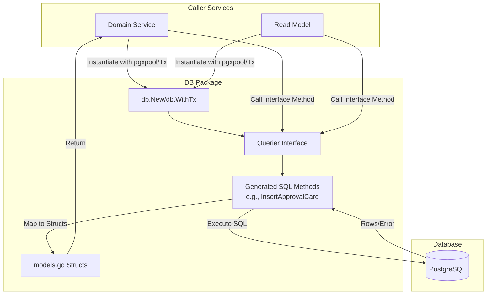

# Database Layer (DB)

## Objective
The `db` module serves as the primary data access layer (DAL) for the core service. It provides strongly typed Go models and a unified interface for all database interactions. The module encapsulates PostgreSQL operations generated by `sqlc`, ensuring type safety, deterministic queries, and adherence to strict architectural boundaries (e.g., append-only auditability, multi-tenant scoping).

## How It Works
- **Code Generation**: The module relies on `sqlc` (version 1.31.1) to generate Go structures and interface methods from raw SQL queries. Do not manually edit the generated files.
- **Models (`models.go`)**: Contains type definitions mapping directly to database tables (e.g., `MarketEvent`, `Observation`, `ApprovalCard`, `CostProfile`, `User`).
- **Querier Interface (`querier.go`)**: Defines the comprehensive `Querier` interface outlining every available database operation (Insert, Get, Update, Count, etc.). 
- **Implementation**: `*db.Queries` implements the `Querier` interface, executing parameterized queries against a `pgxpool.Pool`.

## Data Flow
1. **Connection**: Higher-level application services (e.g., domain logic, read models) instantiate the database layer by passing a `pgxpool.Pool` to `db.New(pool)`.
2. **Query Execution**: Services call methods on the `Querier` interface (e.g., `GetActionExecution`, `InsertApprovalCard`). 
3. **Database Interaction**: The generated methods execute the underlying SQL, serializing/deserializing data into the structs defined in `models.go`.
4. **Result Return**: The result (or `pgx.ErrNoRows`/other errors) is returned to the calling service for further domain processing.

## Constraints
- **Append-Only History**: Many tables (e.g., `approval_card_states`, `audit_records`, `conversation_messages`, `cost_profiles`) are strictly append-only. There are deliberately no `UPDATE` or `DELETE` queries generated for these records to preserve authoritative audit trails.
- **Strict Tenant Scoping**: Multi-tenancy is enforced directly in the SQL queries. Methods such as `GetEventForOrg`, `GetApprovalCardForAccount`, and `GetObservationForAccount` automatically enforce account and organization boundaries. Cross-tenant access fails closed without leaking existence (e.g., acting as an existence oracle).
- **Idempotency**: Insert and execution paths frequently rely on database-level constraints like `ON CONFLICT DO NOTHING` (e.g., `ClaimActionExecution`, `DeliverNotification`, `CreateCatalogSyncRun`) to handle concurrent requests safely and prevent duplicate records.
- **State Machine Transitions**: Mutable current-state tables rely on optimistic concurrency and FROM-state guarded updates (`AdvanceApprovalCardState`) rather than blind overwrites.

## Data Flow Diagram

