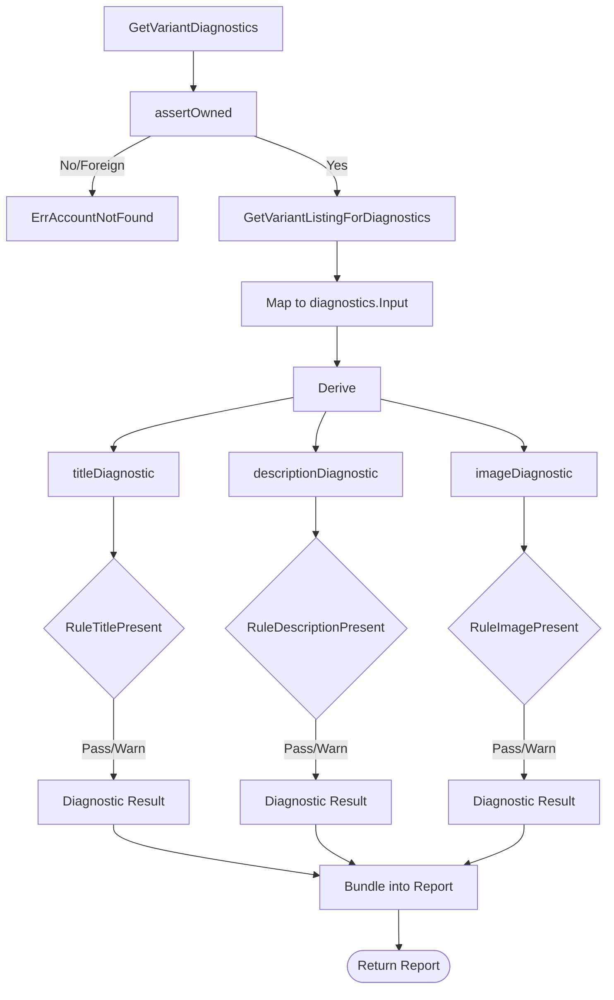

# Diagnostics Read Model

## Objective
The `diagnostics` module is a strictly read-only service responsible for evaluating captured canonical catalog data (Product, Variant, Listing) and producing diagnostic reports (pass/warn) for a variant's listing fields (such as title, description, and images). Its purpose is to accurately report the observed state against defined rules (LST-001) without modifying data or generating new content.

## How It Works
- **ReadService (`read.go`)**: The main entry point that implements the account-scoped, read-only diagnostic read model. It relies on a `diagnosticsQuerier` (typically the `db` module) to fetch captured data.
- **Rules Derivation (`diagnostics.go`)**: Contains the `Derive` function and specific evaluators (e.g., `titleDiagnostic`, `descriptionDiagnostic`, `imageDiagnostic`). It takes captured `Input` and evaluates it against named rules (e.g., `RuleTitlePresent`).
- **Observed Metadata**: Diagnostics record the state (`present`, `empty`, `not_observed`) and length metadata of the field. They do **not** return the raw text of the listing.

## Data Flow
1. **Request**: A caller invokes `GetVariantDiagnostics(ctx, organizationID, accountID, variantID)`.
2. **Ownership Assertion**: The service validates that the `accountID` strictly belongs to the `organizationID` by calling `GetOrgMarketplaceAccountID`. 
3. **Data Fetch**: The service fetches the canonical catalog data via `GetVariantListingForDiagnostics`.
4. **Evaluation**: The fetched row is mapped to an `Input` struct and passed to `Derive(Input)`.
5. **Report Generation**: The `Derive` function runs rule logic for the title, description, and images, outputting a slice of `Diagnostic` structs. This is bundled into a `Report` and returned to the caller.

## Constraints
- **Strictly Read-Only**: This package has no write handle and no content-generation seams. Deriving a report mutates nothing. 
- **Quarantine-Over-Inference**: A field whose source content is not yet surfaced by the connector (e.g., currently description and images) is reported as `not_observed` (warning/failing closed). The service never fabricates a pass or infers an unobserved value.
- **Fail-Closed Cross-Tenant Checks**: Ownership checks happen before any catalog read. A foreign or unknown account returns `ErrAccountNotFound`, ensuring that possession of an account or variant UUID never leaks another tenant's data.
- **Privacy via Metadata**: The `Diagnostic` output contains character length and state only, never exposing the raw field content outside of the input boundary.

## Data Flow Diagram

