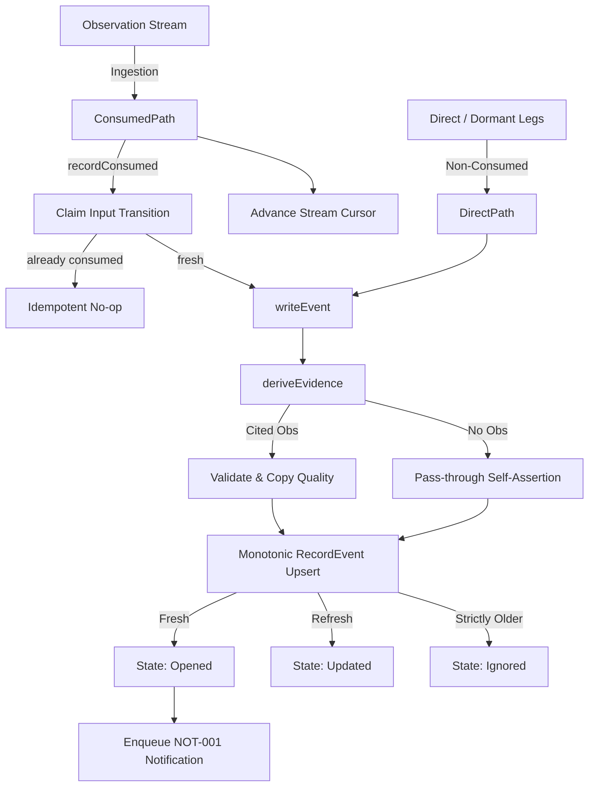

# Event Service

## Objectives
The `event` package implements the P0 market-event engine and the Today ranking system (PRD §7.4 EVT-001..005). It is responsible for detecting material market events, managing their lifecycle (open, updated, resolved, expired), and ranking them for the Today feed based on exposure, confidence, and urgency.

## How it works
The package is composed of several key components:
- **Event Types (EVT-001)**: Supports five primary event types (winning state, competitor price, seller count, suppression boundary, and contribution floor).
- **Materiality Thresholds (EVT-002)**: Events are evaluated against versioned, category-specific materiality thresholds.
- **Producer**: The `Producer` runs as a scheduled job, scanning a durable `Source` of input transitions. It resolves the applicable threshold, invokes the corresponding detector, and hands material `Candidate` events to the `Recorder`.
- **Deduplication (EVT-003)**: A repeated signal for the same dedup key updates the single open record in place (refreshing its evidence) rather than creating a duplicate Today item.
- **Ranking (EVT-004)**: The `Today()` feed ranks events deterministically using the formula: `exposure × confidence × urgency`, with a stable tie-break.

## Data Flow
1. **Ingestion**: The `Producer` consumes observation stream transitions.
2. **Evaluation**: Transitions are evaluated by type-specific detectors against the current `ThresholdAsOf`.
3. **Recording**: The `Service.RecordFor()` method records the event. For stream-consumed events, it commits the ingestion claim, the event upsert (open or update), and the durable stream cursor advancement in a single, monotonic transaction.
4. **Lifecycle**: Open events are resolved when their triggering condition clears (`ResolveOpen`), or swept to an expired state once their deadline passes (`ExpireStaleAll`).
5. **Retrieval**: `TodayForOrg` and `ListOpenForOrg` serve tenant-scoped views of the active events to the gateway.

## Constraints
- **Unknown Impact (EVT-005)**: Missing sales/cost context results in an explicitly `Unknown` exposure, which is never coerced into a zero value or numeric float.
- **Evidence Quality (§10.3)**: Corroborated evidence qualities (`verified`, `supported`) cannot be self-asserted by a caller; they must be derived from a validated, fresh observation record within the same transaction.
- **Money Quarantine (§9.1)**: Price signals are handled as raw evidence tokens. Price movement is evaluated via dimensionless basis-point comparisons, ensuring money amounts are never improperly coerced.
- **Tenant Integrity**: All reads and writes enforce organization-to-account ownership checks. A cross-tenant access attempt yields a generic not-found error to prevent existence oracles.

## Architecture Diagram

