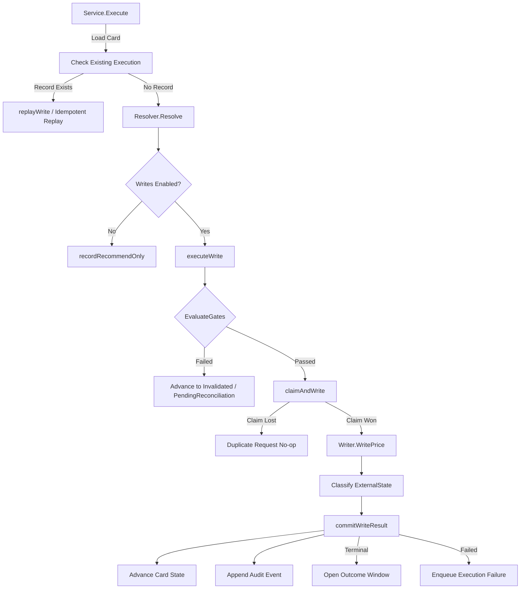

# Execution Service

## Objectives
The `execution` package is responsible for safely and idempotently enacting approved price changes in the marketplace (PRD §7.5 EXE-001..005). It acts as the final gatekeeper, ensuring that an approved action is revalidated against authoritative server-side state immediately before performing the external write. It supports both active writes (`ModeWrite`) and tracking for external matching (`ModeRecommendOnly`).

## How it works
- **Revalidation (EXE-001)**: Before writing, the `Service.Execute` method consults a `Resolver` to fetch a `RevalidationContext`. The resolver checks six authoritative external signals: identity confirmation, current price match, unambiguous money unit, known marketplace price boundary, active execute permissions, and evidence freshness (JIT).
- **Execution**: If the revalidation gates fail, the card is advanced to `Invalidated`. If they pass, the `Service` performs exactly one external write via a `Writer`. 
- **Idempotency (EXE-002)**: The execution is strictly idempotent. A stable idempotency key is claimed before the write, ensuring an at-most-one-write guarantee even across restarts or concurrent requests.

## Data Flow
1. A client invokes `Execute()` with a card ID.
2. The executor reads the card (`CardStore`) and re-resolves the binding via the `Resolver`.
3. `EvaluateGates()` evaluates the inputs against the six required signals.
4. If enabled and valid, it claims the idempotency key (`claimAndWrite`) and issues the external mutation.
5. The classified external result (`ExternalState`), card state transition, and an `AUD-001` audit event are committed atomically in a single database transaction. 

## Constraints
- **Authoritative Resolution**: The revalidation relies entirely on server-resolved state; it never trusts client-echoed request bodies for gate checks.
- **Fail-Closed Design**: If any live signal source is missing, the resolver refuses to authorize execution (`ErrSignalsStatic`).
- **Atomic Auditing**: State changes never commit without their corresponding audit row. 
- **Free-Text Containment**: Raw marketplace free-text from external responses is redacted before being stored in the append-only audit trail.
- **Visibility**: Parked cards (e.g. stranded due to crashes) are aggressively tracked with no-write markers, ensuring they become visible for reconciliation.

## Execution Flow Diagram

