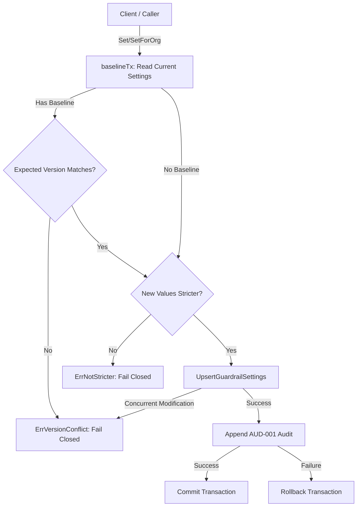

# Guardrail Service

## Objectives
The `guardrail` package is responsible for persisting L3 commercial guardrails (contribution floor, movement cap, cooldown, strategy enablement), aligning with S37 consolidated PD-3 item 6. It provides a secure, tenant-scoped, and auditable mechanism to manage account-level guardrail settings.

## How it works
The package exposes a `Service` with methods to read (`Get`, `GetForOrg`) and write (`Set`, `SetForOrg`) guardrail settings. 
Writes are governed by two critical invariants:
1. **Optimistic Concurrency**: Writes require an `expectedVersion` token to ensure that concurrent updates do not result in lost updates. If the version has advanced, the write fails with a safe conflict.
2. **Stricter-Only (PRC-004)**: Guardrails can only be tightened. The `validateStricter` logic enforces that new values are strictly tighter (e.g., smaller movement cap, longer cooldown, higher or equal contribution floor) compared to the authoritative effective baseline (or PRC-004 defaults for the first write).

## Data Flow
- **Reads (`GetForOrg`)**: Resolves the single marketplace account owned by the caller's organization ID. If the account does not match the requested account, it uniformally returns a not-found error to prevent existence oracles.
- **Writes (`SetForOrg`)**: Account ownership is resolved first. Then, in a single transaction, the authoritative baseline is read, the stricter-only gate is checked, the new settings are upserted, and an `AUD-001` audit record is appended. A failure in the audit append rolls back the entire transaction.

## Constraints
- **Tenant Isolation**: Operations are strictly scoped to the authenticated principal's organization and marketplace account. Foreign account IDs are rejected with a uniform 404 (ErrAccountNotFound).
- **Atomic Auditing**: Guardrail changes are never recorded without their reproducible audit trail. The write and the audit log append occur on the same database transaction.
- **Stricter-Only Mutations**: Loosening guardrails is structurally prevented at the domain level, failing closed without mutating state.
- **Valid Strategies**: Enforces a closed vocabulary of valid strategies (`hold`, `match`, `undercut`).

## Flow Diagram

