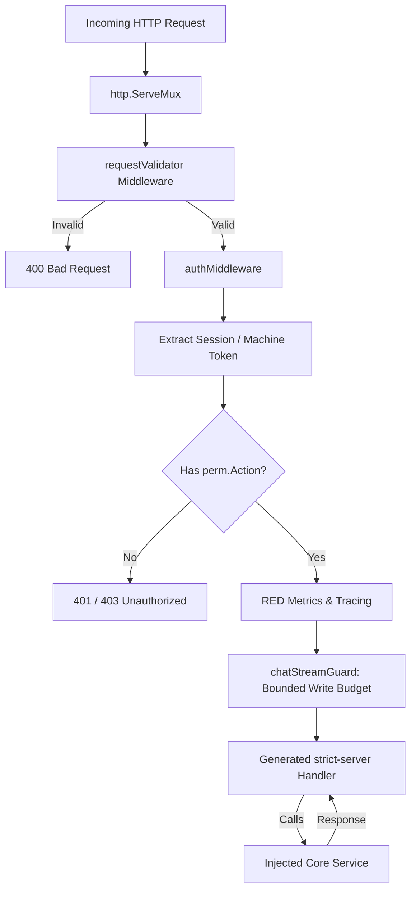

# HTTP API Transport

## Objectives
The `httpapi` package is the HTTP transport adapter for the core service. It mounts the generated OpenAPI gateway routes (`gen/go`) onto a standard `net/http` multiplexer. It is responsible for request ingress, strict payload validation, authentication, and authorization.

## How it works
- **Server Assembly**: The `NewServer` function constructs the HTTP server. Core business services (e.g., Auth, Connector, Cost, Event, Approval, Execution) are injected using functional options (`Option`).
- **Strict Request Validation**: It employs a `requestValidator` middleware (using `kin-openapi`) to enforce the OpenAPI contract before any handler is invoked. This checks for required properties, closed schemas (`additionalProperties: false`), and limits request body size.
- **Authorization Enforcement**: The `authMiddleware` binds each mounted route to a specific required action (`perm.Action`). It resolves the session token and enforces the `perm.Can(role, action)` matrix.

## Data Flow
1. **Ingress**: An incoming HTTP request hits the `http.Server`.
2. **Validation**: The `requestValidator` reads the body, enforces a 2MB size limit, ensures exactly one JSON document, and strictly validates the shape against the embedded OpenAPI spec.
3. **Authentication & Authorization**: The `authMiddleware` extracts the session (or `LLM_GATEWAY_TOKEN` for machine routes, or scoped capture credentials for extensions), resolves the principal, and verifies they hold the requisite permission.
4. **Handler Execution**: The request is passed to the generated strict-server handler (`gatewayServer`), which delegates it to the injected core `Service`.

## Constraints
- **Strict Separation**: This is the *only* package permitted to import the `gen/go` generated code. Core domain packages remain isolated from transport-specifics.
- **Fail-Closed Unwired Services**: Services not injected into the server fail closed with a structured error, preventing a silent success when a plane is disabled.
- **Free-Text Containment**: Validation errors map to canonical, bounded `ErrorEnvelope`s. The offending request values or raw internal error messages are never echoed back to the client.
- **No Unlisted Routes**: Any path or method not explicitly mapped in `routePolicies` is denied by default, ensuring new endpoints cannot ship unauthenticated.

## Request Pipeline Diagram

