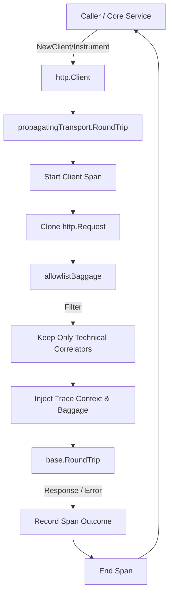

# httpx

## Objective
The `httpx` package centralizes the construction of outbound HTTP clients for the core service. Its primary purpose is to ensure that W3C trace context (traceparent/tracestate) and allowlisted baggage are consistently propagated across every process boundary initiated by the core (e.g., core to LLM plane, core to DK Seller).

## How it Works
It implements a custom `http.RoundTripper` (`propagatingTransport`) that wraps a base transport. For every outbound request, it starts a client span as a child of the caller's context span, injects the W3C trace context into the cloned request's headers, and records the outcome upon completion.

## Data Flow
1. An HTTP request is dispatched using a client created via `httpx.NewClient` or `httpx.Instrument`.
2. The `propagatingTransport` intercepts the request, cloning it to avoid mutating the caller's instance.
3. A new OpenTelemetry child span is started.
4. Trace context and allowlisted baggage (e.g., `service.version`, `schema.version`) are injected into the headers.
5. The request is delegated to the base `RoundTripper`.
6. The response status (or error) is recorded on the span, which is then ended.

## Constraints
- **Security / Containment:** Baggage is strictly allowlisted. Sensitive data (secrets, PII, localized copy, raw text, approval-control secrets) must NEVER be propagated in baggage across process boundaries.
- **Immutability:** The original `*http.Request` is never mutated (a clone is created) to preserve retry safety and the caller's headers.
- **Fail-Closed Tracing:** If no tracing is installed, the outbound behavior remains unchanged (tracing is off). Context deadlines and cancellations (e.g., for SSE streams) are fully preserved.

## Flow Diagram

