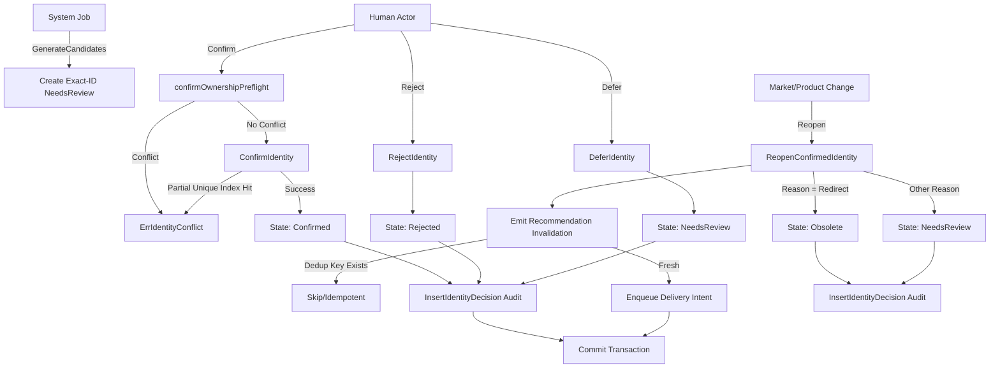

# identity

## Objective
The `identity` package implements Market Product Identity mapping. It links an owned catalog `Variant` to a public DK product record via a versioned, human-governed state machine. 

## How it Works
Identity mappings progress through strict states: `NeedsReview`, `Confirmed`, `Rejected`, and `Obsolete`. The system provides a `Service` that orchestrates these transitions:
- `GenerateCandidates` creates exact-native-id candidates in the `NeedsReview` state.
- Human decisions transition candidates to `Confirmed`, `Rejected`, or `Deferred`.
- Changes in the underlying marketplace or product triggers a `Reopen`, moving a `Confirmed` mapping to `NeedsReview` or `Obsolete` depending on the reason.

## Data Flow
1. **Candidate Generation:** A system task generates candidate mappings based on strict exact-match rules.
2. **Decisions:** A human actor confirms, rejects, or defers mappings. These state changes write the mapping and an append-only audit trail (`market_product_identity_decisions`) in the same transaction.
3. **Reopening:** If an identity needs to be re-evaluated, `Reopen` transitions the state, writes an audit row, and transactionally enqueues a durable recommendation-invalidation event via a River job dispatcher to downstream consumers.

## Constraints
- **Quarantine Invariant:** ONLY a `Confirmed` mapping may drive an executable path or recommendation.
- **Ownership Invariant:** A variant can have at most ONE active `Confirmed` mapping, enforced by a partial unique database index. Any concurrent violations result in a mapped `ErrIdentityConflict`.
- **Transactional Integrity:** State changes, append-only audits, and durable dispatch intents (for reopening) are always committed atomically within a single `pgx` transaction.

## State Diagram

