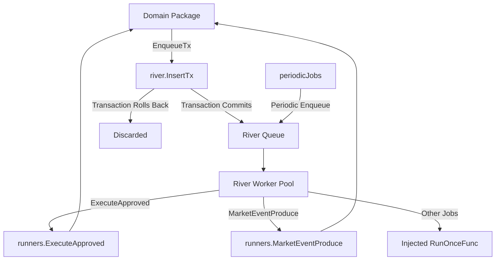

# jobs

## Objective
The `jobs` package serves as the platform's job pipeline, providing a domain-agnostic wrapper over the River queue. It manages the registration, migration, and transactional enqueuing of both periodic and event-driven background jobs.

## How it Works
It initializes a River client bound to `pgx.Tx` to ensure work is enqueued only when the associated business transaction commits. It registers various workers through `ExecutionRunners` (e.g., recommend-only matching, outcome closure, market-event production, recommendation production, notification delivery). These runner functions are injected to prevent import cycles with domain packages.

## Data Flow
1. **Enqueuing:** Domain logic calls `jobs.EnqueueTx` within a `pgx.Tx`. If the transaction rolls back, the job is discarded. If it commits, the job becomes visible to River.
2. **Periodic Jobs:** Pre-configured schedules (e.g., every 5 minutes, hourly) repeatedly enqueue predefined periodic jobs (like `MarketEventProduce` or `BriefingGenerate`).
3. **Execution:** River workers pull jobs from the queue and invoke the corresponding injected runner functions.

## Constraints
- **Transactional Guarantees:** Enqueuing must be transactional (`EnqueueTx`). Non-transactional insertions are deliberately not surfaced to avoid orchestrating tasks for rolled-back business logic.
- **Dependency Isolation:** The `jobs` package orchestrates workers but knows nothing of their business logic. All domain actions are injected as generic functions (`RunOnceFunc` or specific runner types).
- **Idempotency:** The worker bodies (such as periodic generation tasks) must be inherently idempotent, allowing River to retry them freely upon error without side effects.

## Pipeline Diagram

