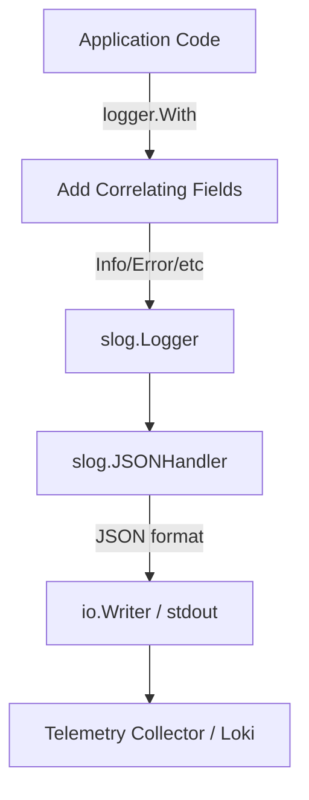

# log

## Objective
The `log` package provides a structured JSON logger using the standard library's `slog` package. It enforces the logging format contract across the core binary.

## How it Works
It configures and returns an `slog.Logger` instance initialized with an `slog.JSONHandler` pointing to the specified `io.Writer`. It also provides a helper (`ParseLevel`) to safely map textual log levels to `slog.Level`.

## Data Flow
1. Application code emits log entries using the initialized `slog.Logger` (and adds correlating fields via `logger.With`).
2. The `slog.JSONHandler` serializes the log lines to JSON.
3. The structured JSON output is written to standard output, where it can be collected by the OpenTelemetry/Loki observability stack.

## Constraints
- **JSON Format:** Logs must be emitted in JSON format to stdout to satisfy the system's collection contract.
- **Level Parsing Defaults:** Unknown or empty textual log levels safely default to `Info` rather than failing.

## Logging Flow Diagram

