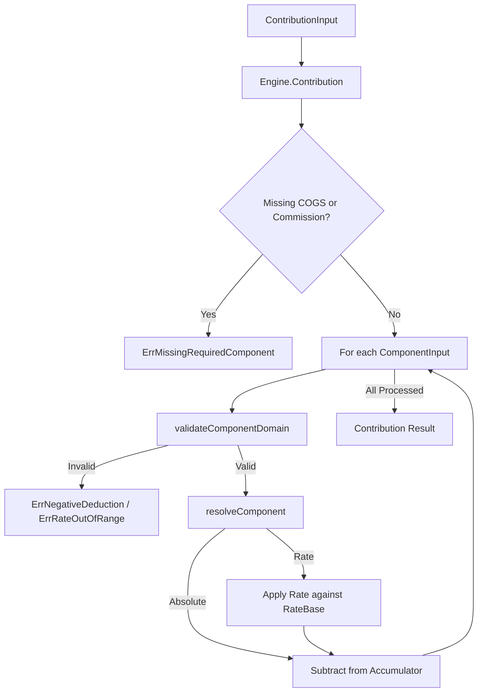

# margin

## Objectives
The `margin` submodule implements the deterministic contribution model (PRD §9.2) for the DK Marketplace Intelligence core. It is the authoritative engine for calculating a SKU's margin contribution:
`Contribution = net seller proceeds − COGS − commission − fulfillment − seller-funded shipping − packaging − seller-funded promotion − variable advertising allocation − expected returns allowance`.

## How it works
It relies on a stateless `Engine` to compute contributions from a `ContributionInput`. It resolves exact component deductions (absolute amounts or rate-based percentages) against net proceeds and a rate base. 
The package strictly utilizes exact money and fixed-point basis-point arithmetic to resolve calculations. For rate components, it applies a versioned rounding rule (`contribution/round-half-even@v1`). It also performs strict component domain validation, rejecting out-of-bounds rates or negative deductions that would inflate the contribution artificially.

## Data flow
1. **Input**: A `ContributionInput` is provided by the S17 assembler, holding `NetProceeds`, `RateBase`, a list of `ComponentInput` deductions, and the current readiness state.
2. **Execution**: `Engine.Contribution()` iterates through the provided components.
3. **Validation**: Each component undergoes domain validation (e.g., verifying absolute deductions are non-negative, and rates are within [0, 10000] bp).
4. **Resolution**: Components are resolved into exact money deductions. Rates are applied against the `RateBase` via `money.Money.ApplyRate`.
5. **Subtraction**: Each resolved deduction is sequentially subtracted from an accumulator via `money.Money.Sub()`.
6. **Hard Requirements Check**: Verifies that both COGS and commission were provided in the input.
7. **Output**: Returns a `Contribution` holding the exact final amount, a breakdown of deductions, the readiness state, and the rounding rule used.

## Constraints
* **No Floats**: No floating-point or raw integer arithmetic is permitted. Arithmetic strictly routes through `money.Money` methods.
* **Hard Requirements**: A contribution cannot be computed without both COGS and commission.
* **Readiness**: The engine computes the value for partial states, but only a `Complete` readiness state produces an `Executable()` contribution.
* **Domain Restrictions**: Deduction rates must be in the `[0, 10000]` basis points domain. Absolute deduction amounts must be strictly non-negative. Duplicate components in a single input are rejected.

## Flow Diagram

