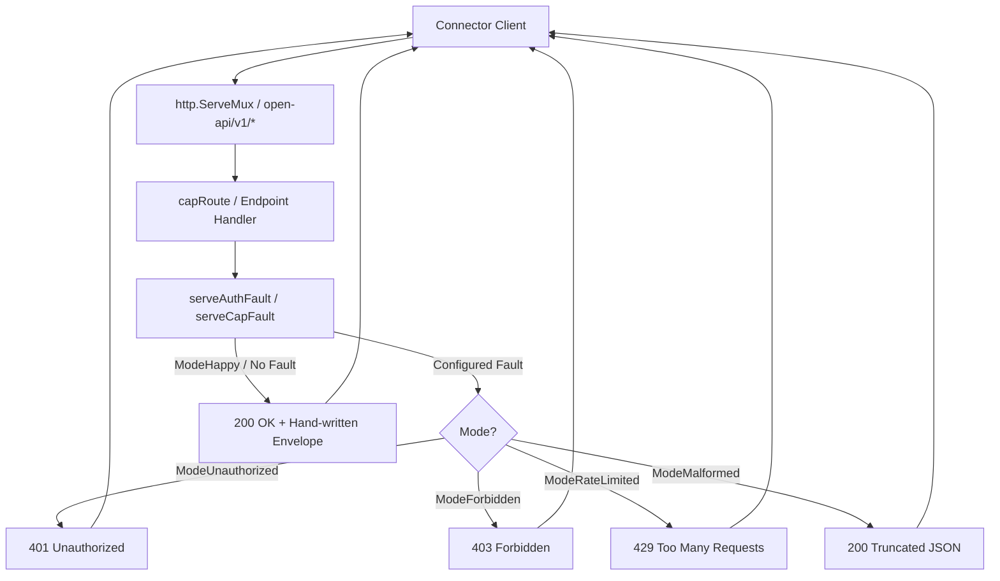

# mockdk

## Objectives
The `mockdk` submodule serves as a configurable, offline stand-in for the live DK Seller API. Its primary objective is to allow the connector to exercise endpoints (auth, token exchange, and §15.2 capability probes) offline and deterministically without touching live DK systems. 

## How it works
It spins up an `httptest.Server` mapping standard DK API routes to mock HTTP handlers. It exposes a configuration (`Config`) that dictates endpoint behaviors (`Mode`), allowing tests to explicitly inject faults such as 401 Unauthorized, 403 Forbidden, 429 Rate Limited, or malformed JSON payloads. It also supports serving a sophisticated paginated catalog fixture (`CatalogFixture`) to test S10 catalog synchronization logic, including resuming from page faults.

## Data flow
1. **Request**: The connector sends HTTP requests to the mock server's `ServeMux`.
2. **Fault Checking**: The handler consults the mock's `Config` via `serveAuthFault` or `serveCapFault` to check for configured anomalies on the requested capability/endpoint.
3. **Fault Path**: If a fault is configured (e.g. `ModeRateLimited`), the server returns the appropriate HTTP status code (429) and a corresponding mock DK error envelope.
4. **Happy Path**: If no fault is triggered, the server constructs a well-formed JSON success envelope mimicking DK's API (e.g. returning tokens, paginated items, or pricing boundary context).
5. **Pagination**: For the `/variants` endpoint, if a `CatalogFixture` is supplied, it slices the items by page size and serves accurate paginated responses or page-specific faults.

## Constraints
* **Decoupled from generated types**: The module must deliberately NOT import `gen/dkgo`. All JSON envelopes are hand-written to ensure the mock acts as a genuine independent oracle and prevents silent drift with the generated types.
* **Stateless Fault Injection**: Mock behaviors are completely determined by the stateless `Config` provided on server creation.

## Request Flow Diagram

