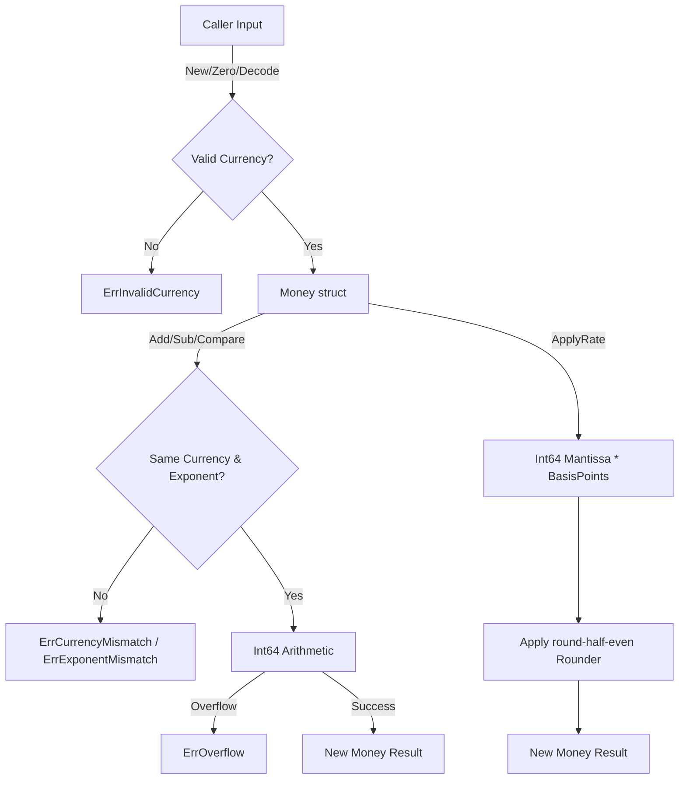

# money

## Objectives
The `money` submodule provides the authoritative money representation for the DK Marketplace Intelligence core (PRD §9.1). It ensures that all monetary values and basis-point rates are handled exactly, preventing precision loss, cross-currency contamination, or arithmetic overflow.

## How it works
It encapsulates amounts in a `Money` struct containing a `mantissa`, `currency`, and `exponent`. It implements arithmetic (Addition, Subtraction, Negation) and comparisons (Equal, Compare) directly on this struct. To handle percentages and rates (e.g. commissions), it offers a `BasisPoints` type and an `ApplyRate` method that uses arbitrary-precision rational math (`math/big`) to compute intermediate products before applying a deterministic rounding rule back to an integer mantissa.

## Data flow
1. **Initialization**: Money is constructed via `New`, `Zero`, or parsed from canonical string encodings via `Decode` / `UnmarshalText`. A missing amount (Go zero value) is strictly treated as invalid.
2. **Validation**: Every operation enforces compatibility checks: values must be valid, and they must share the exact same `currency` and `exponent`.
3. **Arithmetic**: Computations run on the exact `int64` mantissas, returning a new `Money` instance or throwing typed errors for overflow (`ErrOverflow`) or incompatibility.
4. **Rate Application**: Multiplies the `Money` mantissa by a fixed-point `BasisPoints` value, delegating the quotient to a `Rounder` (e.g. round-half-even) to produce the exact resulting money amount.
5. **Output**: Resulting `Money` can be stringified to a strict `CURRENCY:mantissa:exponent` format.

## Constraints
* **No Floats**: Floating-point types are strictly forbidden on any money path.
* **Isolation**: This package imports no other internal packages to preserve strict domain isolation.
* **Currency Boundaries**: Cross-currency operations are not permitted (P0 constraint). Addition, subtraction, or comparisons across different currencies or exponents strictly fail at runtime.
* **Invalidity of Zero-Value**: An uninitialized `Money` (Go zero-value) is considered invalid, not zero. `IsZero()` will return an error if called on an invalid object.
* **Currency Code Standard**: Currencies are strictly validated against an active list of ISO-4217 alphabetic codes.

## Logic Flow Diagram

