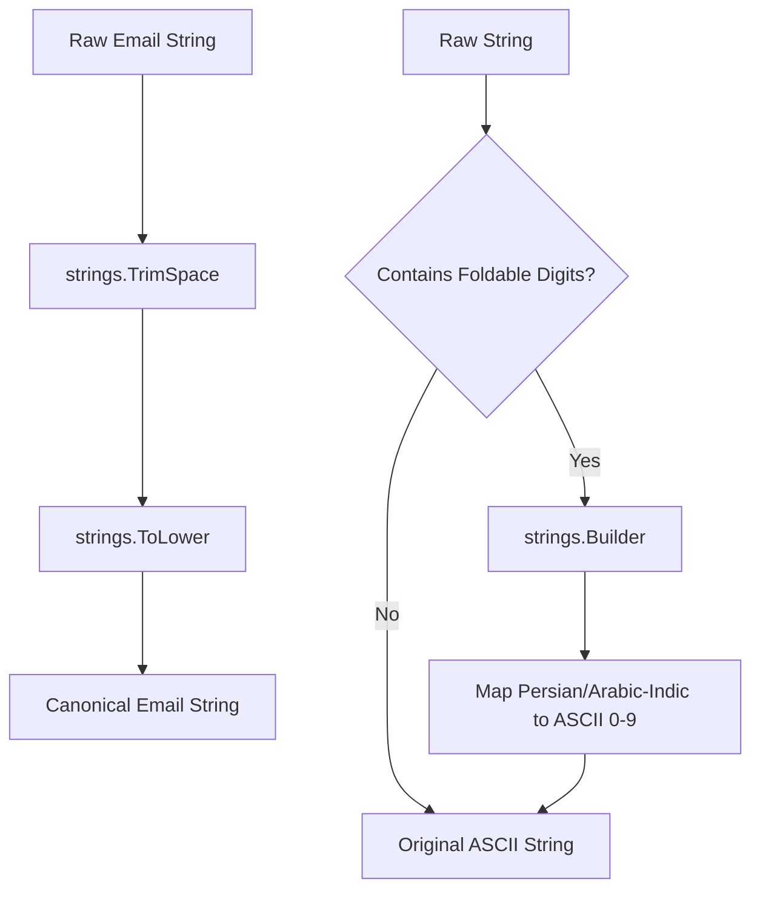

# normalize

## Objectives
The `normalize` submodule acts as a shared input-boundary text normalizer for the core system. It is designed to canonicalize text inputs—specifically user emails and digit families—before calculation and storage to ensure deterministic equivalence (PRD §11 LOC-007 / CHAT-081).

## How it works
It exposes simple, idempotent canonicalization functions:
*   `Email`: Trims surrounding whitespace and lowercases the input string, providing the single Go source of truth for email normalization. 
*   `Digits`: Maps non-ASCII decimal digit families—namely Persian (Extended Arabic-Indic `۰..۹`) and Arabic-Indic (`٠..٩`)—to their ASCII `0-9` counterparts.

## Data flow
1. **Input**: Unsanitized string at the system boundary (e.g. login payload or numeric input field).
2. **Processing**:
    *   For emails, standard library `strings.TrimSpace` and `strings.ToLower` are applied.
    *   For digits, a fast-path scan checks for foldable runes. If found, a `strings.Builder` allocates and maps each recognized extended digit to its ASCII equivalent via a lookup table (`digitFold`), leaving all other characters (letters, separators) untouched.
3. **Output**: Returns the folded, canonicalized ASCII string for further business logic parsing or database operations.

## Constraints
*   **Locale-Neutral**: Normalizations privilege no specific locale and do not branch on calendars or directionality.
*   **No Parsing**: Functions are strictly limited to code point mapping/folding. They do not parse numbers, interpret numeric separators, or execute any business logic.
*   **Idempotency**: Applying normalizers to already-normalized text is a safe no-op.
*   **Database Synchronization**: `Email` normalization must remain in exact lockstep with the database's `email_canonical` implementation to prevent identity aliasing vulnerabilities (issue #201).

## Normalization Pipeline

