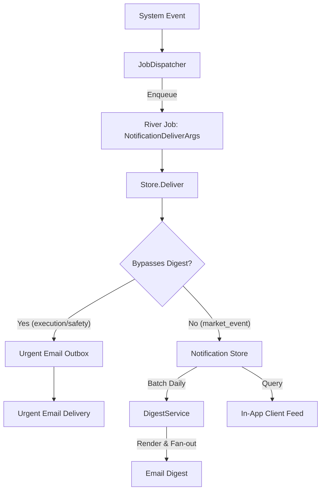

# notify

## Objectives
The `notify` package is the delivery layer for in-app notifications and the daily email digest (PRD §7.5 NOT-001, §6.8). It is responsible for providing shared event IDs across surfaces, strict idempotency and deduplication, robust message category-based routing (e.g., immediate bypass for failures vs. daily digest batching for market events), and locale-safe message formatting using closed catalogs. 

## How It Works
- **Idempotency & Dedup**: Implements delivery deduplication utilizing an append-only store. It generates a stable `dedup_key` (via SHA256 digest of identity and payload) for each notification to guarantee idempotency. Duplicates are silently returned un-delivered to prevent identical product events from surfacing. 
- **In-App Store**: Provides bounded, keyset-paginated read access (`List`, `Feed`) to user notifications. It enforces an append-only pattern where rows are immutable aside from the `read_at` field which uses a FROM-guarded update.
- **Digest Service**: The `DigestService` gathers eligible batchable notifications (e.g., `market_event`) within a finalized UTC business day (a completed 24-hour window) and sends out a daily rendered email summary to the target account. Failed accounts are isolated so one account's email failure does not abort the system-wide fan-out.
- **Urgent Deliveries**: Critical system notifications (like `execution_failure` and `safety_failure`) bypass the batched daily digest and are enqueued immediately for urgent email delivery, transactionally bound to the notification store commit.
- **Dispatch**: The `JobDispatcher` implements the producing side, enqueuing delivery intents transactionally alongside state transitions into River jobs.

## Data Flow
1. **Dispatch (Producer)**: System events (e.g., market event, execution failure) invoke `JobDispatcher` within their PostgreSQL transaction to enqueue a `jobs.NotificationDeliverArgs` River job.
2. **Delivery (Store)**: The asynchronous River worker calls `Store.Deliver()`. 
   - Non-bypass notifications (`market_event`) are saved to the PostgreSQL store and wait for the daily digest.
   - Bypass notifications (`execution_failure`, `safety_failure`) are saved and immediately enqueue an urgent email outbox job in the exact same transaction.
3. **Consumption (In-App)**: The user's client queries their feed (via `snapshotFeed`), fetching paginated items and the unread count in a single repeatable-read transaction.
4. **Digest Fan-Out**: The `DigestService.GenerateAll()` loops over all user accounts, gathers their batchable notifications for the previous finalized business day, renders the copy via catalog keys, and dispatches the email.

## Constraints
- **Shared Event ID**: An in-app notification and its digest line must reference the exact same underlying event ID (NOT-001). 
- **Deduplication is Fatal**: Idempotent re-deliveries of the same payload/identity return `Delivered=false`, avoiding duplicates. A reused `dedup_key` with a differing payload results in an `ErrIdempotencyConflict` preventing data loss of distinct events.
- **Bypass Rule**: Execution and safety failures must always bypass the digest and never be shed.
- **Append-Only Store**: The notification rows are never DELETED or blindly over-written (UPDATE is only permitted for marking `read_at`).
- **Locale as Data**: Message structures never embed rendered localized text. They only embed closed catalog keys (`title_key`, `body_key`) and parameter slots (`body_params`), resolving to the user's locale only on the client or during digest email generation (LOC-001).
- **Business Day Finalization**: The digest only processes closed 24-hour business windows in UTC to prevent missing late-arriving events for an open day.

## Architecture Diagrams

