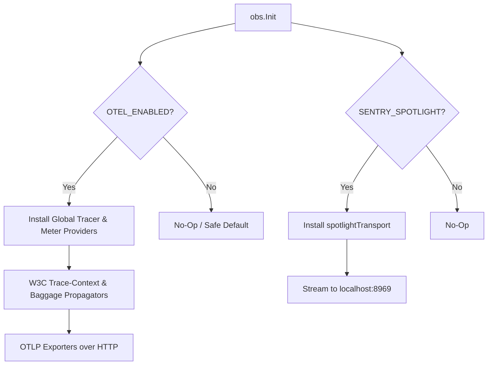

# obs

## Objectives
The `obs` package configures and wires process-wide observability for the service. It encapsulates the initialization of OpenTelemetry (OTel) metrics and tracing, and provides dev-only Sentry Spotlight integration for local debugging without emitting events to Sentry's cloud. Its core objective is to fail closed securely: if environment switches are unset, observability degrades to safe no-ops without crashing the service or breaking core domains.

## How It Works
- **OpenTelemetry Tracing**: When `OTEL_ENABLED` is active, it installs a global `TracerProvider` with W3C trace-context and baggage propagation. This ensures that incoming traces (e.g., web → gateway) are correctly continued into core spans and propagated on outbound requests.
- **OpenTelemetry Metrics**: When `OTEL_ENABLED` is active, it installs a global `MeterProvider` to capture and export domain metric seams (like execution/analytics costs and RED/latency instruments). 
- **Sentry Spotlight**: When `SENTRY_SPOTLIGHT` is set, it provisions a local Sentry sidecar transport to receive envelopes without requiring a DSN. This allows for rich local debugging and trace inspection using a sidecar running on `localhost:8969`.
- **Teardown**: The initialization phase returns a combined shutdown function that will correctly and safely flush telemetry buffers and tear down installed providers in reverse dependency order.

## Data Flow
1. **Initialization**: On application start, `obs.Init` checks the provided configuration flags (`OTelEnabled` and `SpotlightEnabled`).
2. **Propagators & Providers**: If `OTelEnabled` is true, the composite text map propagator (trace-context + baggage) is installed globally alongside the tracer and meter providers.
3. **Transport**: If OTel is enabled, it exports data using standard OTLP over HTTP (`otlptracehttp`, `otlpmetrichttp`). If Sentry Spotlight is enabled, it intercepts events using a custom `spotlightTransport` and streams them to the local Spotlight URL via HTTP POST.
4. **Shutdown**: Upon process termination, the returned `ShutdownFunc` flushes any in-flight Sentry events and securely shuts down the OpenTelemetry providers.

## Constraints
- **Fail Closed / Opt-in**: The package enforces an opt-in behavior; no external exporter is invoked, and no traces are emitted unless the feature switches explicitly enable them. If a collector or sidecar is misconfigured, the service MUST NOT crash.
- **No Production Sentry Cloud**: Sentry integration uses a custom DSN-less transport (`spotlightTransport`). It deliberately does not leak telemetry outside the cluster (it refuses to send to the Sentry cloud). 
- **Graceful Shutdown**: The returned `ShutdownFunc` is guaranteed to be non-nil (even if no telemetry is wired), safely allowing unconditional `defer` in the caller. 
- **Global Seams**: The OTel tracer and meter are installed globally. Core domains consume these via the standard global `otel.Tracer()` and `otel.Meter()` calls, decoupling them from exporter wiring specifics.

## Architecture Diagrams

