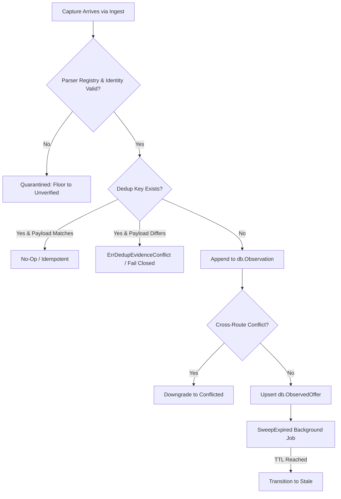

# observation

## Objectives
The `observation` package manages the core evidence-quality state machine and the append-only observation store (OBS-001..004, OBS-008, §10.3, §16). It is responsible for ingesting new captures (evidence), deduplicating idempotent replays, cross-referencing values across routes, enforcing a strict six-state evidence quality model, and maintaining the current 'Observed Offer' view for targets. It treats prices as raw verbatim evidence (Money Quarantine, §9.1) and enforces strict identity quarantines.

## How It Works
- **State Machine (Quality)**: Evaluates incoming captures and places them exactly into one of six strictly-defined quality states: `Verified`, `Supported`, `Unverified`, `Conflicted`, `Stale`, or `Unavailable`. The quality derives from factors like schema/identity validity, freshness, cross-route corroboration, cross-route conflict, and historical sightings.
- **Append-Only Evidence**: All incoming evidence is written to an append-only store (`db.Observation`). Deduplication relies on a deterministic `dedup_key`. Reused keys with matching evidence hashes are silently de-duplicated (no-op). Reused keys with materially differing evidence trigger a fatal `ErrDedupEvidenceConflict` and write an auditable conflict record without corrupting the authoritative current offer.
- **Current Observed Offer View**: A single derived table (`db.ObservedOffer`) represents the current state of an observation target. This is mutated during the ingest transaction. Expired offers are transitioned out by the `SweepExpired` method.
- **Parser Registry Gate**: Every capture is tested against a server-owned, explicit allow-list of known parsers (`ParserRegistry`). Captures using unknown or malformed parsers are strictly quarantined: they are persisted as evidence but their quality is floored to `Unverified` and they can never overwrite the current offer view or assert a route conflict.

## Data Flow
1. **Sync**: `SyncTargetsFromConfirmed` initializes targets based on accounts' active confirmed identities (defaulting to the standard freshness tier).
2. **Ingest**: A capture arrives via `Ingest()`. 
3. **Cross-Route Analysis**: Before insertion, the system reads all in-window append-only evidence for the target to discover cross-route corroborations or conflicts. 
4. **Quarantine Check**: The parser's version is checked against the `ParserRegistry`. The identity is cross-checked against the target. If either fails, the capture is strictly quarantined (quality is floored).
5. **Deduplication**: `ClaimDedupKey` ensures no exact replays are double-processed. Conflicting data envelopes under the same key are caught.
6. **Transaction Commit**: The new observation is appended. If it's the current freshest and most reliable, the `db.ObservedOffer` is upserted. If routes disagree, the current offer transitions to `Conflicted`. Disappearances permanently close the offer.
7. **Sweep**: Background processes call `SweepExpired()` to gracefully downgrade live offers past their freshness deadlines into `Stale`. `DowngradeCurrentForDrift()` allows emergency stop downgrades.

## Constraints
- **Money Quarantine**: Prices and list prices are stored as `money.RawAmount` (raw text strings, string values, and string units). They are NEVER parsed to floats or cast to standard `Money` within this package.
- **Quarantine-Over-Inference**: Untrusted evidence (schema-invalid, identity-invalid) must NEVER assert a disagreement that blocks a good offer and must NEVER overwrite a legitimate current offer.
- **Event Deduplication (Never-Cut)**: A capture colliding on `dedup_key` but with a materially different payload must FAIL CLOSED, never silently dropping the distinct envelope.
- **Append-Only**: Evidence rows are never updated or deleted. Only the derived `ObservedOffer` view is mutated.
- **Routes Disagree (Block)**: If a new in-window capture from a qualifying route disagrees with existing in-window evidence from a different route, the offer goes to `Conflicted` and stops serving as executable/recommendable.

## Architecture Diagrams

