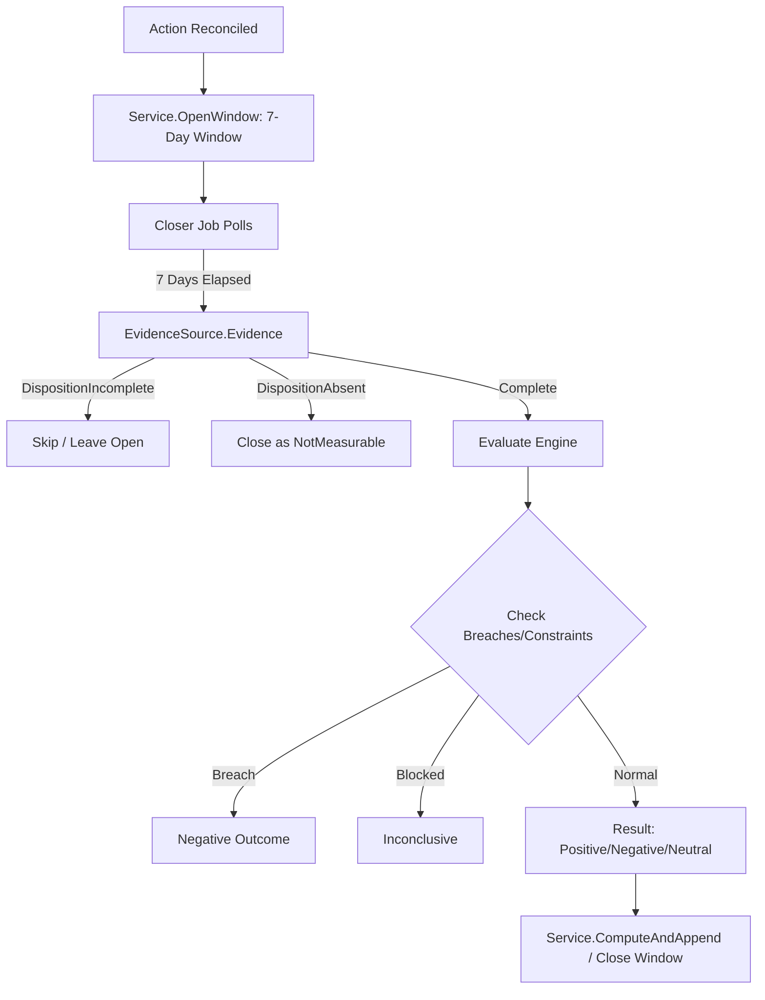

# outcome

## Objectives
The `outcome` package implements the evaluation and persistence of seven-day outcome windows for reconciled actions (OUT-001, PRD §15.3). It is strictly responsible for measuring the business effect of an action after a fixed 7-day period. It evaluates whether the outcome is Positive, Negative, Neutral, Inconclusive, or Not Measurable based on objective metrics and concurrent material changes.

## How It Works
- **Windows**: Every reconciled action opens a 7-day `Window`. This window represents the observation period required before declaring an outcome result.
- **Evaluation Engine (Pure)**: The `Evaluate` method runs a pure (no I/O) rules engine that consumes a set of resolved `Inputs`. It maps them to a `Result` (`Positive`, `Negative`, `Neutral`, `Inconclusive`, `NotMeasurable`) and a `Confidence` grade (`High`, `Medium`, `Low`) based on concurrent changes.
- **Closer Job**: A background worker (`Closer`) continuously polls for windows that have elapsed their 7-day period. For each due window, it queries the `EvidenceSource`.
- **Evidence Source**: The `DBSource` examines external systems to see if the write is still pending reconciliation (`Incomplete`), or if the pipeline measured the outcome (`Absent` or `Measurable`). It fails closed—any error just defers closing the window. 

## Data Flow
1. **Window Opening**: `Service.OpenWindow` creates a 7-day window tied to a specific action and optionally a card.
2. **Scheduled Polling**: The `Closer` regularly asks `Service.ListClosable` for windows that are older than 7 days and haven't been computed.
3. **Evidence Gathering**: For each closable window, `Closer` calls `EvidenceSource.Evidence(actionId)` (`DBSource`).
   - If the action is still `pending_reconciliation` or pipeline evidence isn't ready yet, it returns `DispositionIncomplete`. The window is skipped and left open.
   - If the pipeline checked and the evidence is genuinely unavailable, it returns `DispositionAbsent`. The outcome gets closed as `NotMeasurable`.
   - If evidence is complete, it gathers flags (improved, worsened, floor breached, etc.) and counts concurrent material changes.
4. **Resolution**: `Evaluate` takes the `Inputs` and assigns the final `Result` and `Confidence`.
5. **Persistence**: `Service.ComputeAndAppend` appends the evaluation to the database and marks the window as closed.

## Constraints
- **Fail-Closed Evidence**: A database or query error NEVER results in a `NotMeasurable` state. It results in a hard error, which keeps the window open for a retry. `NotMeasurable` is only assigned when the evidence source definitively reports `DispositionAbsent`.
- **Fixed Window**: The observation period is rigidly 7 days. Results cannot be evaluated early.
- **Immutability (Compute Once)**: Outcomes are evaluated exactly once per window. `ComputeAndAppend` uses an idempotency mechanism so a duplicate request simply returns the previously computed result.
- **Attribution Precedence**: A breached floor or bounds is unconditionally `Negative` regardless of the objective metric direction. A blocked attribution makes the window `Inconclusive`.

## Architecture Diagrams

