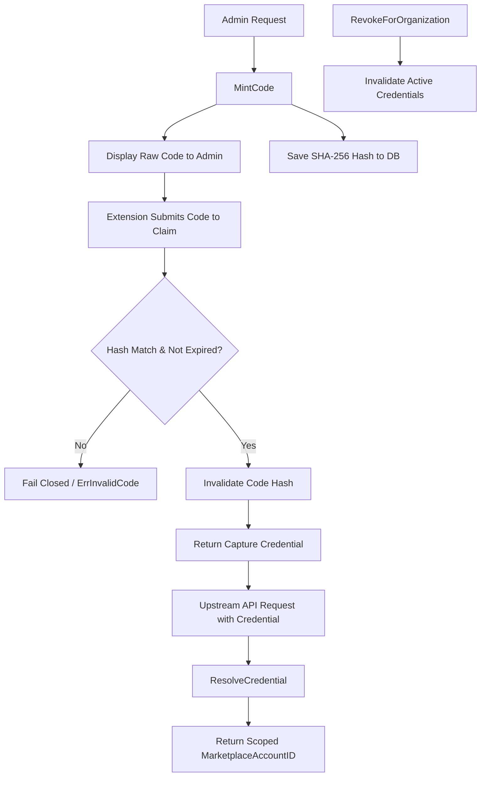

# pairing

## Objectives
The `pairing` package implements the browser-extension pairing plane (EXT-001, PRD §14). It enables a logged-in human to mint a short-lived, single-use pairing code, which the browser extension exchanges for a scoped, long-lived capture/overlay credential bound to one marketplace account. The core objective is to ensure the extension never holds a sensitive seller-API token, relying strictly on a tightly scoped credential solely authorized for capture and overlay tasks.

## How It Works
- **Minting**: An organization administrator requests a pairing code via `MintCode`. The service generates a 256-bit random secret. Only the SHA-256 hash is persisted. It has a short TTL (e.g., 5 minutes) and is intended to be hand-carried to the extension.
- **Claiming**: The extension submits the raw pairing code via `Claim`. The code is authenticated against its hash. If it is valid and unexpired, the code is immediately invalidated (single-use) and exchanged for a capture credential. This credential is valid for a longer TTL (e.g., 30 days).
- **Resolution**: Upstream services resolve the presented capture credential via `ResolveCredential`, mapping it back to its scoped marketplace account.
- **Revocation**: The service supports a kill switch (`RevokeForOrganization`) to immediately revoke all active capture credentials for an organization's marketplace account.

## Data Flow
1. **Minting**: User requests a code -> `MintCode` -> raw code displayed to user (once), hash saved to DB.
2. **Claiming**: Extension submits code -> `Claim` -> code hash verified -> code marked claimed -> raw credential returned to extension, credential hash saved to DB.
3. **Usage**: Extension calls API with credential -> gateway invokes `ResolveCredential` -> hash verified -> returns scoped `MarketplaceAccountID`.
4. **Revocation**: Org requests revocation -> `RevokeForOrganization` -> sets `revoked_at` on all DB pairings for the account -> subsequent resolutions fail closed.

## Constraints
- **Hash-Only Storage**: The raw pairing code and the raw capture credential NEVER touch the database. Only their SHA-256 hashes are persisted. A database read can never reconstruct a usable code or credential.
- **Single-Use Codes**: A pairing code is strictly single-use. Claiming it clears its hash from the database.
- **Fail Closed**: Any resolution of a code or credential that is unknown, expired, or revoked yields a generic error (`ErrInvalidCode` or `ErrInvalidCredential`). This prevents brute-force probing of reasons.
- **No Seller-API Tokens**: The generated credential does not map to a full session token and can only be resolved for capture workflows.

## Architecture Diagrams

