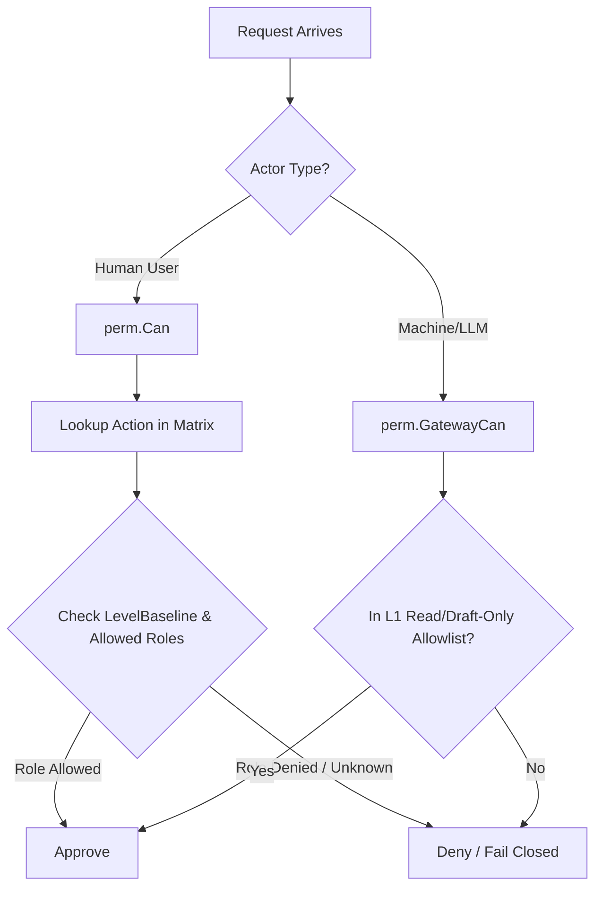

# perm

## Objectives
The `perm` package is the single, declarative permission matrix for the entire platform (ACC-002, PRD §2.2, §8.3). It encapsulates the authoritative definitions for roles (`Owner`, `Operator`, `Internal`), administrative ladder levels (`L1Read`, `L2ReversibleConfig`, `L3CommercialGuardrail`, `L4MarketplaceMutation`), and specific distinct Actions (e.g., `connector.inspect`, `guardrail.write`). Its primary objective is to maintain a unified, fail-closed access control list shared by both the chat interface and the standard screens API.

## How It Works
- **Admin Ladder (LevelBaseline)**: Establishes a rigid, invariant governance table that specifies which roles are admitted at each sensitivity level. For instance, `L3CommercialGuardrail` admits only the `Owner` role.
- **Permission Matrix**: A declarative list of `Rule`s tying each `Action` to its `AdminLevel` and an explicitly allowed subset of roles. The allowed roles for any action MUST NOT exceed the bounds set by the `LevelBaseline` for that action's level.
- **Authorization Resolution**: The `Can(role, action)` function evaluates whether a user with a given role is allowed to perform a specified action. It is strictly fail-closed: unknown actions, unknown roles, or missing grants result in denial.
- **Machine Gateway Envelope**: The `gateway.go` models the precise capabilities of the LLM plane's machine credential (`LLM_GATEWAY_TOKEN`). The machine principal's access is restricted EXCLUSIVELY to a specific allow-list of L1 Read tools and Draft-only write actions. It is structurally forbidden from accessing execution, approval, or guardrail-modifying actions.

## Data Flow
1. **Human Action Request**: When a user attempts an action (via UI or Chat API), the gateway maps the request to an `Action` identifier.
2. **Access Check**: The handler calls `perm.Can(user.Role, action)`. The decision is derived in O(1) time via an internal lookup map (`index`). 
3. **Machine Request**: When the LLM plane calls a tool, the core gateway evaluates `perm.GatewayCan(action)`. This immediately rejects any call not within the exact read/draft-only allow-list.

## Constraints
- **Invariant Ladder**: A per-action grant may only tighten the baseline permissions for a level, it can never widen them (e.g. an L3 action cannot be granted to an Operator).
- **Fail Closed**: Any un-mapped actions, missing roles, or absent grants safely default to denying access.
- **Machine Containment**: The LLM machine principal is fundamentally read + draft-only. A new read action added to the main matrix DOES NOT automatically expand the machine principal's authority; the machine allow-list must be explicitly updated and reviewed.
- **Single Source of Truth**: Authorization must not be duplicated or inferred separately per-surface. The identical `Matrix` decides for both standard UI endpoints and AI-driven chat.

## Architecture Diagrams

