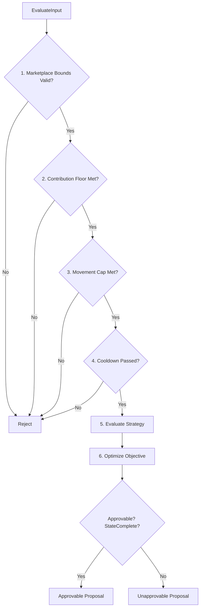

# policy

## Objectives
The `policy` package implements the core pricing policy engine (PRD §9.3, PRC-003/004). Its objective is to evaluate proposed pricing actions through a rigidly ordered, six-stage pipeline. It guarantees that commercial constraints (boundaries, floors, movement caps, cooldowns) are never bypassed by downstream strategy choices or objective optimizations.

## How It Works
The engine evaluates proposed actions against a strictly ordered pipeline:
1. **Marketplace Boundary (Hard)**: Rejects if the marketplace bounds are unknown or invalid.
2. **Hard Contribution Floor (Hard)**: Evaluates whether any feasible price meets the absolute contribution floor and remains strictly positive.
3. **Movement Cap (Hard)**: Restricts the proposed price to a maximum allowed delta from the current price (default max 5%).
4. **Cooldown (Hard)**: Blocks any price changes (holds are permitted) if the time since the last action is within the cooldown period (default 60 minutes).
5. **Strategy (Subordinate)**: Evaluates the user-selected pricing strategy (`hold`, `match`, `undercut`). This step cannot override hard constraints.
6. **Objective (Subordinate)**: Attempts to select a final price from the feasible window to optimize the target objective (`maximize_contribution`, `track_strategy`).

## Data Flow
1. **Configuration Generation**: `NewConfig` creates a valid `Config`, rigorously enforcing stricter-only policies for cap and cooldown.
2. **Input Formulation**: An `EvaluateInput` is built with the config, current price, an abstract contribution function (from the margin engine), the current time, the last action time, and the margin-readiness state.
3. **Evaluation Execution**: `Evaluate` calls the pure rules engine `evaluate`. It steps through stages 1-6 in exact order.
   - If any hard stage (1-4) fails, execution halts and the engine returns the typed blocker(s).
   - If all hard stages pass, the engine attempts to fulfill the strategy and objective. The final output is constrained strictly to the bounds dictated by the hard stages.
4. **Result Determination**: The engine returns a `Result` containing either a strictly validated `Proposal` or a list of `Blockers` (in precedence order). The result is explicitly marked with the margin readiness state to determine approvability downstream.

## Constraints
- **Absolute Precedence**: Stages 1-4 are hard constraints. A strategy or objective (Stages 5-6) NEVER overrides or suppresses a blocker from an earlier hard constraint.
- **Money Invariant**: There is NO floating-point arithmetic. All monetary values use strictly typed fixed-point arithmetic (`money.Money` or `money.BasisPoints`) to prevent precision leakage.
- **Fail Closed Configuration**: An unknown strategy or objective immediately fails closed. A looser-than-default cap or cooldown is rejected.
- **Never-Cut Zero-Cross**: Regardless of configuration, no pricing action is ever allowed to produce a non-positive contribution (≤ 0).
- **Simulation Containment**: Simulated policies (`Simulate()`) yield `Result`s explicitly flagged as `Simulation = true`. They are structurally forbidden from driving an approval control.
- **Approvability Gate**: A result is only deemed `Approvable()` if all constraints pass AND the provided margin readiness state is explicitly `cost.StateComplete`.

## Architecture Diagrams

