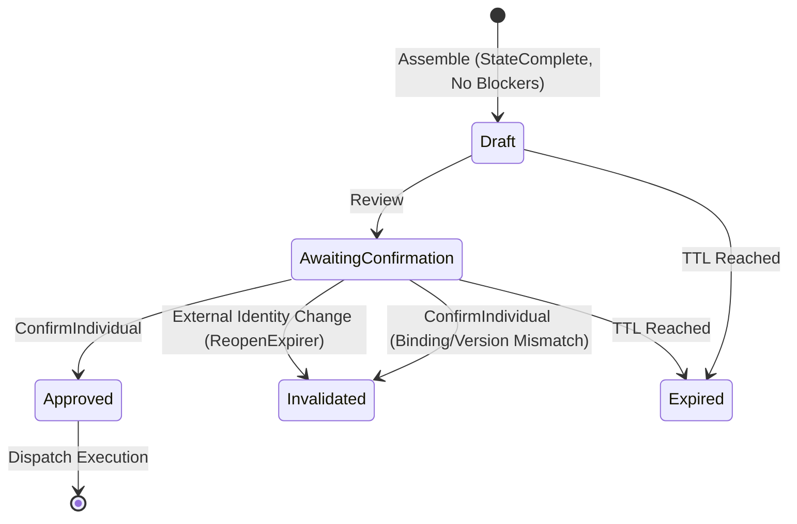

# recommendation

## Objectives
The `recommendation` package implements the assembly, persistence, and state machine transitions for market product pricing recommendations (PRD §9.2, PRC-001, PRC-002) and their associated approval cards (§8.4). Its main objective is to deterministically combine policy decisions, margin computations, and evidence state into a verifiable `Recommendation` record, and strictly govern its lifecycle (Draft -> Awaiting Confirmation -> Approved -> Invalidated/Expired) via an immutable, version-bound control graph.

## How It Works
- **Assembly**: `Assemble` consumes signals from the policy engine, margin engine, and evidence observation. It produces a structured `Recommendation`. It enforces the PRC-002 gate: a recommendation can only mint an approval control if it is NOT a simulation, has no blockers, has a margin-readiness of `StateComplete`, and has a proposed price.
- **Approval Cards (Controls)**: A validated, executable recommendation mints an `ApprovalCard`. The card retains a cryptographically verifiable `Binding` (ActionID, ParameterVersion, ContextVersion, PolicyVersion, CostProfileVersion, EvidenceVersions).
- **State Machine**: The `Service` manages the strictly audited state progression (§8.4) of approval cards: `Draft`, `AwaitingConfirmation`, `Approved`, `Invalidated`, `Expired`. State advances (`AdvanceTx`) are atomic and require an explicit "from" state to prevent race conditions.
- **Confirmation Verification**: When a client requests confirmation, `ConfirmIndividual` verifies the presented binding against the authoritative current version. If the versions do not match exactly, the stale card is superseded (invalidated) and no execution is dispatched.
- **Invalidation Triggers**: `ReopenExpirer` consumes identity reopen events. When an identity mapping is reopened, any dependent, live approval cards for that variant are systematically driven to `Invalidated`.

## Data Flow
1. **Creation**: Upstream orchestration (S37 or Chat) calls `Assemble()`.
2. **Persistence**: `Service.CreateCard` starts a transaction, delegates to `mintDraftCardTx` to lock the lineage, stores the `Recommendation`, creates the initial `ApprovalCard` in `Draft` state, appends to the history log, and commits.
3. **Execution**: A user activates a control.
4. **Validation (ConfirmIndividual)**: 
   - Lock lineage.
   - Assert requested card is the latest version.
   - Assert presented binding equals current binding.
   - Assert not expired.
   - Advance state to `Approved`.
   - Append AUD-001 confirmation audit event (who, what, when, exactly what price) *atomically* in the same transaction.
   - Dispatch to `ExecutionDispatcher`.
5. **Invalidation**: External event (e.g., identity changed) triggers `ExpireDependentForVariant`, safely invalidating outstanding recommendations.

## Constraints
- **Binding Veracity (APR-001)**: A stale control can NEVER execute. A confirmation requires the exact bound versions (parameters, context, policy, cost, evidence) to match the current authoritative reality. 
- **Immutable Audit**: Approvals (`ConfirmIndividual`) log an immutable snapshot and actor detail on the same transaction. Without the audit row, the state change rolls back.
- **Execution Separation**: This package explicitly records intent (Approved) and dispatches it via an interface. It does not perform the external API execution itself.
- **Fail Closed Machine**: Undefined transitions, stale starts, and missing configurations immediately reject the operation rather than falling back to an unverified state.
- **Lineage Locking**: Lineages are database-locked during mutation to ensure zero race conditions between card generation (edit price) and user confirmation.

## Architecture Diagrams

