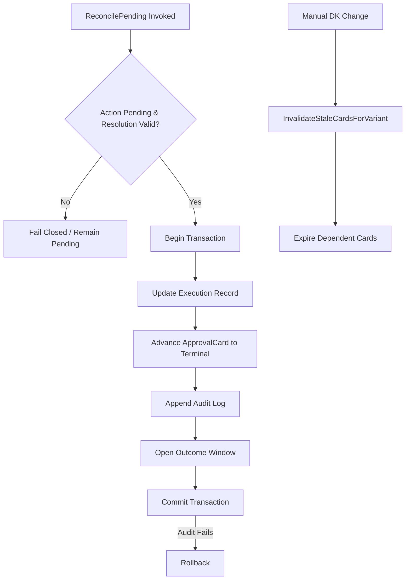

# reconcile

## Objectives
The `reconcile` package is responsible for resolving the external state of a write after it has been executed (EXE-003) and invalidating stale approval cards when out-of-band manual changes occur (PRD §16). Its primary objective is to guarantee that the terminal state of any write operation is deterministically derived from observed evidence (never inferred), and to prevent stale approvals from overwriting recent manual changes by the seller.

## How It Works
- **Pending Resolution**: The `ReconcilePending` function resolves an action stuck in `PendingReconciliation`. It must be provided with a definitive `Resolution` (either `Accepted` or `Failed`). If the provided resolution is unknown or the action is not in a pending state, the function safely fails closed.
- **State Machine Advancement**: Upon successful resolution, the corresponding `ApprovalCard` is advanced to the terminal state (`Accepted` or `Failed`), and an `OutcomeWindow` is formally opened for downstream measurement (OUT-001).
- **Stale Card Invalidation**: The `InvalidateStaleCardsForVariant` function consumes manual DK price changes. It delegates to the `StaleCardInvalidator` (the recommendation service) to systematically expire any live, dependent cards for that variant.
- **Atomic Operations**: All state transitions and audit logging occur within a single database transaction. If the audit log fails to write, the state transition is rolled back.

## Data Flow
1. **Reconciliation Trigger**: A post-write read-back worker or periodic job invokes `ReconcilePending` for a specific action ID.
2. **State Verification**: The service ensures the action is currently in `PendingReconciliation` and that the proposed resolution is explicitly valid.
3. **Transaction Execution**:
   - The execution record (`action_executions`) is updated to the terminal state.
   - The approval card is advanced from `PendingReconciliation` to the terminal state.
   - A reconciliation audit event and a terminal audit event are appended to the log.
   - A 7-day outcome window (OUT-001) is opened.
   - The transaction commits.
4. **Out-of-Band Invalidation**: A manual change triggers `InvalidateStaleCardsForVariant`, which delegates the expiration to the recommendation service, closing the loop on manual override protection.

## Constraints
- **No Inferred Success (EXE-003)**: A pending action can only be resolved by concrete evidence. An unrecognised resolution fails closed (keeps it pending). Furthermore, a gate-blocked action that performed no write can ONLY be resolved to `Failed`; it can never be inferred as `Accepted`.
- **Atomic Terminal State**: A terminal state (Accepted or Failed) can NEVER exist without its corresponding audit log row. Both commit simultaneously.
- **Stale Card Protection (§16)**: Out-of-band marketplace changes MUST immediately invalidate all pending approval cards for the affected variant to ensure a user's previous manual change is not accidentally overwritten.

## Architecture Diagrams

