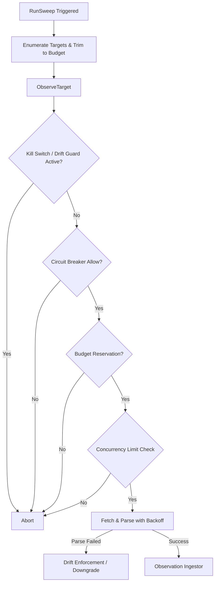

# routec

## Objectives
The `routec` package implements the Route C server-side observer (PRD §7.3 OBS-005..007, §10.1/§10.2/§10.4). Route C is the single authoritative path for scheduled, P0 competitor freshness targets. Its primary objective is to reliably fetch product details from public DK endpoints, parse them into standard observation captures, and seamlessly handle concurrency limits, backoffs, circuit breakers, and budget tracking—all without violating the strict "money quarantine" rule (raw prices only).

## How It Works
- **Scheduler & Tiers**: Targets are organized into tiers (`priority`, `standard`, `background`) with varying cadence constraints. The scheduler dynamically adjusts the number of targets observed under budget constraints (it never widens freshness windows; it trims the target count).
- **Guarded Observer Pipeline**: When `ObserveTarget` runs, it traverses a rigid set of safety checks:
  1. Kill Switch Check
  2. Drift Guard Check
  3. Circuit Breaker (`breaker.Allow()`)
  4. Durable Budget Reservation (`DBBudget`)
  5. Concurrency Limiter
  6. Fetch & Parse (with jittered exponential backoff on transient errors)
  7. Evidence Generation & Ingestion
- **Resilient Limits**: The observer is bounded by both `PerAccountConcurrency` and `PerHostConcurrency`. Operations are additionally bounded by a durable request and byte `BudgetReserver`.
- **Parser & Drift Guard**: The response parser translates public payloads into captures. If parsing fails, or if the product identity mismatches (e.g. redirect), the Drift Guard kicks in (§10.4). This pauses future extraction for that endpoint and systematically downgrades previously cached observations, preventing stale data from masquerading as fresh.

## Data Flow
1. **Periodic Trigger**: A jittered scheduled sweep (`RunSweep`) is initiated for a given tier.
2. **Target Enumeration**: Eligible targets are fetched. A rotation cursor ensures fairness if targets must be trimmed due to budget constraints.
3. **Observation Loop**:
   - The observer checks local bounds (breakers, limiters).
   - `fetchWithRetry` makes the HTTP request to the external API, decrementing the budget.
   - The response is parsed by `ParseProductDetail`.
   - Resulting captures are handed to the observation store via the `Ingestor` interface.
4. **Drift Enforcement**: If the identity (NativeProductID) does not match or the parser breaks, extraction stops. The observer invokes `DowngradeCurrentForDrift` to aggressively expire current views based on the failure.

## Constraints
- **Public Endpoint Only**: Route C exclusively fetches the documented, public single product-detail endpoint. It explicitly forbids general crawling, search discovery, or seller enumeration.
- **Money Quarantine**: Parsed prices remain `money.RawAmount` tokens. Route C NEVER constructs `Money` or interprets floating-point currencies directly.
- **Durable Budgeting**: The budget (`DBBudget`) is authoritative and durable (shared across processes). Schedulers cannot independently admit targets if the budget is exhausted.
- **Fail Closed**: Any failure to reserve a budget, track concurrency, or successfully parse payloads halts extraction. The circuit breaker handles upstream errors safely by opening on sustained failures.
- **Cadence Preservation**: Under pressure, Route C trims target count rather than widening the freshness window, strictly enforcing §10.2 freshness targets.

## Architecture Diagrams

