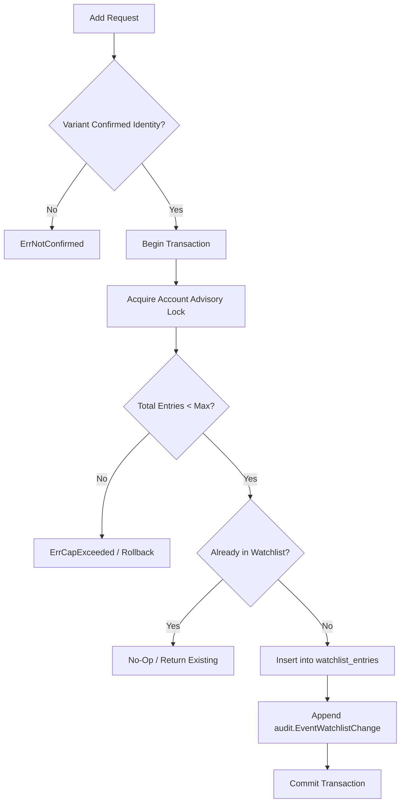

# watchlist

## Objectives
The `watchlist` package implements the EXT-007 priority watchlist feature. It allows authenticated actors to add "Confirmed" owned products to a curated, server-capped list for priority observation. Its primary objective is to enforce the business rules surrounding the priority watchlist—specifically, that the list cannot exceed a configured maximum (default 50), that only variants with an active "Confirmed" identity mapping can be added, and that all modifications are strictly audited (AUD-001).

## How It Works
- **Listing**: Clients can retrieve a user's current watchlist entries via the `List` method, ordered newest first.
- **Adding Entries**: 
  - The `Add` function enforces the core constraints.
  - It checks if the target variant has an active "Confirmed" market product identity.
  - It locks the account explicitly to prevent Time-of-Check to Time-of-Use (TOCTOU) race conditions from concurrent `Add` calls bypassing the cap.
  - It verifies the current watchlist size against the `MaxEntries` constant.
  - If everything passes, it inserts the new watchlist entry and an associated audit record simultaneously within the same database transaction.
  - Adding an already-present variant is treated idempotently without duplicating the audit log.

## Data Flow
1. **Request**: An `Add` request is received containing the `AccountID`, the `VariantID`, and the `Actor` metadata.
2. **Validation**: The system first verifies that the provided variant holds an active "Confirmed" identity.
3. **Transaction & Lock**: A transaction begins and immediately takes an advisory lock on the `AccountID` to serialize concurrent adds.
4. **Cap Enforcement**: The system checks the total number of items currently on the account's watchlist. If it exceeds 50 (`MaxEntries`), the transaction aborts with `ErrCapExceeded`.
5. **Idempotency Check**: If the variant is already on the watchlist, the transaction effectively becomes a no-op, returning the existing entry safely.
6. **Insertion & Audit**: The variant is inserted into the `watchlist_entries` table. Simultaneously, an `audit.EventWatchlistChange` is appended to the audit trail.
7. **Commit**: The transaction commits atomically.

## Constraints
- **Confirmed Identities Only**: A variant without an active "Confirmed" identity cannot be added (`ErrNotConfirmed`). This prevents the system from wasting priority crawling resources on unmapped or loosely guessed products.
- **Hard Server Cap**: The maximum number of entries per account is strictly enforced server-side (default 50). A client application cannot bypass this limit.
- **Race Condition Prevention (TOCTOU)**: Using PostgreSQL advisory locks, concurrent additions to the same account are serialized so the limit cannot be transiently breached.
- **Atomic Auditing**: The addition of a product to the watchlist MUST produce an audit record in the exact same transaction. Failure to write the audit record aborts the addition.

## Architecture Diagrams

