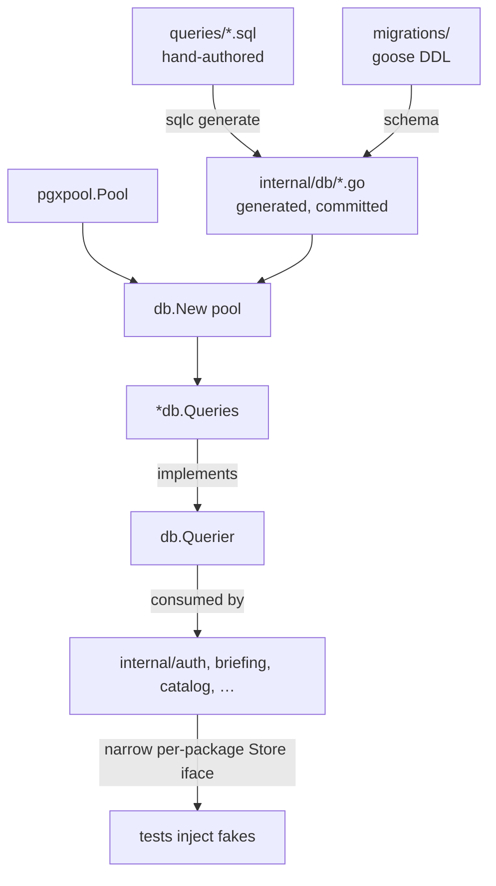

# SQL Queries (sqlc source)

## Objective
This directory holds the **hand-authored SQL query sources** consumed by
[`sqlc`](https://docs.sqlc.dev) to generate the strongly typed Go data-access
layer at `services/core/internal/db`. The `.sql` files here are *inputs to a
code generator*, never imported or read at runtime.

The generated `*db.Queries` type is the sole persistence surface for the core
service. See `../internal/db/README.md` for the generated-output side.

## Layout
One `.sql` file per domain area, named to match the table family or capability
it serves (e.g. `auth.sql`, `approval.sql`, `catalog.sql`, `observation.sql`).
Keeping queries area-scoped makes ownership and review boundaries obvious and
lets the generated `internal/db/<area>.sql.go` files mirror this layout 1:1.

## Query annotation
Every query is preceded by a sqlc directive that controls the generated method
shape:

```sql
-- name: CreateSession :one
INSERT INTO sessions (token_hash, user_id, expires_at)
VALUES ($1, $2, $3)
RETURNING *;
```

| Suffix   | Generated signature                          |
|----------|----------------------------------------------|
| `:one`   | `(Row, error)` — expects exactly one row    |
| `:many`  | `([]Row, error)` — zero or more              |
| `:exec`  | `error` — no rows returned                   |

`$1`, `$2`, … become fields of a generated `<Name>Params` struct; columns in
`RETURNING` / `SELECT` become a `<Name>Row` struct (or a `models.go` struct when
the projection is `SELECT *`). Type overrides from `../sqlc.yaml` map `uuid` →
`github.com/google/uuid.UUID` and `timestamptz` → `time.Time`.

## How it generates
`../sqlc.yaml` wires this directory:

```yaml
sql:
  - engine: postgresql
    schema: migrations      # goose migration set (table DDL)
    queries: queries        # ← this directory
    gen:
      go:
        package: db
        out: internal/db    # generated target (committed, never hand-edited)
        sql_package: pgx/v5 # matches River (riverpgxv5) and the runtime pool
        emit_interface: true
```

Running `sqlc generate` (pinned to **1.31.1** in CI; see
`.github/workflows/ci.yml`) produces, per area:

- `../internal/db/<area>.sql.go` — typed methods + `*Params` structs
- `../internal/db/models.go` — Go structs mirroring tables
- `../internal/db/querier.go` — the `Querier` interface aggregating every method
- `../internal/db/db.go` — `db.New(pgxpool.Pool) *Queries` / `db.WithTx`

## Data flow



## Runtime wiring
`cmd/core/main.go` constructs the pool once, builds the `*db.Queries`, and
injects it into every domain service:

```go
pool, _ := pgxpool.New(ctx, dbURL)
queries := db.New(pool)
authSvc := auth.NewService(queries)
```

Each domain package declares a **minimal `Store` interface** over only the
queries it needs (interface segregation), so `*db.Queries` satisfies it
structurally and tests substitute fakes without a database. Example from
`internal/auth/auth.go`:

```go
type Store interface {
    GetUserByEmail(ctx context.Context, email string) (db.User, error)
    CreateSession(ctx context.Context, arg db.CreateSessionParams) (db.Session, error)
    // ...
}
```

## Invariants encoded here, not in callers
Several never-cut rules are enforced inside the SQL itself so caller discipline
alone cannot violate them:

- **Append-only history** — `audit_records`, `approval_card_states`,
  `conversation_messages`, `cost_profiles`, … deliberately have *no* `UPDATE`
  or `DELETE` queries defined here.
- **Tenant scoping in SQL** — reads like `GetEventForOrg`,
  `GetApprovalCardForAccount`, `GetObservationForAccount` filter by
  org/account inside the query, so cross-tenant access fails closed without
  leaking existence.
- **Idempotency via constraints** — `ClaimActionExecution`,
  `DeliverNotification`, `CreateCatalogSyncRun` rely on
  `ON CONFLICT DO NOTHING` for safe concurrency.
- **Optimistic concurrency** — mutable current-state tables use FROM-state
  guarded updates (e.g. `AdvanceApprovalCardState`), not blind overwrites.

## Regeneration & drift
- Regenerate via `task contracts:generate` (also run by `task setup`,
  `task build:all`, and `task ci:local`).
- The generated `internal/db/` tree is **committed**; query sources and their
  generated outputs ship in the same commit. Never hand-edit `internal/db/`.
- CI (and `task ci:local`) re-run generation and fail on any drift between the
  committed tree and a fresh regeneration.
