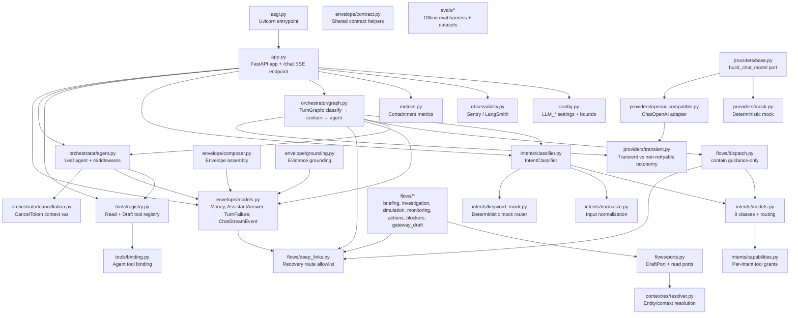
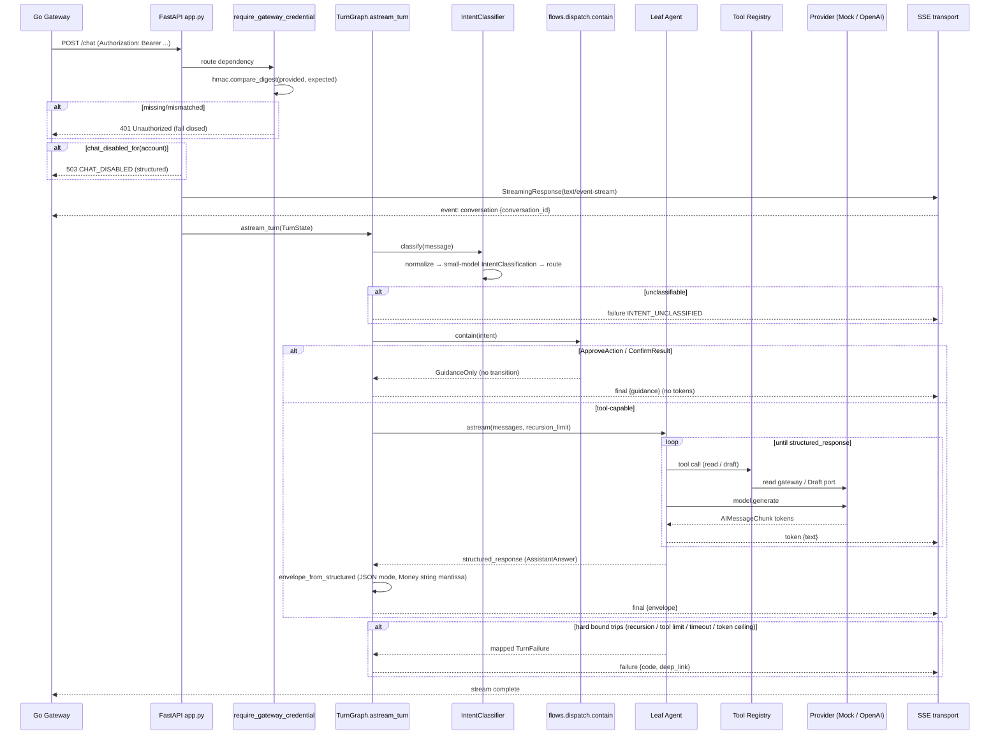
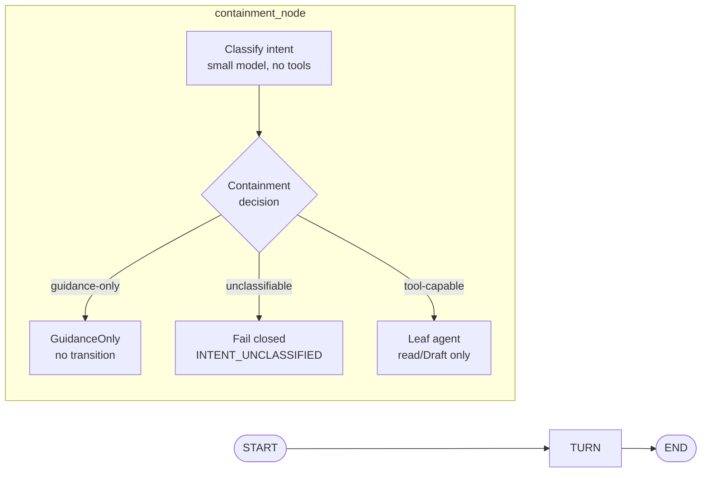
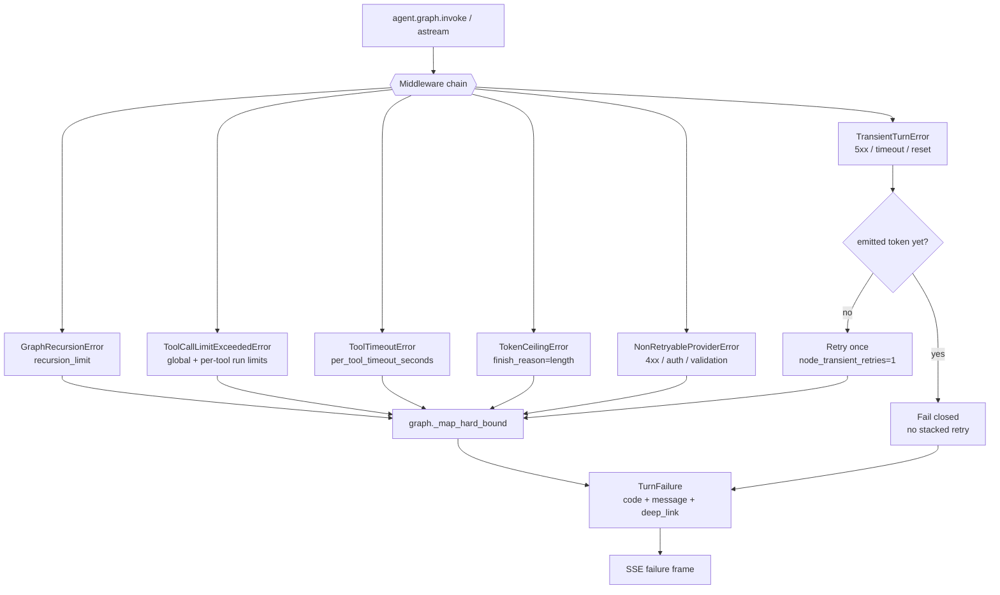
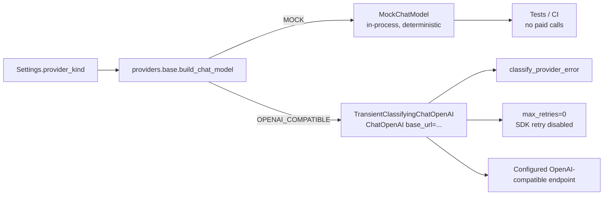
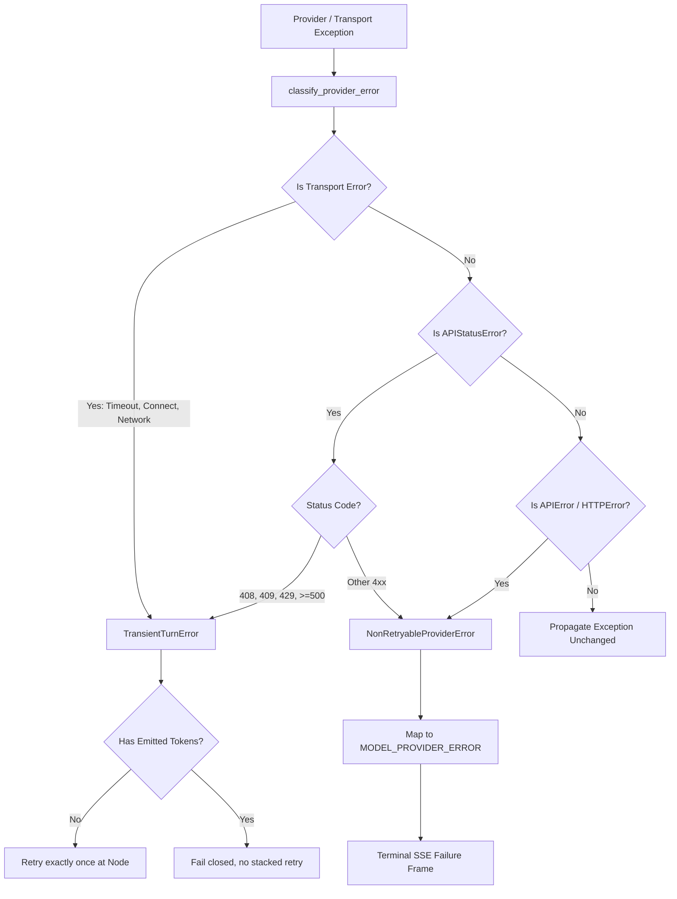

# LLM Service

This package (`services/llm`) implements the Python FastAPI LLM plane for the DK Marketplace Intelligence platform. It provides a read-only and Draft-only LLM service with strict resource bounding and fail-closed security guarantees.

## Architecture

*   **Frameworks**: Built on **FastAPI** for HTTP/SSE transport and **LangGraph** / **LangChain** for orchestrating conversational turns.
*   **No Database Access**: The service has no database credentials (PRD §19.3). Conversation state and durability are entirely the responsibility of the gateway. The state managed here is strictly per-request and in-process.
*   **Orchestration**: LangGraph acts as the sole orchestrator. A conversation turn is modeled as a `StateGraph` that manages intent classification and agent execution.
*   **Provider Abstraction**: It exclusively uses an OpenAI-compatible interface. There is no vendor SDK branch. By configuration, it binds to either an in-process deterministic `Mock` provider (for tests/CI) or a remote `OpenAI_Compatible` endpoint.
*   **Containment & Observability**: Includes explicit intent classification, early containment for unclassifiable intents, and observability tools (Sentry Spotlight, LangSmith) configurable via environment variables.

### Module Map

The package is organized into focused subpackages. The diagram below shows how they depend on each other at runtime — arrows point from a consumer to the module it uses.



### Request Lifecycle

The diagram below traces a single `/chat` turn from the inbound HTTP request through SSE-framed output. It reflects the actual control flow in `app.py::_stream_turn`, `TurnGraph.astream_turn`, `_classify_and_contain`, and `_astream_agent`.



### LangGraph Turn Topology

The P0 turn is a single-node `StateGraph` (post-P0 adds specialist agent nodes without re-architecture). The node runs the deterministic classify-and-contain gate first; only a tool-capable intent reaches the embedded leaf agent.



### Containment & Routing Decision

The intent taxonomy and the deterministic routing function (`route_intent`) together form the structural firewall. `GUIDANCE_ONLY_INTENTS` is the single source: ApproveAction and ConfirmResult can never reach a tool.

```mermaid
graph TD
    MSG[User free-text message] --> N[normalize_input]
    N --> IC[IntentClassifier<br/>small model, tools=[]]
    IC --> RC[route_intent<br/>pure / total]
    RC --> DISP{disposition}

    DISP -- GUIDANCE_ONLY<br/>Approve / Confirm --> GO[GuidanceOnly<br/>deep_link → /actions]
    GO --> NOX[NO token stream<br/>NO transition]

    DISP -- TOOL_CAPABLE<br/>Question, Simulation,<br/>PrepareAction, ReviewAction,<br/>Administration, Navigation --> AGENT[Leaf agent<br/>read + Draft tools]
    AGENT --> DRAFT[Terminal write<br/>at most a Draft]
```

### Hard Bounds & Failure Mapping

Every §12.4 hard bound is enforced inside the agent's middleware chain and mapped to a single structured `TurnFailure` shape with a deterministic recovery `deep_link`. The same mapping is used on both the buffered (`invoke`) and streamed (`astream`) paths.



### Provider Transport

There is exactly one port (`build_chat_model`) that constructs a chat model. Selection is by configuration — there is never a vendor-SDK branch. The production adapter classifies provider errors at the owned boundary and disables the SDK's hidden retry loop so the graph node remains the sole retry authority.



### Envelope & Money Safety

The typed `AssistantAnswer` is the agent's `response_format`. `Money` enforces int64 mantissa and serializes as a signed decimal STRING on the wire so JS `JSON.parse` cannot lose precision above 2^53.

```mermaid
graph TD
    SR[structured_response] --> ES[envelope_from_structured<br/>model_dump mode=json]
    ES --> AA[AssistantAnswer]
    AA --> SUM[summary: str]
    AA --> EV[evidence: EvidenceRef[]]
    AA --> AM[amounts: Money[]]
    AA --> RV[raw_values: RawEvidenceValue[]]
    AA --> MD[missing_data: str[]]

    AM --> M[Money]
    M --> MI[mantissa: int64<br/>rejects float / bool]
    M --> SE[serializer → str<br/>^-?[0-9]+]
    M --> CC[currency: ISO-4217]
    M --> EX[exponent: int]

    ES --> SSE[final SSE frame<br/>exclude_none=True]
```

## Data Flow

1.  **Authentication**: Inbound requests to the `/chat` endpoint must carry a valid `Authorization: Bearer <token>` (issued by the Go gateway). Missing or mismatched credentials immediately fail closed with a `401 Unauthorized`. Comparison is constant-time (`hmac.compare_digest`).
2.  **Kill Switch**: If `chat_disabled_for(account)` is true, the endpoint returns a structured `503 CHAT_DISABLED` and streams nothing else; `/healthz` and `/registry/manifest` stay fully functional.
3.  **Turn Initialization**: An authenticated `ChatRequest` initiates a stream. A `conversation` SSE frame is emitted first; then an in-process `TurnState` (JSON-safe, no framework objects) is created.
4.  **Intent & Containment**: The TurnGraph first evaluates the user's message through an `IntentClassifier` (small model, no tools). If the intent is unclassifiable, it terminates early and yields a structured failure. If it's a guidance-only intent (ApproveAction / ConfirmResult), it yields guidance immediately — pointing at the external structured control — without invoking the agent and without any token stream.
5.  **Agent Execution & Streaming**: For tool-capable intents, the message is routed to the LangGraph leaf agent, which is streamed incrementally:
    *   **Tokens** (`token`): Free-text chunks generated by the assistant are forwarded directly as SSE frames. Tool-call argument chunks and `ToolMessage` echoes are filtered out so a token can never carry an authoritative number reconstructed from the stream.
    *   **Final Envelope** (`final`): Once the tool calls complete, the typed, validated `AssistantAnswer` is serialized through `model_dump(mode="json")` so `Money.mantissa` reaches the wire as a signed-decimal STRING, and sent as the terminal `final` frame.
    *   **Failure** (`failure`): If any hard bound trips (graph recursion, tool-call limit, per-tool timeout, token ceiling, non-retryable provider error) or a transient error fails after exactly one retry, a typed failure frame with a deterministic recovery `deep_link` is emitted.
6.  **Cancellation**: A client disconnect closes the upstream async generator; `CancelledError` / `GeneratorExit` re-raise so no further work runs.
7.  **Serialization**: The response is streamed back via Server-Sent Events (SSE). The `Money` representation is strictly managed, serializing mantissas as signed decimal strings to prevent JS-number precision loss on the client side.

## Design Objectives

*   **Bounded Execution**: The system implements rigorous hard bounds to prevent unbounded resource consumption or runaway loops:
    *   `graph_recursion_limit` (turn-level step limit, default 24).
    *   `tool_call_run_limit` (global per-turn limit, default 12) & `per_tool_call_run_limit` (default 4).
    *   `per_tool_timeout_seconds` (time limit for external tool lookup, default 15s).
    *   `max_output_tokens` (strict token ceiling, default 1024; truncating leads to failure, not silent data loss).
    *   `node_transient_retries` (exactly one node-level retry; never stacked with SDK retry).
*   **Fail-Closed Security**: The service does not attempt to guess or coerce behavior. Unauthenticated requests, missing/misordered configs, invalid intents, or exceeding hard bounds result in deterministic structured failures with explicit deep links to fallback UI screens. The recovery route allowlist (`flows/deep_links.py`) prevents a failure fallback from becoming an open redirect.
*   **Vendor Agnosticism**: Configuration specifies the model provider base URL, ensuring the code is not locked to any single vendor's SDK. All external LLMs must conform to the OpenAI API structure, reached through exactly one port (`providers/base.py::build_chat_model`).
*   **Precision Safety**: Financial values are handled strictly using a `Money` Pydantic model enforcing `int64` ranges and wire-form string serialization. The model strictly prevents floating-point coercion, preserving money invariants.
*   **Structural Containment**: The tool registry admits only `READ` and `DRAFT` kinds; a name-level guard rejects any tool name containing a state-changing verb (`approve`, `execute`, `confirm`, `commit`, `publish`, `guardrail`, `permission`, `grant`, `floor`, `cooldown`, `movement_cap`, `override`, `authorize`). Two defenses, one source.

## Operational Notes

*   **Endpoints**:
    *   `GET  /healthz` — public liveness probe.
    *   `GET  /registry/manifest` — the read/Draft-only tool manifest (gateway-authenticated).
    *   `POST /chat` — a conversation turn streamed as SSE (gateway-authenticated).
*   **Configuration**: All runtime parameters are read from `LLM_*` environment variables via `pydantic-settings` (`services/llm/src/llm/config.py`). Defaults are safe for tests and local dev (mock provider, observability off, chat enabled).
*   **Evals**: Offline adversarial, factual, injection, and cost evals live under `services/llm/src/llm/evals` and run via `python -m llm.evals`. They never call a paid endpoint by default.

## Provider Error Classification and Retry Decision Tree

The diagram below illustrates the exact provider error classification and retry decision tree (from `providers/transient.py`). It shows how raw exceptions from the OpenAI-compatible or HTTP transport are deterministically mapped to retryable vs non-retryable failures.


