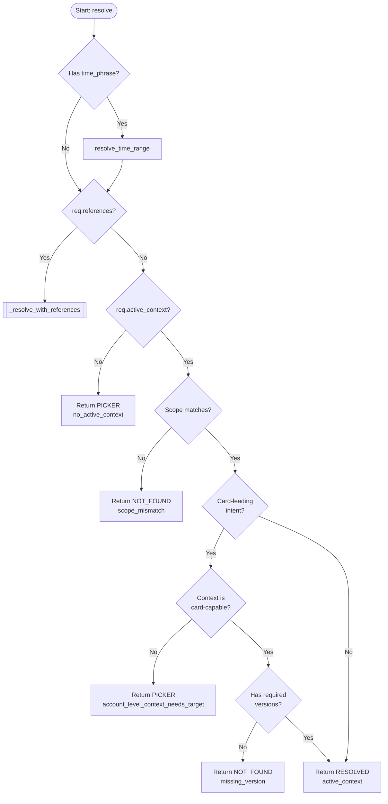
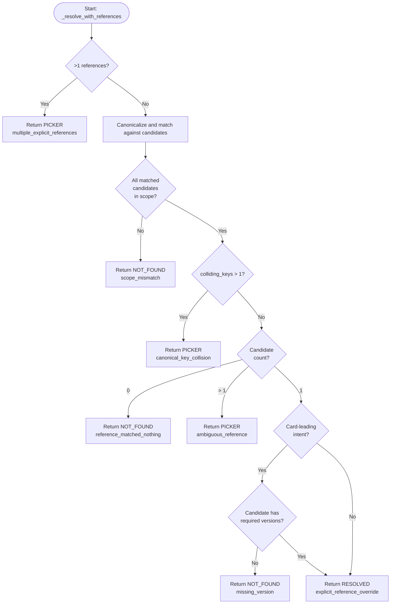

# Context Resolver (`llm.contextres`)

## Objective
This package implements the **Deterministic Context Resolver** (PRD §8.1, CHAT-007). Its primary objective is to determine the single active context for a conversation turn without relying on a model (no LLM in the loop) and without making guesses. 

Key goals:
- **No Guesses:** Ambiguity involving a card-capable target always yields a structured `PICKER` response, never an arbitrary guess.
- **Tenant Isolation:** Strictly validates all context candidates against the authenticated request scope to prevent cross-tenant data leaks.
- **Deterministic Resolution:** Implemented entirely as pure functions that take all state (including the current time and timezone) as input.

## How It Works
The resolution logic is driven by the `resolve()` pure function inside `resolver.py`. The rules are processed in a deterministic order:
1. **Time Range Resolution:** If a `time_phrase` is provided, it is parsed deterministically into an explicit closed range with start, end, and `as_of` boundaries using `resolve_time_range()`. 
2. **Explicit Reference Matching:** If explicit entity references exist in the message, the resolver attempts to match them against the provided authoritative candidate list.
   - Matches are canonicalized (e.g., Persian, Arabic, and English digits fold together).
   - If exactly one candidate matches and meets version requirements, it overrides any prior active context.
   - If multiple distinct references exist, or a canonical key collision occurs, the module yields a `PICKER`.
   - If a reference matches no candidates, it yields `NOT_FOUND` (fails closed).
3. **Active Context Fallback:** If there are no explicit references, the system falls back to the provided `active_context` chip.
   - It validates that the context supports card-leading intents if the intent is to prepare, review, or approve an action (e.g. Account-level contexts cannot be the subject of a card).
4. **Output:** Returns a `Resolution` object indicating one of three outcomes: `RESOLVED` (one valid active chip), `PICKER` (ambiguous choices presented as options), or `NOT_FOUND` (failed closed due to missing/stale references or tenant mismatch).

## Data Flow
1. **Input (`ResolveRequest`):** The module receives a JSON-safe Pydantic model (`ResolveRequest`) containing the turn's intent, the authenticated `scope`, the currently `active_context`, parsed `references`, available `candidates`, time phrases, and a frozen clock (`now`) with timezone data.
2. **Tenant Validation:** Every candidate and active context is validated against the `scope` (`organization_id` and `account_id`). Provenance is checked—not generated—ensuring inputs strictly belong to the current user's tenant.
3. **Canonicalization:** References are canonicalized through a normalizer. All matching candidates are collected under the folded key.
4. **Time Range Parsing:** Named calendar periods ("today", "این هفته") or rolling windows ("last N days") are resolved to their explicit start and end UTC bounds based on the provided timezone and week-start configurations, entirely independent of the phrase's locale language.
5. **Output (`Resolution`):** Returns the final state, containing either the resolved `ContextChip`, a list of `PickerOption`s, or a machine-readable error `reason`.

## Constraints
* **Pure Functions:** No I/O, no network calls, no model invocation, and no local clock reads. `now` is explicitly injected.
* **Tenant Quarantine (PRD §12, §4.6):** Identifiers from an active context or a candidate MUST carry provenance (`organization_id` and `account_id`) that exactly matches the request scope. Missing provenance or mismatches immediately fail closed.
* **Never Guess (CHAT-007):** A card-leading intent (e.g., `APPROVE_ACTION`) that cannot pinpoint a single specific target resolves to a `PICKER`. It never invents a subject.
* **Card Version Binding:** Card-capable contexts (e.g., Product, Recommendation) must carry a `context_version` (and `recommendation_version` for recommendations). If a candidate or active context lacks these while resolving a card-leading intent, it fails closed to prevent unbound or un-invalidatable cards.
* **Safe Time Windows:** Rolling windows ("last N days") are strictly bounded to `MAX_RELATIVE_DAYS` (365). Pathologically large digit sequences are rejected by length before integer conversion to prevent `OverflowError`. Time phrases across different languages resolve identically through the same data path.

## Diagrams

### Context Resolution Flow

The following flowchart illustrates the high-level decision tree inside `resolve()`.

### Explicit References Resolution

When explicit references are provided, `_resolve_with_references()` determines the outcome:

