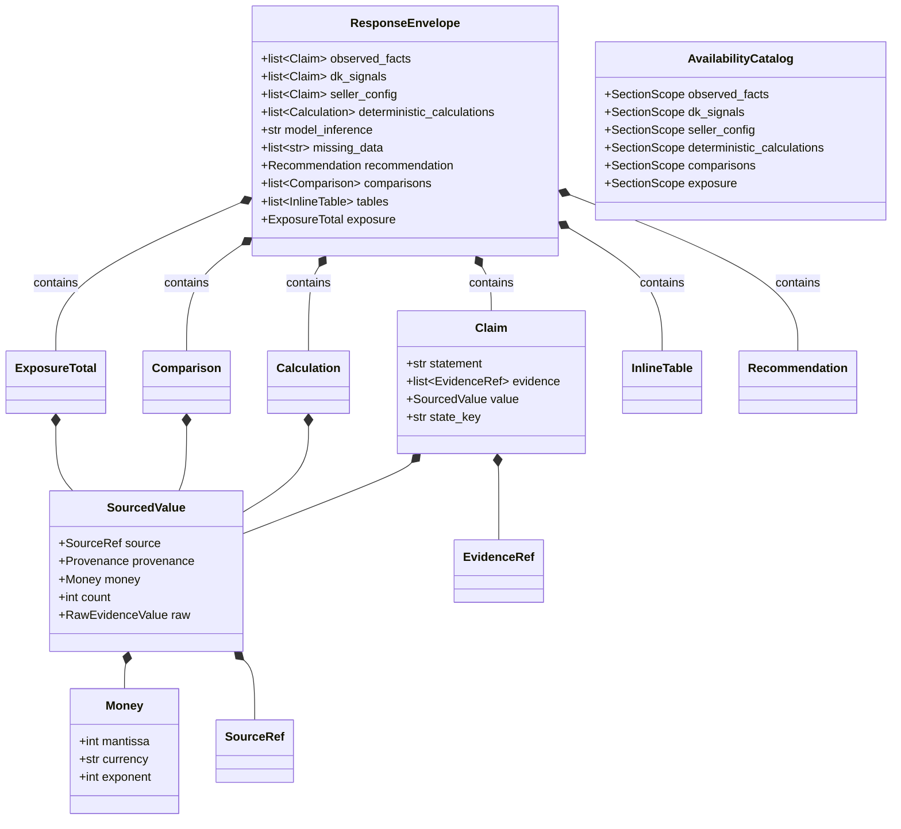
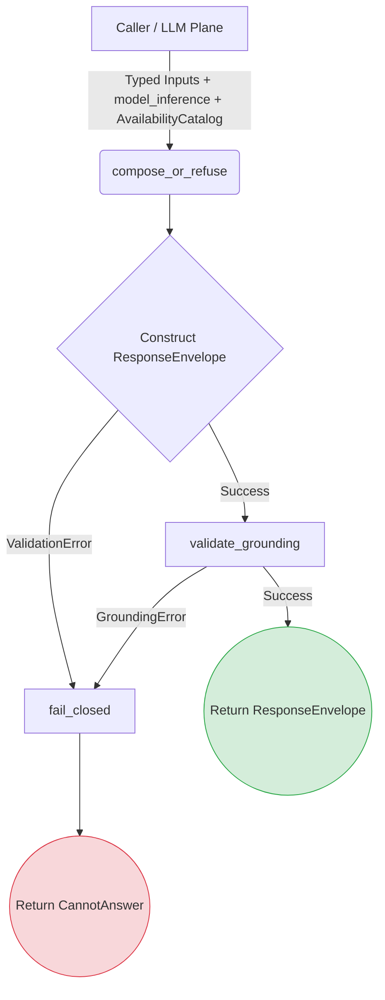

# LLM Envelope Module

This module defines the typed envelope models and contracts for the LLM plane, enforcing product rules around response categorization (§12.2), money invariants (§9.1), and structured failures (§12.4).

## Objectives
- **Categorize Operational Responses:** Ensure that different statement kinds (e.g., observed facts, seller config, inferences) are strictly separated.
- **Money Safety:** Enforce that all money representations use exact integers (mantissa/currency/exponent) and never floats.
- **Strict Grounding:** Prevent the LLM from fabricating numbers or claims. All operational data must be verifiably backed by typed service responses and evidence references.
- **Containment & Fail-Closed:** The LLM's natural language output is strictly confined to a single designated slot. If any rule is violated, the system fails closed to a structured UI refusal rather than guessing or repairing.

## How it Works
The module is divided into four main layers:
1. **Models (`models.py`):** Defines the foundational primitives like `Money` (strict integer validation), `RawEvidenceValue`, `EvidenceRef`, and SSE stream shapes (`ChatStreamEvent`).
2. **Contract (`contract.py`):** Defines the `ResponseEnvelope` which explicitly splits out `observed_facts`, `dk_signals`, `seller_config`, `deterministic_calculations`, `missing_data`, `comparisons`, `tables`, `exposure`, and `model_inference`. It also handles `SectionScope` and `AvailabilityCatalog` to map tools/evidence strictly to valid sections.
3. **Grounding Validator (`grounding.py`):** A read-only walker that traverses a `ResponseEnvelope` and collects any semantic or structural violations against strict product rules (e.g., math checks, time ordering, word/digit scanning). 
4. **Composer (`composer.py`):** The primary entry point. It accepts typed service data and the LLM's text, builds the `ResponseEnvelope`, runs the grounding validator, and either succeeds or emits a structured `CannotAnswer` failure.

### Envelope Architecture

## Data Flow
1. **Data Assembly:** The caller (LLM plane) collects typed inputs (claims, calculations, tables, etc.) from validated tool outputs and an `AvailabilityCatalog` mapping evidence scopes.
2. **Composition:** The caller passes these structured inputs alongside the raw LLM text (for the `model_inference` slot) to `compose_or_refuse()`.
3. **Construction & Structure Check:** The `ResponseEnvelope` validates structural types via Pydantic (e.g. ensuring Money mantissas are valid int64).
4. **Grounding Validation:** `validate_grounding()` walks the envelope checking logical invariants (see Constraints below).
5. **Output:** 
   - If grounded, the `ResponseEnvelope` is returned and emitted to the stream.
   - If a violation occurs, the composer discards the unvalidated text (preventing containment leaks) and returns a `CannotAnswer` payload that deep-links the user to a structured fallback screen.

### Data Flow Diagram

## Constraints (Grounding Rules)
The module enforces severe constraints on data validity:
- **No Floats:** Monetary amounts are strictly integer-based, structurally failing on floats or non-integer JSON forms.
- **Model Inference Containment:** The `model_inference` slot is the *only* field authored by the model. It cannot contain digits or spelled-out number words (English or Persian). All numbers must live in typed slots.
- **Explicit Provenance (CHAT-002, CHAT-005):** Numeric values (`SourcedValue`) require a valid tool/field `SourceRef`. Operational claims require an `EvidenceRef` with a capture time and valid quality state. 
- **Section Scoping (Issue #51):** An evidence ID or source reference must explicitly belong to the section it is cited in (via `AvailabilityCatalog`), preventing cross-section spoofing.
- **Section Policies (Issue #54):** Certain sections have minimum source counts, allowed provenance categories, and freshness checks (current vs stale) defined in a static `SECTION_POLICY` matrix.
- **Coherent Comparisons (Issue #55):** Comparisons must have both sides, exact integer delta math matching their shared scale, consistent currency/exponent, chronologically ordered timestamps (if temporal), and coherent entity bindings.
- **Canonical Keys (CHAT-022):** State keys and quality labels must match predefined canonical sets (drift-guarded against the frontend catalog).
- **Table Caps (CHAT-023):** Inline tables are strictly capped at 20 rows. Larger tables must summarize and provide a deep-link.
- **Exposure Rules (CHAT-012):** Known exposure totals must originate explicitly from the margin engine.
