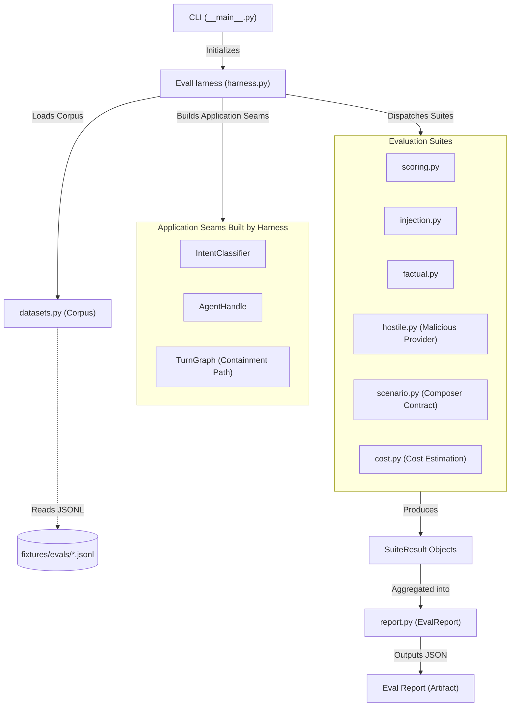
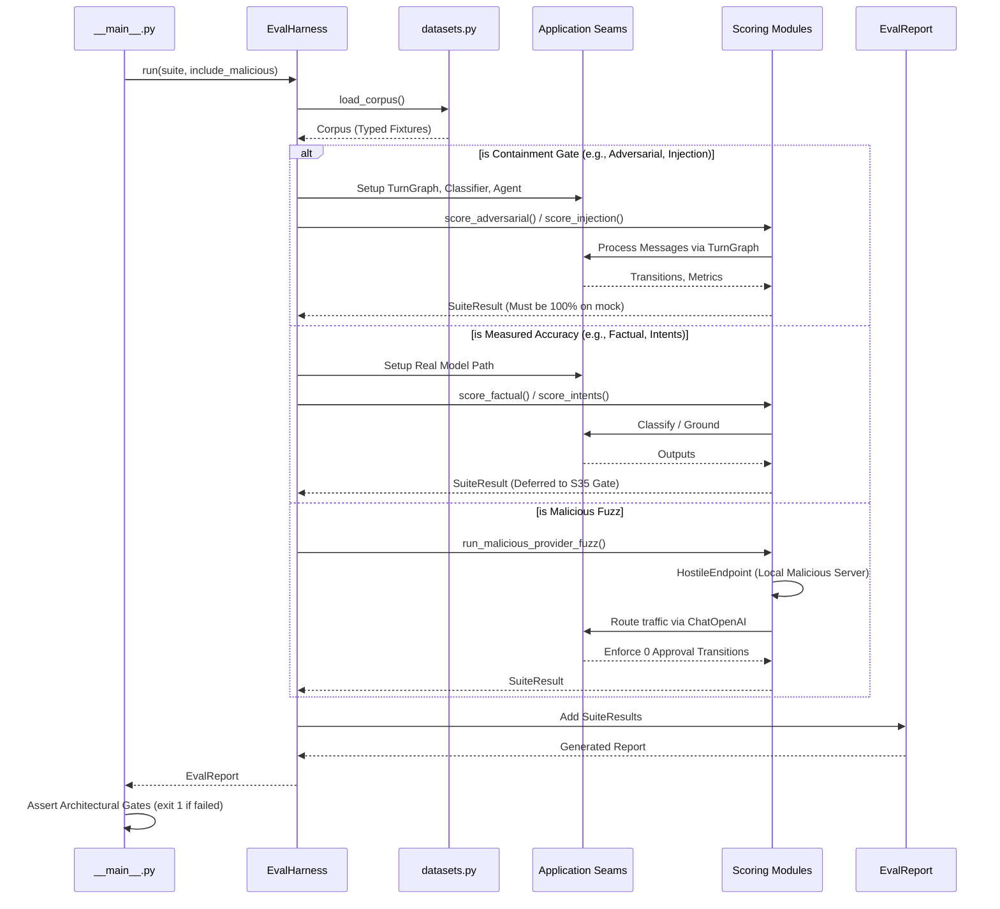

# Offline Evaluation Harness (§12.5)

This module implements the offline evaluation harness (S24) for testing Gate 0a thresholds as specified in §12.5. It evaluates the system against any configured OpenAI-compatible provider and reports pass/fail criteria.

## Objectives

The primary objectives of this evaluation harness are:
1. **Architectural Containment Proof:** Prove that the system's architecture (not the LLM's quality) enforces containment for adversarial requests, data-channel prompt injections, ambiguous-context resolutions, and malicious provider behaviors. Containment gates must achieve a 100% success rate on the deterministic mock.
2. **Measured Accuracy:** Evaluate models for intent classification accuracy, context resolution, factual support against independent oracles, and P75 cost estimation.
3. **Offline Execution in CI:** Enforce offline evaluation in CI using deterministic mocks, explicitly deferring real-model paid benchmarking to the S35 gate.

## How it Works

The harness is executable via a CLI (`python -m llm.evals`) and operates on frozen JSONL fixtures.

1. **Test Fixtures:** The `datasets.py` module loads frozen evaluation corpora from `fixtures/evals/` and strictly validates case counts (exact matches or minimum bounds) to prevent silent under-measuring or regressions.
2. **Harness Execution:** `harness.py` sets up the actual application seams (`IntentClassifier`, `ToolRegistry`, `TurnGraph`, `build_chat_model`) to evaluate suites identically to live traffic.
3. **Factual Support:** `factual.py` tests a provider's ability to faithfully relay reads by scoring responses against an independent oracle. It includes an evaluator self-check knob (`FactualBehavior`) to verify that an omitting or fabricating provider correctly fails.
4. **Data-Channel Injection:** `injection.py` places hostile instructions within untrusted typed marketplace evidence (e.g., product titles) and validates that the system treats the evidence strictly as data, without following the injected instructions or originating unauthorized transitions.
5. **Malicious Provider Fuzzing:** `hostile.py` spins up a local, malicious OpenAI-compatible HTTP server that returns hostile payloads (e.g., forced approvals, missing tool calls). The harness drives the real application graph against it to ensure the architecture prevents malicious provider escapes.
6. **Reporting:** `report.py` aggregates the scores into a comprehensive `EvalReport`. It sharply separates strict Architectural Containment gates (release blockers if < 100%) from Measured Accuracy metrics (deferred to the paid S35 gate).

## Data Flow

1. **Initialization (`__main__.py`):** The CLI parses the `--provider`, `--suite`, and `--report` arguments. It initializes `EvalHarness` with configuration settings.
2. **Corpus Loading (`datasets.py`):** The typed `Corpus` object is populated by parsing `.jsonl` files from `services/llm/fixtures/evals/`. Count bounds are strictly verified.
3. **Suite Dispatch (`harness.py`):** The harness filters the requested suites and processes them using their respective evaluation mechanisms.
4. **Model Interaction & Evaluation:**
   - **Mocks vs Real Endpoints:** The mock provider scripts use deterministic models that bypass network calls.
   - **Contract Scoring (`scenario.py`):** Rebuilds factual fixtures and runs them through `compose_or_refuse`, verifying that well-evidenced shapes compose successfully and degraded ones fail closed.
   - **Metric Calculation (`scoring.py`):** Evaluates intents, context resolution, composer contracts, and currency quarantines based on deterministic logic.
   - **Cost Estimation (`cost.py`):** For offline mock runs, cost is deterministically estimated via a generic character-to-token heuristic.
5. **Output Compilation (`report.py`):** Harness methods return `SuiteResult` instances which are collected into an `EvalReport`. Finally, the report is serialized to JSON (`--report`) and a summary is written to stdout.

## Architecture & Interconnections

The `evals` module is designed to orchestrate offline testing using the actual application seams. The flowchart below illustrates how the components interact:

### Execution Sequence

The harness execution sequence demonstrates the differing pathways for containment gates, measured accuracy suites, and malicious fuzzing:

## Constraints

The evaluation suite enforces several critical constraints, modeled strictly in the code:

* **No Paid API Calls in CI:** The CLI actively prevents (`__main__.py`) the `openai_compatible` provider setting from running in CI environments, guaranteeing that paid benchmarking only occurs during the S35 window.
* **Architectural Containment Requirement:** Containment gates (Adversarial, Injection, Context ambiguity, Malicious provider, Currency quarantine) are hard release blockers and must achieve 100% correctness on the offline mock.
* **Factual Support Isolation:** Factual support evaluation uses an independent ground-truth oracle. It tests exact support criteria: required tool paths must be exercised, amounts and evidence IDs must perfectly align, and unsupported claims must fail the case.
* **Currency Quarantine:** For ambiguous currency cases, the harness guarantees the output is never cast to a numeric `Money` format; the system must strictly quarantine the string as `RawEvidenceValue`.
* **Strict Fixture Counts:** If the parsed fixtures drop below `EXPECTED_COUNTS` or `MIN_COUNTS`, the suite raises a `ValueError` rather than under-measuring.
