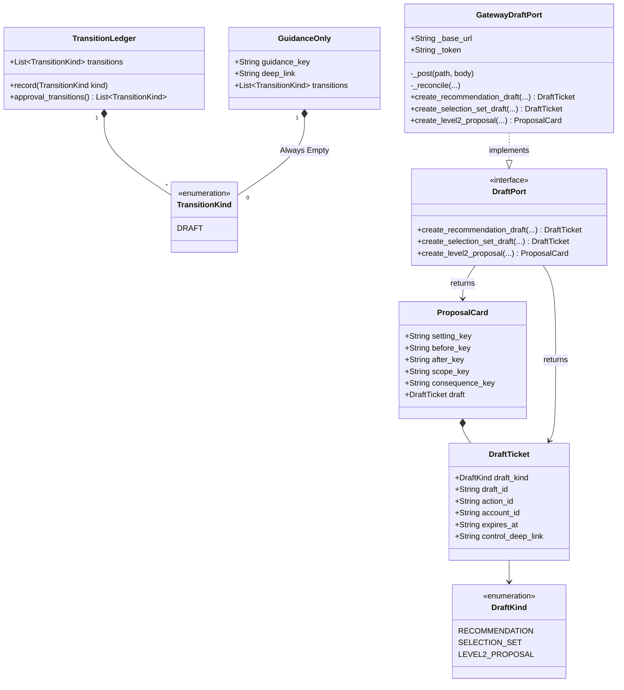

# Chat Flows (`llm.flows`)

This module implements the deterministic, model-free logic for P0 chat flows (Journeys 7-10, PRD §6.8–6.11, §8.3, §8.5). It provides the core containment and execution structures ensuring that the LLM (model plane) cannot unilaterally approve or execute actions, acting instead as a read-only or draft-only assistant.

## Objectives
- **Strict Containment**: Ensure that the model plane can only *prepare* actions (Drafts) and cannot *execute* or *approve* them.
- **Determinism over Improvisation**: Rely strictly on deterministic reducers, external logic, and canonical mappings to answer questions, build queries, or sort items, leaving no room for the model to hallucinate business facts.
- **Unified Surface**: Ensure chat displays the same order, state, and outputs as the user interfaces (screens) by mirroring the external engine schemas and logic precisely.

## How It Works

### Flow Containment (`dispatch.py` & `models.py`)
All intents pass through a deterministic containment gate. The `contain` function structurally blocks free-text intents meant to approve or confirm (e.g., `ApproveAction`, `ConfirmResult`), returning a `GuidanceOnly` pointer to the structured control instead. Any permitted action must record its operations on an append-only `TransitionLedger`, which is strictly limited to recording `TransitionKind.DRAFT`. There are no approval or execution transitions available.

### Write Surface (`ports.py`, `actions.py`, `gateway_draft.py`)
The only permitted writes are Drafts. The `DraftPort` protocol defines exactly three write paths, each resulting in a Draft:
1. `create_recommendation_draft`: Individual recommendation Draft (Prepare-Action).
2. `create_selection_set_draft`: Versioned selection-set Draft (Bulk).
3. `create_level2_proposal`: Reversible before/after proposal Draft (Admin Level-2).

The production adapter, `GatewayDraftPort`, calls the gateway over HTTP using a read/draft-only token. It ensures idempotency and fail-closed behavior on timeouts or transport errors, ensuring no fabricated Drafts are returned on failure.

### Daily Briefing (`briefing.py`)
Briefings strictly mirror the pricing engine's Today feed. The flow is order-preserving by construction, ensuring byte-for-byte equality with the screen. It also utilizes deterministic pure functions to provide aggregate answers (like `count_total` or `count_in_state`), ensuring ground-truth counts without LLM-based hallucination.

### Investigation Filters (`investigation.py`)
Natural language queries are compiled into a `FilterSpec` which then deterministically serializes to a canonical query string. The serialization enforces key order and value sorting, guaranteeing byte-identical outputs to what the standard screen filters would generate.

### Blocker Guidance (`blockers.py`)
Chat lists blockers strictly sorted in the same engine-driven priority order as the Go backend (e.g., policy stages and cost-readiness components). It resolves one blocker at a time via external controls and tracks a `RefreshBudget` to prevent unbounded re-evaluation loops. 

### Monitoring (`monitoring.py`)
Monitors in-flight and terminal actions strictly through read-only access to the append-only action state history. A retry is blocked for any unreconciled actions (mid-flight or awaiting reconciliation), aligning seamlessly with execution engine rules.

### Simulation (`simulation.py`)
Simulations execute what-if scenarios utilizing external policy evaluations. Output simulations are labelled non-executable by construction (`state.simulation` glossary key); the `SimulationResult` schema structurally lacks the capability to hold an approval control.

### Deep Links (`deep_links.py`)
Since chat cannot own the execution path, it delegates approvals to external structured controls via deep links. A closed set of canonical fallback and recovery routes (`RECOVERY_ROUTES`) prevents injection of external, cross-site, or arbitrary bypass paths.

## Constraints
- **Zero Approvals**: The model plane can NEVER originate an `APPROVED`, `EXECUTED`, or `CONFIRMED` transition. The logic structurally omits these capabilities.
- **Fail Closed**: In cases of network failure or malformed data during Draft creation, the flow always fails closed (`DraftUnavailable`) and delegates to a fallback screen; it never fabricates an entity.
- **Deterministic Routing**: Any fallback link must belong to the exact set of approved `RECOVERY_ROUTES`. Attempting to route out of this set results in a structural failure.
- **Stable Idempotency**: Draft HTTP requests use a stable idempotency key derived from the payload, preventing duplicate Draft creation during ambiguous timeout reconciliations.

## Architecture Diagrams

### 1. Flow Containment & Draft Creation Architecture

This flowchart illustrates how user intents are gated and routed, ensuring the model plane cannot bypass the strict Draft-only write limitations.

```mermaid
flowchart TD
    %% Intent & Containment
    Intent([User Intent]) --> Contain{dispatch.py<br/>contain(intent)}
    
    %% Containment Decision
    Contain -- "ApproveAction / ConfirmResult" --> Guidance[models.py<br/>GuidanceOnly]
    Contain -- "Other Intents" --> FlowDispatch[Tool-capable Flows]
    
    %% Flows
    subgraph Flows [Flow Modules]
        direction TB
        Act[actions.py<br/>Prepare / Bulk / Level2]
        Inv[investigation.py<br/>compile_query]
        Brf[briefing.py<br/>daily feed & counts]
        Blk[blockers.py<br/>order_policy_blockers]
        Sim[simulation.py<br/>what-if scenarios]
        Mon[monitoring.py<br/>action state tracking]
    end
    
    FlowDispatch --> Flows
    
    %% Draft Path
    Act --> DPort[[ports.py<br/>DraftPort]]
    DPort -. "implemented by" .-> GPort[gateway_draft.py<br/>GatewayDraftPort]
    
    GPort -- "POST /chat/cards/..." --> API[(Gateway Draft API)]
    API -- "Returns Draft" --> Ticket[models.py<br/>DraftTicket / ProposalCard]
    
    Ticket --> Ledger[dispatch.py<br/>TransitionLedger]
    Ledger -- "Appends" --> DraftKind(TransitionKind.DRAFT)
    
    %% Guidance Path
    Guidance -. "Points to" .-> DeepLink[deep_links.py<br/>External Structured Control]
    Guidance -. "Zero Transitions" .-> Ledger
```

### 2. Core Data Models

This class diagram depicts the relationships between the foundational types that enforce the read/draft-only invariants across the module.


